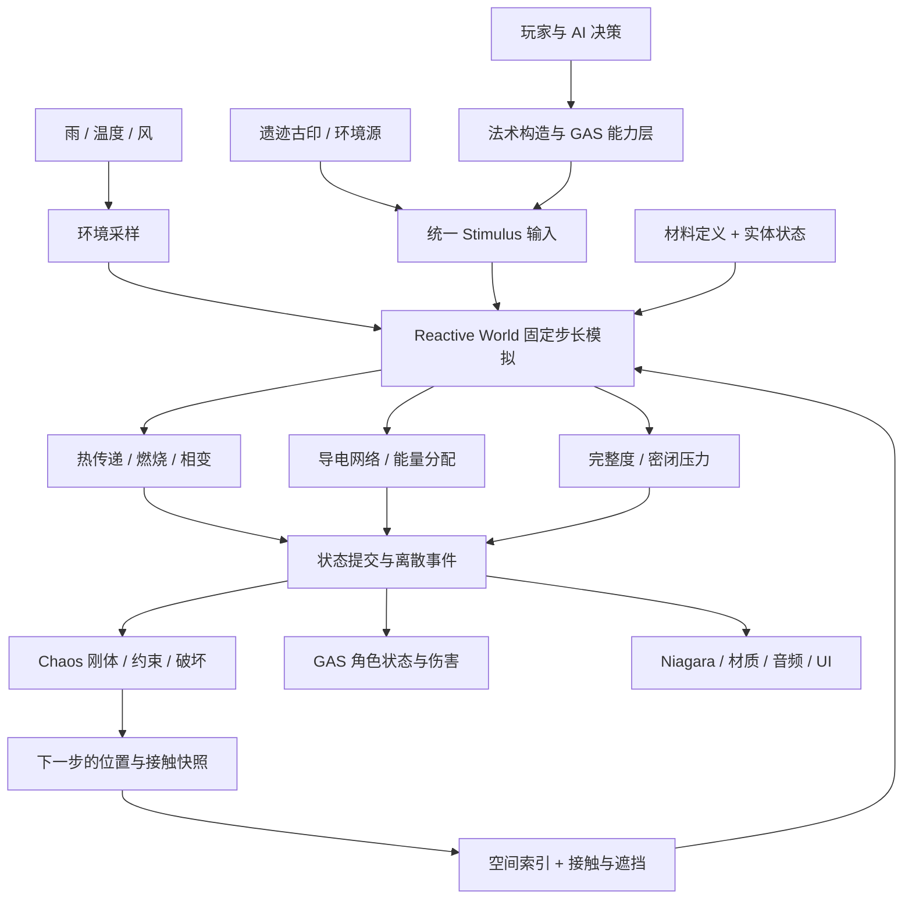
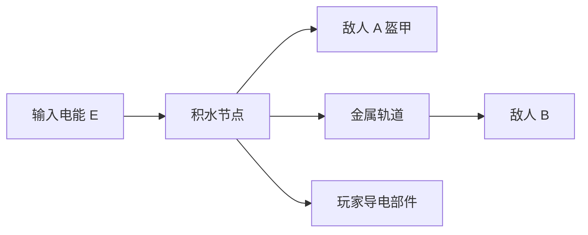
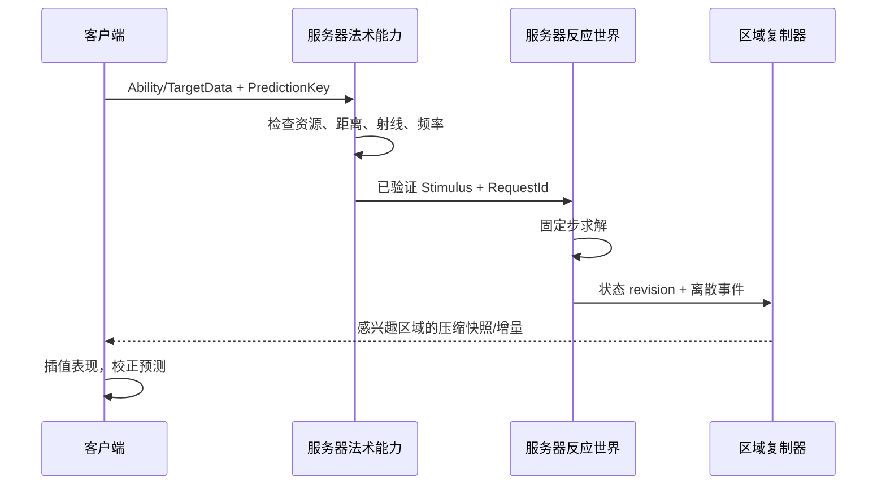

# 以太反应世界：UE 5.8 底层架构设计

**0.4 工程更新**：[模块化角色、装备与 UE 玩法](ModularGameplay.zh-CN.md) 记录已落地的独立装备模块、数据定义、命中接口、关卡资产、服务器权威和 v2 存档。本文件保留最初反应核心设计的范围与假设。

版本：0.1 · 目标引擎：UE 5.8.0 · 项目：AetherLab · 设计依据：用户提供的“UE物理引擎模拟”讨论与补充正文。

玩法与世界设定已更新到 0.2：[玩法设计](GameDesign.zh-CN.md)、[世界设定集](WorldBible.zh-CN.md)、[首个可玩切片规格](VerticalSlice.zh-CN.md)。下文的 0.1 实现范围与验证结论保持原义；新增玩法仍需按切片规格实施。

## 1. 架构结论

把“魔法遵循并操纵物理规则”实现为一个 **Reactive World 游戏模拟层**。这个层使用 UE 的基础容器和数学库，独立维护材料、能量、水量与结构状态；UE 世界子系统调度它；Chaos、GAS、Niagara 分别接收机械、角色和表现结果。

统一的是输入契约、状态归属和结果分发，不是把所有现象塞进一个万能求解器。魔法、下雨、火堆、电缆、敌人和旧文明装置都通过同一个刺激入口改变状态。

本次交付包含设计、可编辑的 C++ 插件、基础材质实验场和自动化测试。它是继续开发完整游戏的工程起点。**当前可玩程序是单机实验场；没有宣称完成多人复制、完整 GAS 战斗、连续流体、开放世界或正式美术。**



GAS 的职责是能力、属性、效果和执行流程；该边界符合 [Epic 的 GAS 定义](https://dev.epicgames.com/documentation/unreal-engine/gameplay-ability-system-for-unreal-engine)。区域力和应变可以接入 [Chaos Physics Fields](https://dev.epicgames.com/documentation/en-us/unreal-engine/physics-fields-in-unreal-engine)，热量与湿度仍由本项目维护。

## 2. 产品约束与首版范围

当前世界以剑与魔法文明为主体：王国、骑士、教会、法师学派与魔物构成玩家日常接触的内容。旧文明前史深藏于遗迹，详见 0.2 世界设定。底层使用 Heat、Water、ElectricalEnergy、Impulse 等物理量，玩家通过命名咒术和剑术操作世界；遗迹古印产生的物理作用也使用同一反应入口。

新增近战需要武器接触、斩刺钝载荷、格挡、架势与护甲传递；当前冲量代理不能覆盖整套剑术。角色生命、誓约与任务事实由战斗/GAS/冒险模块持有，产生物理作用时再接入 ReactiveWorld。底层统一不要求将灵魂、信仰或人物关系转换为物质温度。

第一阶段默认 Windows PC 单机，目标交互对象为局部实验房间。设计上保留服务器权威位置，但在复制和网络验证完成前不将程序作为联网游戏发布。注册数量上限是保护阈值，不是性能承诺。

首批材料：木、金属、水、油、石；首批输入：正/负热量、水、电能、冲量；环境：温度、降雨和风。

| 玩法关系 | 0.1 实现 | 边界 |
|---|---|---|
| 火 → 木头燃烧 | 温升到燃点，消耗燃料并释放热量 | 温度集中参数模型；没有内部温度梯度 |
| 水 → 降温/灭火 | 质量与焓混合，含水量影响燃烧 | 超过吸水容量的水被计入拒收量，没有生成水流 |
| 水 + 雷 → 导电 | 液态水增加导电权重，接触图传播 | 权重是玩法参数；不解真实电路 |
| 雷 + 金属 → 传播 | 金属原生导电，循环图去重 | 无空气电弧；绝缘层尚未分层建模 |
| 水 + 冰 → 冰面 | 抽热、冻结潜热、冰比例与碰撞切换 | 使用预设网格；没有运行时生成冰桥几何 |
| 冰 + 冲击 → 破裂 | 冰比例降低有效强度，发出一次破坏事件 | 单节点结构代理；没有完整应力场 |
| 火 + 水 → 蒸汽 | 汽化消耗潜热并转移质量/焓 | 蒸汽事件可见；气体遮挡/输运待实现 |
| 火 + 油 → 燃烧/密闭爆裂 | 敞口燃烧；有密闭容积时储气能、升压、爆裂 | 简化气体热容模型；不是燃爆工程计算 |
| 风 + 火 → 偏向传播 | 顺风方向热传递权重提高 | 不模拟氧气补给、湍流或毒气平流 |
| 燃烧木材 → Chaos 坍塌 | 燃料消耗降低完整度，启用刚体或施加应变 | 示例展示整块落下；碎裂需要制作 Geometry Collection |

## 3. 工程与模块边界

```text
AetherLab.uproject
Source/AetherLab/                 实验场、交互控制、HUD、运行时烟雾测试
Plugins/ReactiveWorld/
  Source/ReactiveCore/
    Public/ReactiveSimulation.h   材料、状态、输入、事件、求解器契约
    Private/ReactiveSimulation.cpp
    Private/Tests/                数值与组合性质测试
  Source/ReactiveRuntime/
    Public/ReactiveTypes.h        Blueprint 类型与材料数据资产
    Public/ReactiveBodyComponent.h
    Public/ReactiveWorldSubsystem.h
    Private/                     UE 生命周期、Chaos/GAS/Niagara 适配
Docs/                            架构、接入、验证记录
Scripts/                         构建与测试入口
```

依赖方向：`AetherLab → ReactiveRuntime → ReactiveCore → UE Core`。Core 不依赖 UObject、Actor、GAS、Niagara 或 Chaos。运行时模块才引入 Engine、GeometryCollectionEngine、FieldSystemEngine、GameplayAbilities 和 Niagara。

现阶段将热、电、相变和结构放在一个 Core 模块中，由明确的方法与数据结构分隔，方便编译与验证。后续求解器体积增长后，可拆出 `ReactiveThermal`、`ReactiveElectrical`、`ReactiveSurface`，不能让它们反向依赖法术或 UI。不要一开始创建十几个几乎空的插件模块。

| 类型 | 生命周期/所有权 | 负责什么 |
|---|---|---|
| `Reactive::FSimulation` | 一个游戏 UWorld 一个实例 | 唯一的权威反应状态与步进 |
| `UReactiveWorldSubsystem` | Game/PIE 世界 | 调度、注册、接触门控、UE 结果分发 |
| `UReactiveBodyComponent` | Actor | 注册和注销，材质配置，结果接收，无组件 Tick |
| `UReactiveMaterialAsset` | 可复用 Primary Data Asset | 作者配置；注册时复制为只读运行参数 |
| `FReactiveStimulus` | 一次输入 | 热量、水量、电能、冲量，以及范围 |
| `FReactiveSnapshot` | 只读派生展示 | 温度、相态、燃烧、结构等 |
| `FEvent` | 一步产出、分发后消费 | 起火/灭火/冻结/融化/蒸汽/触电/破坏/爆裂 |

## 4. 材料数据与状态：避免两个真相

**材料定义**描述物质的响应规律；**状态**描述这块物体此刻的情况。不要把温度写在 GAS、材质参数和 ReactiveComponent 三处，分别更新。

| 材料字段 | 单位 | 用途 |
|---|---|---|
| DryMassKg | kg | 干物体的等效热容量和冲量估算质量 |
| SpecificHeatJPerKgK | J/(kg·K) | 能量与温度换算 |
| WaterCapacityKg | kg | 可绑定/吸收水量上限 |
| InitialFuelKg | kg | 可燃物库存 |
| IgnitionC | °C | 起燃阈值；灭火采用低 40°C 的滞回 |
| BurnRateKgPerSec | kg/s | 反应速度 |
| CombustionJPerKg | J/kg | 化学能来源 |
| RetainedHeatFraction | 0–1 | 热量留在本体的比例 |
| Conductivity | 0–1 | 导电接触权重，**不是 S/m** |
| ThermalCouplingWPerK | W/K | 等效节点间热交换系数 |
| CoolingWPerK | W/K | 与背景环境的冷却系数 |
| StrengthNs | N·s | 玩法冲量破坏阈值，**不是应力或材料强度单位** |
| FrozenStrengthMultiplier | 0–1 | 冻结后的有效强度比例 |
| SealedVolumeM3 | m³ | 零为敞口，正值为简化密闭储能容积 |
| BurstGaugePressurePa | Pa | 相对背景压力的爆裂阈值 |

`DryMassKg` 是固定等效质量，0.1 不会随燃料烧掉自动减少；燃料与水量用于反应账本。生产版本若需要质量/惯量变化，要在结构提交阶段统一更新 Chaos 质量，不能让两个系统独立变化。

权威状态保留：`EnthalpyJ`、`WaterKg`、`FuelKg`、`Integrity`、`GasEnergyJ` 和不可逆破坏标记。温度、冰比例和压力由这些量派生。燃烧是具有滞回的反应状态。快照只读，不允许 UI 直接改温度。

“Wetness”由水量/容量派生。当前雷电是一次电能脉冲，没有持久 `Charge`。若以后引入电容器、持续带电表面和电网，增加电荷、电势、接地与电路模型，不能把焦耳直接当库仑。

### 实体标识

当前 `FBodyId` 是世界实例内单调递增的 32 位 ID，0 表示无实体，不复用已注销的 ID，旧输入不会意外命中新物体。ID 不能跨关卡、存档或网络直接使用。

正式存档与复制增加 `PersistentGuid + RuntimeHandle(Index, Generation)`。World Partition 加载时从 GUID 映射为运行时句柄；卸载时先冻结状态、序列化，再注销句柄。

## 5. 热量与相变模型

基础式：`Q = m × c × ΔT`。同样的火球热量作用于小木片和厚金属板，应产生不同温升。

使用集中参数焓模型，参考点为“0°C 的冰”。同一个物体上的干材料与水假设达到局部热平衡，尚不建模内部传热延迟。

```text
C_dry = max(1, DryMassKg × SpecificHeatJPerKgK)
H = C_dry × T + WaterKg × h_water(T)

T < 0:      h_water = c_ice × T
T = 0:      h_water 在 0 … L_fusion 之间，对应不同冰比例
0 < T <=100:h_water = L_fusion + c_water × T
```

本版常数：冰比热 2100 J/(kg·K)，液水比热 4186 J/(kg·K)，熔化潜热 334000 J/kg，汽化潜热 2256000 J/kg。这些是游戏近似常数，不随压力、杂质和温度变化。

例如 1 kg、20°C 的水，先抽走约 83.7 kJ 才到 0°C；再抽走约 334 kJ 才能全部结冰。不会在温度刚小于 0°C 时瞬间冻住整条河。

水加入时同时带入它在环境温度下的焓；输入容量以外的水记入 `RejectedWaterKg`。汽化后移出对应水质量和蒸汽携带的焓，发出 kg 单位的 Steam 事件。开放环境下进入 `VentedEnergyJ`；密闭代理则转入气体储能。

### 节点间热传递

```text
Q_raw = Coupling × (T_hot - T_cold) × DistanceWeight × WindWeight × fixedDt
```

只查询活跃物体周边格子，一对物体每步只计算一次。先从同一温度快照计算候选热流，再限制每个供热节点的总输出和每个受热节点的总输入，最后成对提交 `-Q/+Q`。这个限制使大耦合系数不会导致显式积分温度越界和交替振荡。

该模型包含间隙内的等效热传播，属于可调的游戏传热代理，没有宣称求解辐射的四次方定律。默认热传播范围 250 cm，并受到碰撞遮挡门控。

### 燃烧

```text
可燃库存 > 0
且含水比例 < 0.35
且温度达到有滞回的起燃条件
    → 消耗 FuelKg
    → 化学能 = 消耗质量 × CombustionJPerKg
    → 按比例留在本体，剩余散失或进入密闭气体储能
    → 完整度随消耗比例下降
```

环境是开放的能量源/汇，魔法也显式输入或抽走能量。测试验证具体交换过程守恒，不宣称整个游戏绝热。0.1 的统计量不是完整的全球能量审计器；背景冷却和最低温度钳位等需要在生产版本扩充账本。

## 6. 导电：连接关系比距离重要

接触图的节点是反应物体。存在导电连接的必要条件：两个交互球接触、双方有效导电权重大于阈值、遮挡门控允许。地上相距一米的两滩水不会因“都很湿”而隔空连成一片。

有效导电权重由材料基础值与液态含水比例组成；冻结水不会保留全部液态导电贡献。金属自带的导电能力仍然存在。



0.1 使用受限的广度优先能量包传播：每个节点留下一部分能量，剩余按尚未访问的导电邻居权重**归一化分配**。叶节点保留剩余全部能量。每个脉冲维护 visited 集合，循环图不会重复放大；达到跳数/节点上限后就地沉积剩余能量。

`ElectricalInputJ = Σ ElectricalDepositedJ` 是这一过程应满足的性质。没有使用“每条分支都复制 80% 能量”的写法。

沉积能量同时转换为局部热量，Shock 事件携带的是电能剂量代理。它不直接等价于真实电流伤害。将来需要路径电阻、电势与接地时，可替换该求解器，而不改变法术输入和表现接口。

该 BFS 选择一棵确定顺序的传播树；并行物理路径的电流分配、跨脉冲叠加和电容储能不在本版内。需要更真实电网的设施使用单独的电路子图，不能依靠增大 BFS 深度代替电路求解。

玩家和敌人共用相同节点规则。若某玩法要免伤，必须由明确的绝缘设备或玩法规则说明，不能在导电器里写“跳过 Player”。

## 7. 结构与爆裂

完整度降到阈值，产生一次 Broken 事件。冻结使有效冲量阈值降低。机械执行器把 SI 冲量 `kg·m/s` 乘以 100 转成 UE 的 `kg·cm/s` 后交给刚体；不能漏掉这个单位转换。

普通静态网格使用“启用刚体后坠落”的最小方案。Geometry Collection 收到外部簇应变，实际碎裂由事先制作的破碎资产、聚类和伤害阈值决定。仅调用 API 不会把任意 Static Mesh 自动变成可破坏建筑。

大建筑的下一阶段应引入支撑图：结构节点记录连接、承重关系和剩余强度；温度和燃烧改变边强度；断边后重算连通分量，再把失去锚定的部分交给 Chaos。Gameplay 只记录关键结构件，装饰碎片可以只参与表现。

密闭燃料样本采用可审核的简化储能模型：

```text
GaugePressurePa = (gamma - 1) × GasEnergyJ / VolumeM3
gamma = 1.4
```

压力过阈值时一次性释放并清空气体能量，将其分配为周边目标的热量与动量输入，排入**下一步**队列；不会在一次回调栈中递归炸完整张地图。没有目标或队列拒收的份额计入散失。

这是统一理想气体热容代理，不包含氧气耗尽、蒸汽质量/状态方程、容器泄漏、燃料蒸发或爆轰波。真实压力玩法升级时，扩展气体质量、组分和焓；敞口油燃烧与密闭爆裂的区别仍保持不变。

## 8. 调度、睡眠与查询

`UReactiveWorldSubsystem` 在 Game 与 PIE 世界创建；编辑器预览不运行模拟。世界结束时释放组件映射和求解器，防止多个 PIE 世界串状态。

默认固定步长 0.05 s，即 20 Hz。单个渲染帧最多补 4 步，超出累计时间明确记入 `DroppedSeconds`，避免卡顿时无限追赶。这个选择意味着过载时游戏模拟会丢失时间；不是实时同步保障。

```text
帧输入与位姿更新
  → 累加时间
  → 固定步循环（最多四步）
      1. 取出当前输入批次
      2. 按目标或区域预算注入，解析相态与电脉冲
      3. 构建本步热交换对，从同一快照计算并提交
      4. 雨水/背景换热 → 相态 → 燃烧 → 压力 → 结构
      5. 标记活跃/睡眠
      6. 把状态同步给 UE 组件
      7. 分发离散结果事件；新刺激进入下一步
```

静止且接近环境温度、没有燃烧、雨水容量稳定的物体在稳定一段时间后睡眠。输入、邻居热流、位移或环境参数改变会唤醒。改变天气会唤醒当前注册对象；大世界版本应按空间区域唤醒。

空间索引是中心点格子 + 最大半径扩展查询，候选再做球形距离筛选。负坐标使用 floor。移动体在子系统里集中更新格子；静态体不用每帧扫描。被 Chaos 激活的体自动加入移动集合；外部脚本移动的体需要启用 `bTrackMovement`。

0.1 的接触门控直接使用 UE Visibility 线段查询并忽略两个端点 Actor。反应球是代理体，复杂/扁长几何需要更细的反应节点或自定义接触。建筑墙体必须阻挡该碰撞通道。区域刺激暂不对施法原点执行完整遮挡裁剪，正式范围法术要在法术命中阶段或输入收集阶段补上。

### 当前预算与性能验收

| 项目 | 默认值 | 超限行为 |
|---|---:|---|
| 注册物体 | 4096 | 拒绝注册，日志报错 |
| 等待输入 | 512 | 返回 false，累计拒绝计数 |
| 每步热交换对 | 16384 | 截断并累计预算命中 |
| 每次电脉冲节点 | 128 | 余能留在最后节点 |
| 每次电脉冲跳数 | 8 | 余能就地沉积 |
| 事件缓存 | 65536 | 未及时消费时丢弃并计数 |
| 单帧补步 | 4 | 丢弃多余时间并计数 |

这些值用于保护原型。稠密接触图仍可能产生高候选查询和遮挡成本，预算上限也不等于 CPU 毫秒上限；当前热对截断按稳定 ID 顺序，连续过载会使后面的对象处理不足。生产调度需加入区域配额、公平轮转、缓存和优先级，不能通过提高上限掩盖问题。

建议的下一阶段验收目标（尚未实测承诺）：目标 PC 上 60 fps；以 1000 注册/100 活跃为第一档，记录 ReactiveWorld 的 p50/p95/p99 耗时、候选数、遮挡次数、活跃比例、预算命中与补步丢时；稳定后再扩大负载。项目已经加入 Unreal Insights CPU scope 和运行时计数。

## 9. 线程模型

0.1 全部模拟与 UE 适配在游戏线程执行，方便验证生命周期。虽然 Core 没有 UObject 依赖，`CanExchange` 在运行时会访问 UWorld，因此**当前不能直接把 Step 丢到工作线程**。

迁移异步的正确步骤：

1. 游戏线程收集位置、材质、接触/遮挡结果与输入，形成不可变快照。
2. 工作线程只处理纯数据，输出状态增量和事件。
3. 游戏线程校验句柄 generation 与世界 revision 后提交。
4. Actor 已卸载的事件取消或写入持久状态，不访问失效指针。

进一步扩展可以按区域分片；跨区域热流在同一边界协议交换，不能让两个工作线程各自改变同一实体的权威状态。

## 10. 法术与 GAS 接入设计

法术定义采用“操作对象 + 操作 + 形态”的创作方式，但编译后的执行入口仍是有限类型的刺激。

| 法术 | 输入 | 世界响应 |
|---|---|---|
| 火球 | Projectile + HeatJ + ImpulseNs | 受热物体各自响应 |
| 冰束 | Beam + 负 HeatJ | 先降温，再相变 |
| 水术 | WaterKg 的移动或注入 | 吸水/水面代理，后续可冻结或导电 |
| 雷击 | ElectricalJ + 命中起点 | 接触网络分配与热沉积 |
| 风场 | 环境速度 + 持续机械力 | 热传递偏向；刚体通过力适配器执行 |

正式 `USpellDefinition` 建议包含能力标签、形态、刺激参数、施法距离、持续时间、资源曲线、命中策略、预测策略、表现资产。配置定义允许的组合，不给玩家 UI 暴露任意 UObject 类或任意参数执行权限。

正式执行顺序：GAS 检查标签/冷却/共鸣资源 → 服务器验证目标/射线/距离 → 提交能力消耗 → 创建投射物或场源 → 每次命中生成刺激 → 世界求解 → 角色反应事件进入 GAS。

0.1 实验场由本地控制器直接注入刺激，用于隔离验证世界规则。插件已经把 Shock、Ignited、Frozen、Broken 桥接为 `Event.Reactive.*` Gameplay Events，但**没有赋予角色能力、实现 AttributeSet、伤害换算、持续 GE、冷却或预测**。角色必须拥有 ASC 和相应监听能力才会响应这些事件。

正式伤害桥需要加入 `RequestId / SourceEntity / Instigator / AbilityTag / HitLocation / CausalChainId`，支持归因、仇恨、抵抗、日志和去重。0.1 的事件只有实体、序号、类型、标量和向量，暂不用于完整战斗结算。

环境对法术本身的反作用：让有持续物理状态的投射物/场源同样注册为反应实体，使用能量库存决定剩余强度与寿命，位置由 ProjectileMovement/Chaos 提供。当前实验场是瞬时刺激，尚未实现会被雨消耗、被风偏转的投射物。

## 11. 表现与可读性

所有 VFX、材质、音效只能读取已提交状态/事件。关闭 Niagara 不应改变导电、燃烧和伤害结果。视觉 LOD 不影响权威反应精度。

近距离重要物体允许独立 NiagaraComponent；远处大量燃烧点建议写入分区 Niagara Data Channel，再由共享系统消费。[Epic 的 NDC 文档](https://dev.epicgames.com/documentation/unreal-engine/data-channels-in-niagara-for-unreal-engine)也将共享模拟作为优化用途。

0.1 提供可选 BurningEffect、`User.TemperatureC / User.FuelKg / User.Burning` 参数，并用实验场颜色、文字和 debug primitive 展示状态。没有交付正式 Niagara 资产或 NDC 配置。

正式表现需要区分：持续状态用快照重建；瞬时事件用序号去重。玩家远离再靠近时，应直接看到物体仍在燃烧，而不是必须重新收到一次 Ignited 才生成火焰。

## 12. 多人与服务器权威设计

当前子系统拒绝在 `NM_Client` 上求解/注入，预留权威边界。**这不等于已实现网络游戏**：UWorldSubsystem 本身不复制，组件快照当前也未复制。

下一阶段增加按区域存在的 `AReactiveRegionReplicator`：



推荐按“稀疏实体状态 + 区域面片”复制，字段包含稳定 GUID、revision、燃烧/破坏位、量化热态/水态、关键相态和结构状态。实现可使用复制 Actor 上的 Fast Array；更新频率、量化区间与 relevancy 用网络测试决定。

服务器保存所有 Gameplay 反应，客户端只预测施法动画与飞行表现；不能提交“目标温度已变为 900°C”这样的结论。延迟加入客户端先收基线，再按 revision 接收增量。灭火、破坏、卸载都是显式状态转换，不能靠客户端计时推测。

破坏只复制关键结构件及事件，细碎片可为客户端装饰。关键刚体需要单独选择 Physics Replication 模式；[Epic 的 Networked Physics 文档](https://dev.epicgames.com/documentation/unreal-engine/networked-physics-overview)明确说明高速交互、高延迟与重模拟的成本。固定反应步长不保证 Chaos 跨机器逐位确定，不采用整个世界锁步复制。

首轮网络验收至少覆盖：两个客户端同一积水导电、施法者自伤、晚加入已燃烧区域、丢包后相态一致、跨 relevancy 回流、破坏事件不重复、断线重连和 Actor 卸载。

## 13. 大世界、表面与存档扩展

**表面反应层**：大面积地面不适合“一块地一个 Actor”，也不适合“一滴水一个 Actor”。增加区域面片/稀疏格子，记录水体积或水深、焓、表面材料、气体等；通过守恒通量进行格间转移。角色与面片接触时建立耦合边。坡度、排水、分离积水的连通性必须来自几何，不能只按湿度连图。

**表示层级**：近处可交互主体为 Actor + Component；远处大量植被可使用 Mass fragment 或压缩区域状态；纯装饰体不进入 Gameplay 模拟。只有需要机械结果时才提升为 Chaos Actor。Mass 是数据载体/调度选择，不再建立第二套燃烧真相。

**分区**：注册与卸载挂到 World Partition 的加载生命周期。远处区域采用低频近似演进，不能因为无人看见而忘记关键任务物体被烧毁；长期扩散可按区域边界条件保存，避免后台全城高精度模拟。

**存档**：自定义版本号、材料资产 ID、稳定实体 GUID、权威焓/质量/燃料/完整度/储能、不可逆事件、区域格子。读档先查材料兼容性再构建运行句柄与空间索引。不要序列化 Actor 指针、Niagara 粒子或临时接触缓存。材料版本变化需显式迁移策略。

0.1 实验场重新加载仍恢复初始状态。0.3 修道院已经实现部分水面、复制和版本化存档；准确范围见 [B–E 实施记录](Implementation-BCDE.zh-CN.md)。区域 LOD、Mass 和 World Partition 仍是后续设计。

## 14. 扩展流程

增加新物质或现象时按以下顺序处理：

1. 写出可观测的玩法问题，例如酸损坏金属门但石墙保留。
2. 定义量、单位、来源、去向和有效范围。
3. 明确哪一个系统拥有状态，其他系统只能观察或提交输入。
4. 定义局部相互作用、空间连接与预算。
5. 在纯数据测试中验证孤立现象、组合现象、极端输入和守恒性质。
6. 在 UE 接上最小可视结果，再做正式 VFX。

例如酸不是增加一个 `FireAndPoisonCombo()`；应增加腐蚀剂库存、材料反应速率、反应产物/损耗，再由同一完整度模型触发机械后果。

## 15. 下一阶段交付顺序与验收门槛

以下保留原阶段的最终门槛；当前已实现内容和未完成项见 [0.3 实施表](Implementation-BCDE.zh-CN.md)，不能将接口落地等同于整阶段生产验收完成。

| 阶段 | 交付 | 完成标准 |
|---|---|---|
| A：本次基础 | Core、UE 组件、实验场、文档、测试 | 本机 5.8 编译、数值性质与运行时烟雾测试通过 |
| B：可玩法术 | GAS 能力、角色 ASC、共鸣资源、火球与冰束 | 资源/目标校验完整，雨和风会改变投射物，伤害有来源 |
| C：场景材料 | 连续水面代理、遮挡/接触缓存、真实破碎资产 | 水流和分区连接可靠，冰面可通行，木梁破坏可影响通路 |
| D：垂直切片 | 10–15 分钟遗迹关卡：一战斗、一谜题、一小 Boss | 至少两种通关方法，玩家会主动利用环境，失败原因可读 |
| E：规模与网络 | 存档、区域 LOD、复制、性能预算 | 指定硬件与网络条件下达到可重复的性能/一致性标准 |

先用 B–D 验证“观察 → 干预 → 连锁反应”是否成立，再扩展腐蚀、气体、磁力与大规模区域。最终生产化需要明确目标硬件、联网人数、地图规模、场景密度和美术预算；架构已经为这些决策保留边界。
