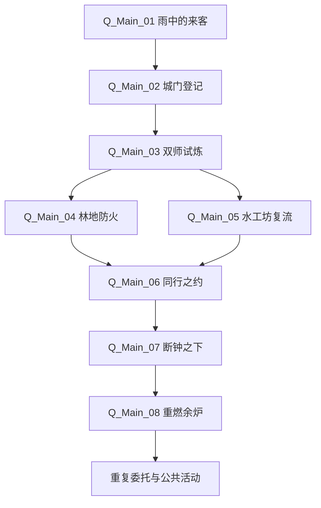
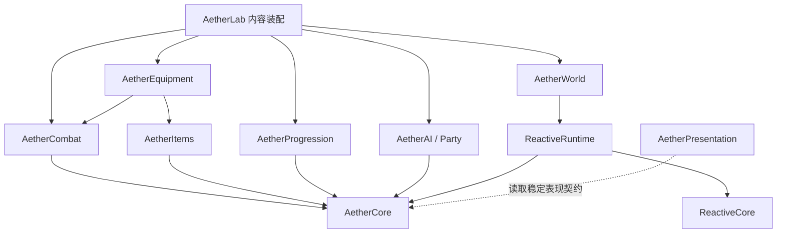
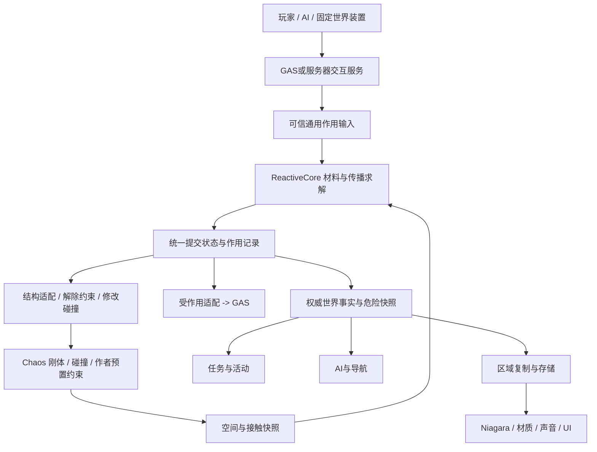

# 《余烬誓约：余炉边境》完整游戏设计与技术实施方案

## v4 · 《旷野之息》式物理交互与化学引擎整合版

**项目：** AetherLab · 余烬誓约：余炉边境  
**版本：** 4.0（完整整合版）  
**日期：** 2026-09-17  
**目标平台：** Windows PC；目标引擎UE5.8，具体补丁/构建在工程基线阶段固定。  
**开发优先级：** 程序架构 > 程序功能 > 玩法 > 美术 > 剧情。

**项目定位：** 以服务器权威、数据驱动、模块化玩法和反应世界为基础的第三人称开放世界迷你MMORPG。玩家从野外沿小路进入中心城镇，学习武学与魔法，完成外勤、日常与公共活动，并与真人或AI同行者共同挑战遗迹。

这是一份完整设计与实施基线，整合游戏流程、逐场景关卡、角色/装备/怪物外观、程序架构、GAS、背包、任务活动、AI、联机持久化、UI图标、工程实施和验收。**数值与性能均为待验证目标；类名与JSON是设计契约，不是已编译代码。** 本次未修改游戏工程、未运行UE测试，也没有将文档完成写成游戏功能完成。

以已交付的v3完整方案为底稿，保留原有24章结构及游戏、工程、美术设计范围，重写第14章，并同步修订玩法、任务、关卡、数据、GAS、AI、网络、存档、UI和验收。本文可单独阅读，不依赖旧图片或其他Markdown；官方技术依据集中在第24章。

**本次确认的范围：只借鉴《旷野之息》的物理交互与材料/元素反应思想，不引入《王国之泪》的自由装配、装备融合、载具建造、自动建造或时间回放。雨不参与电交互。** 关卡作者预置的铰链、吊绳和导体接点仍然保留；玩家可以推、搬、放允许的单体物件，但不能任意黏合构造机器。

“化学引擎”是本项目的广义材料反应层。所有算法、字段、参数和关卡都是AetherLab的设计，既不是任天堂内部实现的复原，也不是已编译工程。设计正文为唯一实施口径；旧对话中超出本版范围的建议不再视为需求。

**优先阅读：** [14章反应世界](#chapter-14) → [4.14水工坊多解切片](#waterworks-slice) → [19.6实施门槛](#reaction-gates) → [23.6范围决策](#scope-decisions)。

## 阅读目录

1. [项目定位、范围与完成定义](#chapter-01)
2. [世界背景与核心玩法](#chapter-02)
3. [游戏流程与主线任务脚本](#chapter-03)
4. [开放世界布局、关卡流程与逐场景外观](#chapter-04)
5. [角色设定、职责与外观制作规格](#chapter-05)
6. [武器、装备、能力与动画配置](#chapter-06)
7. [怪物、首领与战斗阅读设计](#chapter-07)
8. [程序总体架构与职责边界](#chapter-08)
9. [数据驱动与资源管理](#chapter-09)
10. [GAS战斗与角色能力](#chapter-10)
11. [背包、物品与装备事务](#chapter-11)
12. [任务、活动与奖励系统](#chapter-12)
13. [怪物AI、队伍与AI同行者](#chapter-13)
14. [《旷野之息》式物理交互与化学引擎](#chapter-14)
15. [多人同步与服务器安全](#chapter-15)
16. [存档与持久化](#chapter-16)
17. [系统UI、背包UI、图标与表现数据层](#chapter-17)
18. [美术总风格、道具特效与生产交接](#chapter-18)
19. [分阶段实施、回归测试与技术展示](#chapter-19)
20. [服务契约、内容样例与端到端执行](#chapter-20)
21. [可实施的战斗、成长、遭遇与运营数据基线](#chapter-21)
22. [工程实施、引擎选型、迁移与测试细则](#chapter-22)
23. [风险、架构决策、需求追踪与最终验收](#chapter-23)
24. [文档依据与官方技术参考](#chapter-24)

---

<a id="chapter-01"></a>

## 1. 项目定位、范围与完成定义

### 1.1 产品定位

第三人称、可联机、带持续角色成长的开放世界动作 RPG 技术 Demo。玩家从雨中的野外出生，沿小路进入余炉镇，学习武学和魔法，接取个人主线与日常委托，在外围区域探索和战斗，最后与真人或 AI 同行者共同挑战断钟修道院。

“迷你 MMORPG”描述的是游戏结构：公共城镇、野外遭遇、个人成长、任务、活动、背包、组队与服务端持久化。第一版不是万人同服产品，不包含跨服分布式世界，不把四人联机成果当成 MMO 承载量证明。

### 1.2 首版范围锁定

| 维度 | 必做范围 | 暂不做 |
|---|---|---|
| 地图 | 一张约 800×800 米灰盒；中心小城、三片外围区域、环路 | 多大陆、海洋航行、无限地图 |
| 玩法人口 | 先验收服务器+2客户端，再验收4真人；队伍最多4席位，允许AI补位但不要求填满 | 百人同屏、万人同服承诺 |
| 身份 | 一个账号可加载一个角色档案；固定首版角色外观 | 复杂捏脸、账号商城 |
| 动作 | 跳跃、冲刺、轻击、重击、格挡、闪避、施法、交互、倒地救援；允许物件的近身推/搬/放 | 攀岩、游泳、坐骑、空战、远程自由造物 |
| 装备 | 剑、盾、双手锤、法杖；身体与装备分离 | 所有武器门类、复杂词缀组合 |
| 魔法 | 热、水、霜、电四类基础能力；材料反应与机械后果联动 | 任意法术编辑器、无限组合语言、时停/时间回放 |
| 反应世界 | 有限水/燃料、接触导电、可切/可烧支撑、落物和多解任务 | 自由黏合、装备融合、玩家造车、雨滴导电 |
| 内容 | 1条主线、3类日常模板、1个公共活动、1个组队挑战 | 大量支线、世界政治模拟 |
| AI | 3种常规敌人行为、1个Boss、2类同行者 | 大模型在线决策、全城居民生活模拟 |
| 经济 | 单一金币、商店、基础掉落、有限补给 | 拍卖行、玩家交易、公会仓库 |
| 持久化 | 角色、背包、装备、任务、领取记录、必要世界变更 | 全物理世界逐帧持久化 |

首次流程 60～90 分钟为节奏目标；可重复内容的目标时长为单个日常 5～10 分钟、修道院 12～18 分钟。具体数值必须由灰盒试玩修订。

### 1.3 项目级完成定义

完成不是“编辑器中看起来能动”。至少需要独立服务器与客户端构建可以启动；两名玩家任务独立；四人或真人+AI可完成主要流程；重连及服务端重启后正确恢复；取消攻击不重复扣费；同一奖励不能重复领取；晚加入能看到正确世界；关闭粒子效果不改变游戏规则；配置校验与自动回归入口可以重复执行。

第一个纵向闭环限定为：登录 → 接任务 → 拾取与堆叠 → 装备剑/锤 → 切换动画 → 施法灭火 → 击败怪物 → 独立领奖 → 退出重连。该闭环先在小测试场跑通，再装配城镇与大地图。

### 1.4 本版资源与工程边界

美术文字范围锁定为12场景、6核心角色与4服务变体、4玩家装备与2敌方附件、4首版敌人与1储备敌人、10系统UI和82个图标条目。储备角色/图标/敌方附件不自动成为可玩职业、可装备物品或新地图。当前优先级仍是程序架构 > 程序功能 > 玩法 > 美术 > 剧情。

### 1.5 v4借鉴范围与非目标

本次增强的是“既有世界物件之间怎样相互影响”，不是新增建造游戏。关卡预置桥梁可以被烧断绳索后放下，铁杆可以被放到接点之间，木箱可以挡门；这些均由既有材料、碰撞和作者预置结构决定。没有玩家连接编辑器、装配配方、组合体背包或装备融合菜单。

首版验收同时看一致性和用途：同一物件定义能放进第二个场景，且至少支持两种实际用途；一个关键探索目标支持不依赖唯一技能的多条路径。环境解法可以绕过部分战斗，但不能绕过服务器资格、资产归属和奖励事务。

保留12个场景、10个角色、6件装备/附件、5种敌人（含储备）、10个UI、82个图标的既有文字规格。反应需求增加的是可复用道具变体、碰撞/挂点和状态制作要求，不以本版名义自动新增一批完整美术成品。

---

<a id="chapter-02"></a>

## 2. 世界背景与核心玩法

### 2.1 一句话背景

旧文明的能量网络破碎后，边境居民以武学守护道路、以魔法维护遗存。余炉镇依靠一座古老炉心维持供水和灯火；近期断钟修道院的回鸣令外围设施失控，刚到镇上的游誓者被卷入修复道路、救援居民和重新稳定炉心的行动。

旧技术是世界历史，不要求前期出现电脑、现代枪械与赛博城市。首版视觉主体是可生活的剑与魔法小城：雨棚、工坊、灯笼、石桥与磨损的古代导能构件。

统一命名使用“余炉镇、雨落山径、灰烬林地、旧水工坊、断钟修道院”。旧版本中的其他别名不作为正式命名，氛围描述也不自动扩大开发范围。

### 2.2 四条体验支柱

**有生活的中心城镇**：回城可以整备、学习、组队、领任务；设施位置形成短路线，而不是强迫玩家长距离跑菜单。

**武学与魔法互补**：武器提供动作与近战取舍；元素改变局部条件。环境解法是优势选项，不是每场战斗强制谜题。

**可解释的环境**：看到木梁、水面、金属导体，就能预测一定范围内的反应。不按任务名称决定“这扇门能烧、那扇完全相同的门不能烧”；特殊规则必须通过材质和交互提示表达。

**可替代的队伍席位**：真人和 AI 使用相同的行动能力。任务需要团队分工，但首版不能因为没有第二个真人而永久卡主线。

### 2.3 三层循环

| 时间尺度 | 循环 |
|---|---|
| 10～40秒 | 观察 → 格挡/走位/施法 → 改变条件 → 输出窗口 → 调整资源 |
| 5～15分钟 | 城镇接取 → 选择装备/同行者 → 外勤目标 → 战利品 → 返回或继续探索 |
| 60～90分钟 | 入城 → 双师试炼 → 两项外勤 → 解锁进阶能力 → 组队遗迹 → 世界局部恢复 |

### 2.4 成长、失败与经济

角色等级只提供有限基础提升和区域资格；武学修习解锁攻击形态；魔法修习解锁元素能力。武器类型不等于职业，装备更换不销毁角色。

倒地时保留身体并开放救援交互；救援被受控或死亡中断。全队失败恢复到最近据点，不回滚其他队伍的世界状态。首版不掉落整个背包、不永久损失装备；可保留补给消耗作为轻度代价。

金币来源是任务、活动与少量战利品，主要消耗在药剂和基础整备。每日任务提供材料与辅助成长，不锁住主线。暂停菜单不暂停在线服务器，必须在设置或帮助里明确提示。

### 2.5 系统化玩法语法：玩家改变条件，世界承认结果

| 玩家动作 | 直接作用 | 可组合的世界后果 |
|---|---|---|
| 剑切 | 向允许切割的部件提交切割作用 | 吊绳断裂、障碍落下、桥放下 |
| 锤击/推动 | 机械作用、位移、结构损伤 | 移开掩体、滚落物体、接触改变 |
| 搬运与放下 | 改变允许单体的位置 | 木箱挡门、木板搭靠、铁杆接触供电 |
| 热术 | 有预算地注入热 | 点燃、烧损支撑、融化指定冰面 |
| 水术 | 有限水转移/浸湿 | 灭火、改变受电响应、在允许位置补水 |
| 霜术 | 有预算地抽热 | 指定水面冻结、通路/液态连接改变 |
| 电术 | 合法首击及接触传播 | 角色受电、机关受电、有限电热后果 |

典型循环是观察材质与空间→提出方法→移动或施法→观察局部反应→利用新的机会。任务叙述给“救人、通行、供水”等目标，而不提前保证只有一把钥匙才有效。密集特效、隐藏属性堆叠和相同画面不同规则不能代替这一循环。

---

<a id="chapter-03"></a>

## 3. 游戏流程与主线任务脚本

### 3.1 主线状态图



Q06 的前置是 Q04 与 Q05 都完成，而不是任意一个完成。图节点代表内容定义，玩家拥有自己的 QuestInstance。

### 3.2 逐任务脚本

| 任务 | 进入条件 | 目标与行动 | 退出条件 | 解锁/奖励 | 预计时长 |
|---|---|---|---|---|---|
| Q_Main_01 雨中的来客 | 新角色首次进入 | 在驿站醒来；学习移动；拾取两份补给；沿灯火走向城门 | 到达城门交互区 | 保留拾取物；解锁登记 | 5～8分 |
| Q_Main_02 城门登记 | Q01完成 | 与登记员对话；访问旅舍；设置恢复点 | 服务器成功绑定据点 | 基础金币、入城资格 | 4～6分 |
| Q_Main_03 双师试炼 | Q02完成 | 武馆领训练剑盾；3次有效轻击；1次格挡；术院学习引焰/引泉；熄灭训练火盆 | 4个个人训练目标完成 | 正式基础能力、80金币、药剂 | 10～12分 |
| Q_Main_04 林地防火 | Q03完成 | 去林地；处理3个指定火点；解除一处受困点；应对近战怪物 | 目标火点满足状态与归属规则 | 凝霜修习资格、材料 | 8～12分 |
| Q_Main_05 水工坊复流 | Q03完成 | 进入工坊并恢复供水；可战斗、绕行、断电、释放木桥或操作机械旁路；解救受困工匠为可选目标 | SupplyRestored世界事实与本次有效参与凭据成立；不检查唯一操作次序 | 鸣雷修习资格、法杖 | 8～12分；首次系统试验可延长 |
| Q_Main_06 同行之约 | Q04、Q05完成 | 学习队伍菜单；邀请真人或添加AI；在集结点确认出发 | 合法队伍与区域资格满足 | 遗迹准入 | 3～5分 |
| Q_Main_07 断钟之下 | Q06完成 | 前庭→水道→侧廊→钟炉；保护引导；解决铸钟守卫 | 队伍遭遇完成，个人有有效参与记录 | 古印、主线结算资格 | 12～18分 |
| Q_Main_08 重燃余炉 | Q07完成 | 回镇交付古印；恢复一处灯火和供水设施 | 提交材料、世界动作与个人奖励结算成功 | 日常与活动开放 | 4～6分 |

### 3.3 教程的不可卡死约束

Q01 的路边救援是可选内容。玩家尚未学会魔法，因此必须能推倒水桶或沿替代路绕行。不能用“学会引泉”才能完成入城前救援，而引泉又只能入城学习。

训练剑盾通过教学授予记录发放一次；丢弃或异常卸下后允许在武馆补领训练道具，但补领不产生可出售利润。教学火盆按玩家实例或训练会话管理，不能让其他玩家提前熄灭就导致新玩家永远无法完成目标。

主线涉及公共设施时，区分“世界已经修复”与“个人参与了修复”。后来的玩家可以完成替代检查/协助步骤，不需要把桥重新毁掉。世界动作成功但奖励存储失败时，玩家应能重试结算，不能重新刷Boss来弥补数据库失败。

### 3.4 三类日常

| 模板 | 可变数据 | 结算规则 |
|---|---|---|
| Daily_Extinguish | 区域标签、火点类型、目标数量 | 只统计本任务期间有效的状态转换；重复燃烧同一火点不重复计分 |
| Daily_Supply | ItemDefinitionId、数量、提交NPC | 交付时检查当前持有量并原子扣除；“曾经拥有”不等于可提交 |
| Daily_Patrol | 遭遇标签、完成次数、难度 | 统计 EncounterCompleted，而不是客户端自己上报的击杀数 |

每日日常周期由服务器统一计算。奖励幂等键包含角色、任务定义、周期与奖励项。新周期创建新任务实例，旧周期记录仍保留用于去重与审计。

### 3.5 NPC职责与多人教学

Q01可选救援对象为宁榆；Q02由南门登记员岚汀登记，再到柏恩的旅舍绑定恢复点；Q03分别与岑岳、洛灯学习；朵拉提供补给与装备说明；Q08由艾诺接收主线结果。砾石与沐禾在旅舍集结点加入队伍。服务角色可使用基础体型换装变体，不新增复杂行为系统。

教学用训练会话实例标识参与者，材料台使用会话归属或轮流占用机制。新玩家开始训练不能全服重置同一块木材和天气；其他人完成训练也不能把其步骤提前清空。接取时校验前置，领奖时再次校验结果，NPC对话只是入口。

跨任务的稀有主线物品使用任务锁定或持久完成凭据，防止误出售造成卡关。古印交付与个人任务完成、奖励记录形成一致的结算计划；公共灯火已由其他玩家恢复时，个人仍可提交自己的资格凭据，不再次关闭灯火。

### 3.6 主线与多解规则的结合

Q01没有魔法要求，倾倒已有水桶、解除可操作阻挡或绕路都合法；Q03只在教学目标里要求特定动作。Q04的火点仍按唯一任务点去重，参与过的玩家可使用水术、现场水源等既有规则处理。Q05的侧门/桥/水渠只负责进入方法，最终目标是供水结果；不能要求先击杀所有守卫再允许供水开关工作。

第一次做Q05时尚未获得鸣雷，必须有机械旁路和作者预设电源；先做Q04才学会凝霜的玩家可以使用冻结路线，未学会者也能完成。自由选择外勤顺序不是装饰，不能在任务条件中形成隐蔽循环依赖。

公共设施先被其他人修复时，按第12章读取当前事实并提供检查/协助凭据，不把世界强制毁回初始状态。提前合法救援可留下世界或个人凭据，但不自动跳过未满足的全部主线前置。探索目标允许多解与奖励权限严格校验同时成立。

---

<a id="chapter-04"></a>

## 4. 开放世界布局、关卡流程与逐场景外观

### 4.1 地图坐标与关卡职责

采用800×800米左右的连续灰盒作为起点，设计坐标X向东、Y向北，进UE时按既定方向转换成厘米。相邻场景是同一张地图内的区域；概念图里的远山不代表可探索的第二大陆。城镇到外勤的目标步行体验约1～2分钟，必须与实际移动速度同时试玩。

| 区域 | 中心坐标（米） | 建议范围 | 主要联系 |
|---|---:|---:|---|
| 余炉镇 | (0,0) | 半径80～100米 | 所有服务和返程中心 |
| 雨落山径 | (-65,-290) | 约80×180米 | 南门连续入城 |
| 灰烬林地 | (-270,0) | 约140×180米 | 西门外勤与回环 |
| 旧水工坊 | (270,0) | 约130×150米 | 东门外勤与维护栈道 |
| 断钟修道院 | (0,270) | 约170×160米 | 北侧组队挑战 |
| 中继活动点 | (250,220) | 约90×90米 | 东北环路公共活动 |

主路和替代路同时可见；桥、门和关键机关有稳定ID。城镇保护区阻止玩家破坏服务设施；训练位单独开放能力。先实现客户端内容流送，服务端必要权威对象与活跃区域调度另行定义，不因为客户端没看见就销毁公共任务状态。[S10](#ref-s10)

| 场景ID | 关键玩法 | 核心物件/空间 | 防卡死与重入 |
|---|---|---|---|
| SCN_01 | 出生、拾取、可选救援 | 箱1、补给2、水桶1、小火1、路标2 | 水用完可绕行，一次性补给不重领 |
| SCN_02 | 任务与公共恢复 | 炉灯、水井、功能建筑入口 | 公共恢复不替代个人任务 |
| SCN_03 | 入城登记 | 带顶登记台、门洞、侧道 | 门内安全、重复登记不重发奖励 |
| SCN_04 | 攻击和格挡训练 | 两训练位与示范区 | 会话归属、训练道具不可盈利补领 |
| SCN_05 | 热/水教学 | 木/金属/水三试验位 | 局部重置，不清空全局反应 |
| SCN_06 | 补给交易 | 柜台、工作台、水槽 | 容量、余额、商品版本服务端校验 |
| SCN_07 | 复活点与AI加入 | 四人小院与布告板 | 脱战调整，不复制同名同行者 |
| SCN_08 | 灭火与救援 | 三火点、湿河岸、货棚 | 同点不重复刷进度，雨后有替代目标 |
| SCN_09 | 水电机关、多解进入与复流 | 闸2、开关2、池1、石墩3；局部增加预置木桥、绳索、可搬木箱/导体 | 无鸣雷/凝霜也能用机械旁路与维护道 |
| SCN_10 | 前庭、水道、侧廊 | 并行入口、协作锚点、返回近路 | 队伍遭遇占用，AI可达，不阻塞唯一退路 |
| SCN_11 | Boss阶段与供水 | 直径34～40米、外圈4米以上、两供水点 | 无特定职业仍可击败，失败释放机关 |
| SCN_12 | 公共三波防守 | 塔、两入侵路、两接地杆、四掩体 | 晚加入读当前阶段，结束停止危险 |


### 4.2 SCN_01 雨落山径

**定位与印象：** 雨中的新手出生地。不是荒凉恐怖片，而是“有些狼狈，但远处有人烟可去”。画面中心是一条向山下缓慢转折的湿石小路，末端可见余炉镇南门和少量暖灯。

**镜头与空间：** 宽幅人眼高度视角，建议约35毫米等效的自然透视。前景为左侧有木顶的旧驿站、旅行毯和小物资箱；中景是翻倒货车、浅水沟和两条可读通路；后景是河谷和低矮门楼。道路占据连续清晰的画面带，不被灌木、人物或标题挡住。

**建筑与道具：** 驿站由石基、深色木柱、斜顶木瓦组成，边缘绑着一盏铜灯。货车只有一侧轮轴损坏，箱体还能辨认；可推倒的水桶放在明显可达的平台上。火点来自湿雨无法直接淋到的车篷下干草，避免“大雨中完全暴露的小火永不灭”的视觉矛盾。

**色彩与材质：** 雨雾青灰、湿木深褐、苔灰绿为主，灯火和少量火苗提供橙金焦点。石路边缘比中央积水深；屋檐下物资保持较干。雨丝不能密集到遮挡路径。

**玩法可读性与状态：** 初始显示小火、倒车与可选救援；熄灭后保留焦黑草料、湿痕和短暂蒸汽，不瞬间恢复成全新物体。备用小径始终可见。角色尺度参照只使用小面积背影。

**独立成图要求：** 一张无文字全景为主，附一张货车—水桶—绕行路的近景研究。不得绘制宏伟王城、巨型瀑布门或必须攀岩才能通过的道路。


### 4.3 SCN_02 余炉镇广场

**定位与印象：** 世界的安全中心，温暖、整洁但不奢华。城镇地标是低矮的炉灯与水井组合，不是遮挡半个画面的巨型英雄雕像。

**镜头与空间：** 从南门内侧略抬高观看广场。前景石路和排水槽将视线引向中央炉灯；中景左为武馆门廊、右为术院的小型玻璃顶建筑；北侧露出通往修道院的路口。广场建议直径约35米，房屋以两层为主，只有一座较高的公共钟屋。

**建筑语汇：** 灰白石基、木框架、浅色抹灰墙、灰绿或深蓝屋瓦、短雨棚。路边有花箱、布告架、修补过的长凳、饮水槽和折叠货架；各店面以器物轮廓识别用途，不悬挂现代发光文字屏。

**色彩与光照：** 雨后薄云中的柔光，地面仍有局部反射，窗内蜂蜜色灯光；空气清透，远处山体退到低对比。市民衣着颜色较主角更低饱和，防止服务NPC淹没在人群中。

**变化版本：** 主线前炉灯偏弱、一条水槽暂时停流；完成后该设施亮起并恢复细水，不重造全城。夜间保持主路灯链与窗口光，避免用满城火焰表达热闹。

**成图重点：** 必须看出“能在此接任务、学习、补给、组队”，但不用箭头和技术图标说明。群众仅为少量成年生活角色，不由概念图隐含新增大规模人群模拟。


### 4.4 SCN_03 南门与入城小路

**定位与印象：** 从不确定的荒野转入被照顾的公共空间。城门朴素可靠，门洞两侧圆润石墩与灯架强化安全感。

**镜头与构图：** 从门外约20米处正偏侧观看，能看到门洞后的广场炉灯。前景道路稍有坡度但没有陡阶，中景登记台位于门内侧而非行走中心；右侧留一条运货侧道。门洞建议宽约5米、高约6米，不画成峡谷般的巨大城墙。

**外观细节：** 石块下缘有水渍与苔痕，上部修补石颜色稍浅；木门钉为小型铜件，不装满尖刺。城徽是开口灯环包住一簇小火，使用浮雕而非复杂文字。登记桌有遮雨顶、册簿、印章、布垫和收纳箱。

**角色与氛围：** 登记员岚汀站在门内光线较暖的位置，可以自然挥手指引旅舍。守卫只作生活背景和安全说明，不堵住摄像机。人物面孔不需要占据大面积。

**状态与边界：** 开门状态是主要版本；关闭状态只用于非阻断式演示，不把主线进城锁在玩家可破坏的门上。门外雨重、门内雨棚较干的关系清楚。禁止战场关隘、处刑装置、阴森铁笼和压迫性的军事都城造型。


### 4.5 SCN_04 武馆

**定位与印象：** 有木料温度的训练空间，可靠、克制，带适量东方武馆秩序感，但与城镇石木建筑保持统一。

**镜头与结构：** 从入口斜看室内，前景是收起的训练垫与鞋底磨痕，中景左右各一个训练位，后景为导师示范区与武器架。建议24×20米左右活动范围、净高至少5米，横梁和灯具不妨碍第三人称镜头。柱子沿边布置，不置于对练中心。

**材料与陈设：** 蜂蜜褐木地板、灰白石下墙、米白墙面、深蓝布幔。训练傀儡用木柱、粗绳与皮革受击块组成；攻击位用磨损圆垫，格挡位用淡金边线区分。武器架只展示核心剑、盾、锤，不无意增加十几种武器门类。

**光照与人物：** 高窗柔光照亮角色手部和武器，后方暖灯不抢焦点。岑岳的深褐外衣与浅色墙形成轮廓对比。器械分布有秩序，不能用密集兵器遮住训练目标。

**状态：** 训练前目标完整；命中后出现受压反馈但不产生血迹；一次训练结束保留姿势或小标识，目标重置只改变局部。门外保留普通城镇生活，而不是整个室内变成竞技场。

**成图重点：** 一张完整空间主图，另做训练傀儡和装备架特写。禁止整排发光地板、现代健身设备、悬空按钮和长篇门派文字。


### 4.6 SCN_05 术院

**定位与印象：** 小型研究与教学工坊，明亮、好奇、可亲近。空间更像有人使用的温室实验室，而不是皇家魔法大殿。

**镜头与结构：** 从进门处看向长试验台，前景有水壶、折叠布巾与石质托盘；中景依次为木材、金属、水盆三处试验位；后景是一面低矮玻璃顶和青铜透镜架。台间留双人通过的通道，尖锐或危险装置远离面部高度。

**材料与轮廓：** 象牙白石台、浅木抽屉、旧铜导环、浅青晶体、无色厚玻璃。魔法装置必须有底座、支撑和连接，不是一堆漂浮符号。玻璃表面有可控制的反光，仍看得见水量与材料。

**色彩与光照：** 奶白与低饱和水青为主，少量蜂蜜金窗光。水系晶体柔亮但照不白整张桌面。洛灯的银蓝发色与深蓝下层衣料形成层次，脸部不被逆光压黑。

**状态与教学物：** 木块可见干燥—点燃—浇湿三种差异；水槽刻线作为世界内的容量提示；金属导线与石台间有明显绝缘支脚。首次画面不要同时燃烧、电击、结冰，把所有焦点挤在一处。

**成图要求：** 独立室内主图与一张试验台材料研究页。禁止现代化学实验室白大褂、电脑、玻璃幕墙摩天楼以及满屏不可读魔法文字。


### 4.7 SCN_06 工坊商店

**定位与印象：** 能买补给也能看见物品如何被制造的小店。安全炉火、工具的使用痕迹和干净陈列形成生活感。

**镜头与布局：** 半开放沿街店面，前景是两级矮台阶或无阶入口，中景为交易柜台，后方偏左工作台、偏右冷却水槽。店员朵拉可以在柜台与工作台之间短距离移动；顾客站位不覆盖锻造动作区。

**物件语言：** 木柜、皮革工具卷、铜秤、盛放药剂的浅盘、小型砧座、金属夹具。瓶子有形体差异，材料按用途分区；剑盾挂在坚固横杆上，锤头不悬浮。白布覆盖未完成作品，角落有装木料的短框。

**色彩与材质：** 暖木褐、暗铜、青灰石与少量蓝布标记。炉口仅小面积橙光，店员脸部有环境补光。地面只有合理的煤灰与水迹，不形成泥泞垃圾场。

**交互与状态：** 可交易物件用整洁陈列区区分，背景工具不全部带高亮。售罄可以表现为空格和收起的托盘，不在主原画画“库存为0”等数据。修理功能未开放时不以巨大锤子按钮暗示已可使用。

**禁止元素：** 现代收银机、价格霓虹牌、枪械、复杂工业流水线，以及把整个村庄拍卖行写入店内。


### 4.8 SCN_07 旅舍与队伍集结点

**定位与印象：** 可避雨、可等候同伴、可以放心休整的小院。它是玩家返回后的心理落点，不是军营或大型酒会场所。

**镜头与布局：** 从院门看向旅舍门廊，前景为湿石板与矮花箱，中景四人可自然站位的空地，侧面布告板、长凳和饮水盆，后景是开着暖灯的普通木门。院内建议约18×16米，过道能够让跟随AI进出。

**装饰与材料：** 圆角石墙、旧木门、米白窗帘、灰绿屋瓦。布告板旁挂四个小木牌，暗示集结而不烘焙玩家名字。长凳上放折好的毯子，屋檐滴水落入窄排水沟。小院有被照料的草木，不铺满花瓣。

**角色与色彩：** 柏恩在门廊迎客；砾石、沐禾的等待位相隔一定距离，不能所有NPC叠在同一个互动点。主色为暖木、柔米白、深海蓝，火炉暖光只从室内透出。

**状态设计：** 白天与夜间保持同一布局，夜间增强屋檐灯；队伍准备完成只在游戏UI显示，不把“准备”字样刻入场景。复活/休整标识是低矮灯环，不是通天光柱。

**禁止元素：** 豪华宫殿旅馆、现代床铺、赌场、舞台演唱会、满场猫狗或新增宠物系统暗示。


### 4.9 SCN_08 灰烬林地

**定位与印象：** 被局部山火伤过、仍在恢复的森林。危险明确，但不成为满地焦尸的末日场景。

**镜头与空间：** 从低坡向林间空地看去，前景湿草与一段灰黑倒木，中景干叶火点、临时货棚和救援通路，后景为仍青绿的高树与薄雾。主路、湿河岸绕行路和倒木下方捷径三者能被看出，而不是只有一条布满火焰的走廊。

**地貌与材质：** 灰褐树皮、焦黑只集中在受火部位，新枝和蘑菇只作少量恢复细节。可烧木梁有明显干裂纤维；普通不可倒树干不刻意画成同样的脆弱绳索结构。河岸颜色较冷、地面有湿反光，与易燃落叶区形成对照。

**光照与敌人：** 斜向天光穿过疏树照在可走空地；荒野狼轮廓与石木背景分开，拾荒施术者占据可绕行的小高台。火焰最大高度不持续遮住成人胸部以上的敌人动作。

**状态研究：** 火点燃烧时边缘可见蔓延趋势；熄灭后是潮湿炭色和轻烟；雨后部分火点自然减弱，但屋顶遮蔽内仍可保留火源。救援完成后货棚口打开，不把整片森林刷成全新绿色。

**禁止元素：** 永久红天、流血树、满屏浓雾、不可见地面，以及只有学会尚未解锁技能才能离开的设计。


### 4.10 SCN_09 旧水工坊

**定位与印象：** 可理解结构的旧水利站，优雅但务实。水渠、金属导体和机械拉杆是主要视觉语言。

**镜头与构图：** 从维护栈道俯斜看水渠，前景是干燥石平台和断开开关，中景三段渠槽、步石和两道闸门，后景蓄水池与低矮塔屋。轮廓是横向水道加一个中等高度调压塔，不画成巨型空中水城。

**材质与连接：** 浅灰石、受水侵蚀的边缘、暗青铜管、局部铜绿和木栈道。导体可看见从线圈到金属板的连续路径；绝缘支脚和断开的间隙要清楚。水面较浅，能看到石底和流向，危险电弧发生在特定导体附近。

**色彩与光照：** 主体冷灰与水青，机械操作点用少量暖铜。水反射不要像镜子一样遮住台阶。远景薄云提供柔光，雷光不是唯一照明。

**玩法状态：** 失控时一段电弧间歇跳动、一闸关闭；切断导体后相关电弧停止；复流后水轮慢转且水道连通。机械旁路在第一次画面中就应可见，证明玩家不必先学鸣雷。

**细节页：** 闸门正侧视、拉杆两档姿态、金属板与绝缘石墩连接、干湿地面交界。禁止现代高压变电站造型、科幻控制台以及电弧覆盖所有安全站位。


### 4.11 SCN_10 断钟修道院外部

**定位与印象：** 庄严而安静的旧修道院，既是远景地标，也是可进入的队伍挑战区域。它保留日常修缮痕迹，不是无法理解用途的恶魔城。

**镜头与空间：** 从断桥前略低机位看向前庭。前景桥栏与绳索、左侧可绕行维护道，中景小型庭院和侧廊，后景一座缺损钟楼。主楼两至三层，钟楼高于树冠；外观规模应与约170×160米挑战区相称。

**形体与装饰：** 浅灰石拱、圆角窗框、碎裂但仍连贯的铜钟、局部青瓦。墙面纹样采用灯环与流线，不使用现实宗教机构的完整标志。绳索和木桥可交互件独立、有可信挂点。

**色彩与光照：** 冷石与暗青铜为主，少量残存暖灯表达曾经有人守护。天空可以阴云但留天光；不用血月或满天陨石制造最终关难度。

**空间读图：** 前庭可看出两人并行的路线；侧廊入口和近路开关有不同的建筑框景。敌方锈甲卫士站在不堵死唯一退路的位置。水道协作区与大厅之间有短暂安全整备位置。

**状态与禁项：** 守卫解决后残灯转稳、钟不再异常震动，不让整座建筑崩塌。禁止把这里扩成多个独立副本、无穷塔楼或华丽宣传主城。


### 4.12 SCN_11 钟炉大厅

**定位与印象：** 有明确战斗几何的首领大厅。最醒目的是中央炉心和铸钟守卫，玩家应立刻理解危险来自何处以及可以站在哪里。

**镜头与空间：** 从入口向中心观看，地面近似圆形或宽八边形，设计直径34～40米，外圈连续通路宽至少4米。三根主柱靠近外环，不把中心分成不可见的小房间；两侧供水点有独立可站平台，后方有维修通路而非深渊。

**材料与结构：** 灰石地面带嵌铜导槽，中央炉台高度较低，断裂钟体悬在后上方的坚固支架上。上方结构不直接遮挡俯视镜头。水槽与中央炉心有可信连接，但管线不铺成满地绊脚杂物。

**色光阶段：** 常态为低亮青铜与暗青炉窗；过热时炉窗橙亮、机械百叶打开、地面局部出现短火线；暴露时胸甲分开，核心呈青白并附稳定外圈轮廓。三阶段不仅换颜色，也改变机械开合和守卫姿态。

**动作阅读：** Boss轮廓高于玩家，锤子离身体有清楚负空间。火区覆盖部分场地而非全场，供水点能观察中央攻击前摇。击败后的大厅保留行走与返程空间。

**成图要求：** 一张低特效常态主图，三张局部状态研究可在另页。禁止把大量技能、伤害数字和UI烘焙进场景原画。


### 4.13 SCN_12 雷雨中继活动场地

**定位与印象：** 城外可多人协作守护的小型能量中继站。雨负责氛围和已声明的热/湿效果；电危险来自有预警的故障电源与敌人技能，不是雨滴导电，也不是雷雨自动追踪金属装备。整体不画成末日巨型电站。

**镜头与布局：** 从外环小坡看中心塔，前景干燥石台与救援灯，中景中央中继柱、左右两根接地杆和四个低掩体，后景两条入侵小路。占地约90×90米；塔高约12米，在区域内可看见但不抢过修道院的世界地标地位。

**外观语言：** 石基、铜环、圆润陶质绝缘块、嵌青晶体。接地杆与地面导线真实相连，断线处和安全干石之间有明显材质差异。掩体高度允许玩家观察，不做完全封闭堡垒。

**光照与天气：** 雨云青灰，天空闪光少量、间歇且默认只作表现；核心有稳定淡金信标，未进入活动时降低亮度。装饰雨湿与有作用资格的水面分开制作。屋檐能避雨但不自动提供电免疫；安全站位依照实际电源、接触范围与地形确定。

**阶段变化：** 预告时外环缓慢亮起；守护阶段指示不同方向的入侵；核心稳定时从不规则电弧变成连续柔光；结算后熄灭战斗危险并保留一盏可识别灯。活动文字、倒计时和奖励按钮只存在于UI。

**独立画面要求：** 必须真实体现两条入侵路、两根接地杆和可走外环。禁止复用修道院图冒充新场地，禁止现代天线阵列和全地面不留安全区的电网。

<a id="waterworks-slice"></a>

### 4.14 旧水工坊多解切片：60×80米核心灰盒

在SCN_09既有约130×150米区域内划出约60×80米核心，不新增地图。目标试玩10～15分钟，与最终主线8～12分钟节奏分别记录。玩家目标是恢复供水；可选解救工匠。工匠使用服务NPC体型变体，不新增独立骨架或人物主线。

**布局：** 南侧入口能看到北侧的调压塔与供水输出；中间为三段浅渠，西侧是维护道，东侧是可供电侧门。预置木桥由可切/可烧绳索吊住，下方没有必须即死的深坑。固定电源、断路开关和绝缘底座可追踪；工具区提供可搬木箱、松置木板和已有导体开关的可移动桥片变体。

| 区段 | 玩家可理解的问题 | 放置的系统物件 | 达成后的结果 |
|---|---|---|---|
| 入口观察台 | 怎样越过水渠到达供水控制区 | 木桥、绳索、维护道、两只木箱 | 看见至少两种可行入口 |
| 水渠/侧门 | 如何避开或中止局部电危险 | 固定电源、断路开关、有效水面、绝缘石墩 | 断电、旁路或合法接触供能 |
| 工匠平台 | 阻挡/火点使救援不便 | 一个可推障碍、有限水桶、受困NPC | 被救者可到安全平台 |
| 调压塔 | 供水尚未恢复 | 手轮/水闸、可见流路 | 权威SupplyRestored事实 |
| 回程近路 | 如何离开并保留世界结果 | 稳定后的桥/维护门、返回路径 | 个人结算与公共状态分离 |

**四条验证路线：**

| 路线 | 操作示例 | 资源/风险 | 是否是任务硬条件 |
|---|---|---|---|
| 维护道/战斗 | 沿可走旁路进入，处理阻挡自己的敌人 | 战斗与补给 | 否 |
| 释放木桥 | 剑切或烧断吊绳，等待桥稳定 | 接近风险、动作或法力 | 否 |
| 冻结浅水 | 已学凝霜者冻结允许水面，再利用通路 | 有限水和冷却预算 | 否；未学者仍能过 |
| 导体接触 | 搬动允许的导体桥片，接通现有源和门机 | 摆放、接触、危险站位 | 否；不要求鸣雷 |

玩家用木箱当踏步、借现有木板搭靠等未预设方法，只要碰撞、移动和保护规则允许，任务应承认最终结果。不会因为没有触发某条路径的专用动画就拒绝结算。

**两条必须可运行的因果链：** 一是“加热绳索→结构失效→桥落下→导航可用”；二是“移走导体→电接触退出→供能停止→危险消失”。前者不由火技能直接开桥，后者不靠任务脚本手动关闭电特效。

**防卡死：** 维护道始终保留；物件丢失不能迫使重建世界或重新点火。关键角色采用可恢复的受困/救援状态，不允许无提示永久杀死导致主线失败。供水恢复只需最终流路条件成立，控制阀的日志用于归属与调试，不构成唯一按键序列。

**多人：** 同一可搬物件只有一个操作租约；公共关卡已完成时提供个人检查步骤；用于独立测试的遭遇运行版本与公开世界隔离，测试重置不能影响正在游戏的其他玩家。

### 4.15 向既有场景复用，不扩展玩法类型

山径复用有限水桶、可推动阻挡；术院把相同材料放在独立教学会话中；林地复用燃料补丁、遮蔽雨和可烧支撑；修道院复用桥、绳、水面与断电路径。钟炉大厅只开放明确标记的机关/局部支撑，禁止玩家摧毁整座建筑。中继活动的电源与雨分离，天气不会自动改变全场电传播网络。

同一物件在新场景改变参数或保护策略时必须有外观理由。大型锚固梁与松置木板可以有不同可动性，不能把外观完全相同的一根绳索仅因任务进度不同就临时变成无法切割。

---

<a id="chapter-05"></a>

## 5. 角色设定、职责与外观制作规格

6名核心角色加4名服务NPC变体。服务NPC变体复用基础身体、衣物模块和动作，不新增4套复杂骨架或战斗系统。所有年龄和身高为制作规格，不作为战斗强度。每人各有一张独立设定页；正侧背的服装结构、左右挂点、发饰位置必须一致。

| ID | 名称 | 职责 | 年龄与尺度 |
|---|---|---|---|
| CHR_01 | 游誓者 | 主角；首版固定外观 | 成年女性，约23岁；约165厘米 |
| CHR_02 | 岑岳 | 武学导师 | 成年男性，约38岁；约180厘米 |
| CHR_03 | 洛灯 | 魔法导师 | 成年女性，约29岁；约170厘米 |
| CHR_04 | 砾石 | AI前卫 | 成年男性，约34岁；约185厘米 |
| CHR_05 | 沐禾 | AI支援 | 成年女性，约25岁；约163厘米 |
| CHR_06 | 艾诺 | 镇长；主线交付 | 成年年长男性，约62岁；约174厘米 |
| CHR_07 | 岚汀 | 南门登记员；服务NPC变体 | 成年女性，约27岁；约168厘米 |
| CHR_08 | 朵拉 | 工坊店员兼工匠；服务NPC变体 | 成年女性，约36岁；约172厘米 |
| CHR_09 | 柏恩 | 旅舍主人；服务NPC变体 | 成年男性，约46岁；约176厘米 |
| CHR_10 | 宁榆 | 受困旅人/信使；服务NPC变体 | 成年女性，约24岁；约166厘米 |

### 5.1 CHR_01 游誓者

**资源定位：** 主角；首版固定外观。**尺度：** 成年女性，约23岁；约165厘米。

建议文件名：`CHR_01_Wanderer_Turnaround_v01.png`。

**轮廓与气质：** 身形轻盈、结实而非纤弱，约七头身；头部略带二次元柔化，整体仍是成年旅行者。短披肩、收束腰部和不妨碍跑动的下装形成上宽下轻的轮廓。气质温和、好奇，遇到危险时眼神集中，不始终保持夸张卖萌表情。

**头发与面部：** 银白短发至颈肩，后发分成几组清楚体块，右侧有一小枚旧金发扣，额前刘海不挡双眼。眼睛青灰，虹膜有一圈低饱和蓝绿；眉形柔和但能做坚定表情。皮肤自然、细节节制，不做镜面塑料或照片级毛孔。

**服装分层：** 外层象牙白短披肩，边缘一条深蓝细线；内层深海蓝束腰旅行上衣，胸腹由少量软皮护片保护。下装为深色合体长裤与短分片腰摆，双腿在迈步时轮廓清晰。深褐中筒靴、皮革护腕、薄手套，鞋底稍厚。右肩至左腰有一条用于小包的斜带，不与武器收纳带冲突。

**识别物与配色：** 右前臂小型铜环施法导具，内部青色小晶体；它支持空手施法的设定，但不是不可替换的武器。背侧放扁平水囊、左腰预留剑鞘位，披肩只到腰上，不遮挡装备。主色象牙白与深海蓝，金色面积很小。

**动作与装备适配：** 剑盾姿势双手清楚；换双手锤或法杖后肩臂可大幅活动。人物身体原画必须提供不持武器的中立姿态，装备作为分层附件；手指、腰带、袖口不得把武器固定画死。受击、救援时衣摆不过度挡脸。

**设定页与禁项：** 正、侧、背同身高，另给平静、微笑、专注三个表情，以及护腕、鞋底、腰带挂点细节。禁止幼儿比例、露骨服装、超过膝部的长披风、巨大发光羽翼和自动伴随的宠物。


### 5.2 CHR_02 岑岳

**资源定位：** 武学导师。**尺度：** 成年男性，约38岁；约180厘米。

建议文件名：`CHR_02_CenYue_Turnaround_v01.png`。

**轮廓与气质：** 肩背宽而稳定，腰部收束，站姿端正但放松。严谨、可靠，不是暴躁教官；抬手示范时动作干净，微笑以眼角变化表现。身体略壮实但不使用健美式夸张肌肉。

**面部与发型：** 黑褐短发略向后梳，两侧收短，鬓角少量灰发；深棕眼、较清楚眉骨、下巴有短胡茬。左眉可有一条很淡的旧伤，不遮眼，不以巨大伤疤或阴影制造反派形象。

**服装与材料：** 深褐短训练外衣，内层米灰上衣，肩臂只用轻型皮护片；前臂裹布与手套掌心有使用磨损。深海蓝腰带收住衣摆，灰黑长裤、低装饰皮靴。胸前一枚小型武馆结绳徽记，颜色温暖但不鲜红满身。

**道具：** 示范剑采用誓行剑的训练变体，护手和刃口钝化；盾使用守路盾旧款。腰间只有磨刀布、小工具套，不挂几十把武器。训练武器可独立卸下，普通交谈时双手空闲。

**动作阅读与制作：** 主要姿态为双手背后待机、掌心向上的说明、侧身举盾、持剑示范。袖口紧贴前臂，不妨碍手腕骨和盾牌带。首版优先共享人形骨架，体型差异由网格和重定向校验承担。

**设定页：** 无武器正侧背、持盾示范小图、严肃/赞许/思考表情，护腕磨损近景。禁止皇族披风、满身尖刺重甲、巨大背旗和与城镇完全不符的现代运动服。


### 5.3 CHR_03 洛灯

**资源定位：** 魔法导师。**尺度：** 成年女性，约29岁；约170厘米。

建议文件名：`CHR_03_LuoDeng_Turnaround_v01.png`。

**轮廓与气质：** 线条纤长但有实际行动能力，气质从容、好奇、愿意解释。整体轮廓以短斗篷和束袖构成，不用遮脸尖帽与拖地长袍。

**面部与头发：** 淡蓝银发在后脑低束，肩前仅两束短发；眼睛为浅紫灰，眉眼温柔但不过度圆大。发夹采用小型透镜环，绝不画成复杂天线。表情重点是倾听、发现现象时的轻笑和认真制止危险。

**服装分层：** 象牙白短斗篷覆在深蓝窄袖长上衣外；腰部青灰束带，下装为不拖地的分片长外摆加深色长裤。手腕露出可工作区域，薄手套在掌心使用软皮；鞋为低跟系带靴，适合在试验台间行走。

**材料与识别点：** 斗篷是柔软厚织物，内层略细腻但不丝绸高亮。胸前一只小青晶透镜挂饰与旧铜导环相连，腰侧装短测量棒、纸卡和小水瓶。光效只在正在教学时出现，不常驻环绕大法阵。

**道具与模块化：** 可持引潮法杖的导师变体，杖和身体分开；长发不跨过持杖肩部形成严重穿插。右手指示、双手引水、双手放松三种姿态都需要看清手部。

**设定页与区分：** 提供正侧背、束袖和晶体结构、三个表情。与沐禾的区别在冷色、理性器具和更稳定的站姿；禁止花冠婚纱、巨型法师帽、露背礼服或儿童学徒身形。


### 5.4 CHR_04 砾石

**资源定位：** AI前卫。**尺度：** 成年男性，约34岁；约185厘米。

建议文件名：`CHR_04_LiShi_Turnaround_v01.png`。

**轮廓与气质：** 方正、厚实、重心低，肩宽明显但头部比例仍正常。第一眼是值得依靠的同行者，不是只会咆哮的蛮力角色。站立时盾侧略靠前，非战斗时肩部放松。

**头发与面部：** 暖棕短发略蓬，深棕眼，圆钝下颌；保留短胡须但不完全遮住嘴角。表情是安定、专注和带一点笨拙的笑。脸部不使用大面积兽化特征。

**护具结构：** 深苔绿厚织物内衣，胸背是分块旧钢护片；护肩宽但不高到耳侧，腰部用皮带连接，髋部仅短护片以免阻止迈步。前臂金属护甲与掌心软皮分开，膝部有圆润护片，靴子厚底。前胸留一块清楚的深色负空间，不把所有区域铺满金属。

**识别物与颜色：** 守路盾采用淡青城徽，披肩短小且偏暗褐；唯一较亮识别点是肩侧的米白补缀和盾徽。腰侧有救援绳结，表示保护职责，不暗示复杂攀爬系统。

**动作可读性：** 格挡时盾牌与身体之间留足空隙；救援时可以蹲下，不让胸甲与膝甲互撞。装备为独立剑盾，其尺寸兼容角色而非整体放大全部武器。

**设定页：** 无装备三视图、举盾与扶起同伴姿态、护甲分片图、沉稳/鼓励/警戒表情。禁止刺猬般尖甲、巨人尺度、脸被头盔永久遮住和与普通战斗规则脱离的巨大盾墙。


### 5.5 CHR_05 沐禾

**资源定位：** AI支援。**尺度：** 成年女性，约25岁；约163厘米。

建议文件名：`CHR_05_MuHe_Turnaround_v01.png`。

**轮廓与气质：** 轻装、柔和、行动敏捷，整体是能在危险中照顾同伴的成年旅行医者。腰带与小包形成独特的侧向轮廓，表情亲切而不天真失措。

**头发与脸部：** 蜂蜜金短发至肩，下方微卷，后侧编一条短辫固定；眼睛浅绿灰，鼻口小而自然。可保留两枚叶形发夹，但明确是饰物，不是真兽耳。与主角银发、洛灯冷色长发形成区分。

**服装：** 米白短披肩、浅苔绿束袖外衣、深色旅行长裤与柔软皮靴。腰间扁平药袋、水囊和干净布卷固定在左右两侧，不在行走时甩到膝盖。袖子从肘部收紧，手腕和手掌可看见；下摆不使用泡泡裙或拖地裙。

**材料与配色：** 以织物和柔软皮革为主，金属只在扣具和小杖护环；浅绿、米白、蜂蜜金为主，避免整个人像高饱和草药瓶。治疗光效使用柔金与低饱和青绿，不让绿色雾气与中毒混淆。

**装备与姿态：** 默认引潮法杖的短装饰变体，法杖独立；引导时双手沿握柄自然分开，救援时杖可收纳或由能力姿态处理。需要观察同伴、引水、单膝救援和放松微笑四类小姿态。

**设定页：** 三视图、药袋展开与水囊挂接细节、温柔/专注/担忧表情。禁止红十字等现实受保护救护标识、护士制服、幼年兽娘形象和无限神圣光翼。


### 5.6 CHR_06 艾诺

**资源定位：** 镇长；主线交付。**尺度：** 成年年长男性，约62岁；约174厘米。

建议文件名：`CHR_06_AiNuo_Turnaround_v01.png`。

**轮廓与气质：** 稍微前倾但不衰弱，长者的温和和责任感并重。他是管理小镇的人，不是皇帝、教皇或隐藏战神。

**头脸：** 灰白发在后部束成短低束，前额略高，眉毛整齐；灰蓝眼、短胡须和克制的眼角皱纹。能看清嘴部以便对话，眼神平和。皱纹不密集到破坏整体风格。

**服装：** 深蓝灰长外衣到膝上，肩披短米灰披肩，内层普通亚麻上衣；腰带无大金饰。衣缘修补整齐，胸前一枚旧铜炉灯徽记，手套较薄，靴子舒适实用。衣料质感较导师略厚重，但不使用王室丝绒金边。

**道具：** 普通木手杖顶部为圆铜环，不发光；手中可持折叠地图或装订册。手杖是生活道具，不加入玩家武器清单，收放与身体独立。

**动作与成图：** 交谈时以手掌指向广场设施；主线结算后微笑点头，不需要大段施法动画。三视图外增加手杖、徽记和记录册细节，表情为倾听、忧虑、释然。禁止巨大王冠、权杖宝石、教团徽章和铠甲披风。


### 5.7 CHR_07 岚汀

**资源定位：** 南门登记员；服务NPC变体。**尺度：** 成年女性，约27岁；约168厘米。

建议文件名：`CHR_07_LanTing_Turnaround_v01.png`。

**定位：** 使用既有成年通用体型的生活服变体，不新增专属战斗系统。她是玩家进入城市遇到的第一张友善面孔。

**外观：** 栗棕短发收在耳后，灰绿眼、清楚眉形；米灰立领上衣外穿深蓝短马甲，腰间铜钥匙扣和扁平文具包。下装为深褐长裤与防水短靴，衣袖卷到前臂但不杂乱。城徽缝在左胸，以小米白布章呈现。

**道具与姿态：** 一手扶登记册，一手持木笔或指向旅舍；桌边有印章但不一直拿在空中。笔、册与印章是独立道具，正文由界面提供，不在原画写玩家名字。

**色材与区分：** 海蓝、米灰、皮褐，几乎无发光件。比主角装饰少、比武学导师轮廓轻；衣着略带行政工作秩序感但不是现代制服。

**设定页：** 三视图、登记动作、胸章与文具包近景。禁止现代警服、枪械、学生校服和以武器威胁旅人的姿势。


### 5.8 CHR_08 朵拉

**资源定位：** 工坊店员兼工匠；服务NPC变体。**尺度：** 成年女性，约36岁；约172厘米。

建议文件名：`CHR_08_DuoLa_Turnaround_v01.png`。

**定位与轮廓：** 动手能力强的工匠，结实前臂、稳定站姿和略宽工作围裙形成识别。她不是单纯站柜台的礼服商人。

**面部与发型：** 赤棕头发盘成低髻，额前少量碎发，琥珀眼。脸侧可以有极少煤灰，表情直爽友好，不把全脸涂黑。头顶护目镜为简单铜框暗玻璃，通常抬起，不替代眼神表演。

**服装与材料：** 米白厚布上衣、深褐皮革围裙、暗绿长裤、耐磨短靴。围裙下缘到膝上，侧边开口便于蹲下；腰带挂小锤、钳子与工具卷，全部有真实挂点。手部为可脱卸工作手套，材质磨损集中在掌心和腹前。

**动作与拆分：** 柜台说明、夹持小工件、擦手和叉腰微笑。锻造工具属于PROP生活道具，不默认给玩家掉落可战斗武器。

**设定页与禁项：** 正侧背、围裙与工具固定方式、工作/交谈表情。禁止焊接面罩遮全脸、现代电焊机、巨型机械义肢和过度暴露的工作服。


### 5.9 CHR_09 柏恩

**资源定位：** 旅舍主人；服务NPC变体。**尺度：** 成年男性，约46岁；约176厘米。

建议文件名：`CHR_09_BoEn_Turnaround_v01.png`。

**轮廓与气质：** 体型略圆但不是夸张胖墩，张开的手势与柔和肩线表达欢迎。成年生活气息强，脸上带容易辨认的微笑。

**头脸与服装：** 深棕短发略卷，短络腮胡修整整齐；奶白衬衣、灰绿马甲、深褐长裤、舒适皮鞋。腰间系短米色围裙，边缘一条深蓝线，左肩偶尔搭擦杯布。材质清洁，有正常褶皱和使用痕迹。

**道具：** 木杯、铜钥匙圈、折好的客用毯。钥匙数量少且形体清楚，不悬挂一串夸张装备。门廊待机姿态双手空闲，服务动作可从道具挂点取物。

**色彩与区分：** 更暖的米色、木褐、苔绿，与镇长深蓝长衣区分；没有武器、盔甲或魔法光效。

**设定页：** 三视图、递毯与指引小院姿态、微笑/倾听表情、钥匙圈和围裙细节。禁止现代酒店制服、酒吧霓虹、醉酒滑稽造型及暗示赌博系统的道具。


### 5.10 CHR_10 宁榆

**资源定位：** 受困旅人/信使；服务NPC变体。**尺度：** 成年女性，约24岁；约166厘米。

建议文件名：`CHR_10_NingYu_Turnaround_v01.png`。

**定位与轮廓：** 野外救援对象及后续城镇生活角色。她与玩家一样是能行动的成年人，初次受困不是用儿童或重伤血腥画面制造紧迫感。

**外观：** 暖棕色短马尾、灰褐眼，橄榄灰短旅行外套、亚麻内衫、深色长裤和系带靴。背包较扁，腰侧卷着短地图筒；一只肩带松开表现事故，不让身体与货车结构粘连。

**状态差异：** 受困时袖口和靴子湿脏、坐姿护住一条腿，面部担忧但清醒；获救后扶起、拍掉灰尘、略带感激微笑。衣服不变成另一套新服装，没有明显流血或骨折露出。

**道具与复用：** 信筒、背包和旅行毯使用公共生活道具库。剧情对话与救援条件不写在模型内，角色可移到旅舍旁进行简短感谢。

**设定页：** 正侧背、受困和站起两个状态、干净/雨湿材质对照。禁止把她画成被火直接包裹的儿童、恐怖伤患、王族礼服或与主角一模一样的银发造型。

### 5.11 身体、身份与装备的实现边界

角色定义负责身体资源、骨架类别、胶囊、基础数值与默认装配；玩家身份与长期数据不随Pawn或网格改变。普通服务NPC不因换衣服生成新的战斗逻辑，AI同行者和怪物通过行动接口共用能力。初版只做主角固定身体和武器可换，不把10种形象解释成完整捏脸或服装收集系统。

最低动作集为待机、走跑、起停、转向、跳落、闪避、受击、倒地、死亡、交互；战斗角色再有轻重击、格挡、引导与救援。主要人形骨架共享不等于任意比例自动完美重定向；每种持握至少在主角与砾石/沐禾上实测。角色设定页是制作依据，不是已经绑定好的骨骼资产。

---

<a id="chapter-06"></a>

## 6. 武器、装备、能力与动画配置

4件玩家核心装备与2件敌方专用附件。保留旧版资源编号，编号不连续不代表遗漏；旧参考中的弓、长枪、额外巨剑不进入首版范围。每件装备独立出图，身体、武器、剑鞘和背带按可装卸部件拆分。

| 资源ID | 名称 | 使用范围 | 建模尺度起点 |
|---|---|---|---|
| WPN_01 | 誓行剑 | 玩家核心；单手剑 | 总长约95厘米；刃长约75厘米 |
| WPN_04 | 引潮法杖 | 玩家核心；双手媒介 | 总长约155厘米；头部宽约20厘米 |
| WPN_06 | 守路盾 | 玩家核心；副手盾 | 高约62厘米、宽约48厘米 |
| WPN_07 | 训练重锤 | 玩家核心；双手锤 | 总长约115厘米；锤头约32×18×16厘米 |
| WPN_08 | 钟炉大锤 | 敌方专用；铸钟守卫附件 | 总长约220厘米；比例匹配约3米Boss |
| WPN_09 | 拾荒引火器 | 敌方专用；拾荒施术者附件 | 总长约70厘米；单手可持 |

### 6.1 WPN_01 誓行剑

建议文件名：`WPN_01_OathSword_Views_v01.png`。总长约95厘米；刃长约75厘米，仅作为比例起点。

**外轮廓：** 双刃直剑，刃身从护手向尖端轻微收窄，剑尖清楚但不细长得像针。护手是小幅下弯的羽片形，钝圆边缘呼应城镇灯环纹样；整体不是巨剑，也不带复杂锯齿。

**结构与材质：** 刃身银钢，中间浅凹槽，刃面有清楚平面转折；护手旧金铜，握柄深蓝皮革缠绕，尾端扁圆配重。握持段必须能容纳一只戴手套成人手，护手留出手指活动余量。小青晶镶在护手中央，不向外伸出扎手。

**视图与细节：** 正面全长、侧面厚度、护手和握柄近景、剑鞘独立图。剑鞘为深褐皮革包木、浅金口沿，收纳时刃不裸露；挂点在左腰且与披肩分开。鞘口与剑宽一致。

**状态与动作：** 常态只有金属反光；附加元素时允许刃缘短暂低强度光线，但关闭光效仍像一把完整剑。轻击轨迹小而快，重击更有重心转移；视觉刃长应与攻击触达的大体预期相符。

**禁项：** 禁止发光激光刃、数米长刃、漂浮护手、无法握住的晶簇和把剑永久焊在主角手中。


### 6.2 WPN_04 引潮法杖

建议文件名：`WPN_04_TideStaff_Views_v01.png`。总长约155厘米；头部宽约20厘米，仅作为比例起点。

**外轮廓：** 细长但有结构强度的杖身，上端是略椭圆的开口铜环，内部悬置感应通过可见小支架实现。水滴形青蓝晶体是中心焦点，下端有短金属脚套。

**材料与配色：** 杖身为浅灰木质或低亮复合材料，上下两段旧铜套环固定；握持区深蓝皮革，晶体透明度克制，内部只有简洁水纹。主体银灰、旧铜、引水青，不能整根杖都变成高亮蓝色灯管。

**握持结构：** 主握点位于中下段，辅助握点相隔约35～45厘米；双方位都不被尖刺或挂饰占据。头部重心与杆身连接合理，垂落的小布带短于握持距离，不缠住手臂。

**设定页：** 正面、侧面、杖头分解、主副握点、背部收纳姿态。收纳时杖头不穿人物头发；辅助握点是动画配置的参考，不直接指定未经验证的骨骼坐标。

**状态：** 普通状态晶体微亮，施放热、水、霜、电时可用小面积不同的流动图形，不换掉整根法杖。空手基础魔法与持杖专属引导有区别，外观不暗示卸杖就失去全部魔法。

**禁项：** 巨型天使翅膀、满屏魔法书页、悬空无法连接的杆件、手机屏幕或整体巨大到遮挡第三人称镜头。


### 6.3 WPN_06 守路盾

建议文件名：`WPN_06_GuardShield_Views_v01.png`。高约62厘米、宽约48厘米，仅作为比例起点。

**外轮廓：** 上部圆肩、下部浅尖的中型盾，像圆润的短风筝盾；不是纯圆锅盖，也不是覆盖全身的塔盾。弧面适中，边缘厚度能够容纳结构材料。

**正面：** 木质或复合盾芯覆盖暗青灰金属面，周边旧铜包边，中央是淡米白的炉灯徽记。徽记只占中心一小块，发光不作为常态。边缘有合理磕碰，中央保持容易读形的整洁区域。

**背面：** 必须画出前臂皮带、掌心横握柄、衬垫和铆接方式。左前臂接触处是软皮，不直接压在尖锐金属上。握柄与护腕能协调，穿戴方向不会让盾倒置。

**动作适配：** 举盾时不盖住人物全部脸；静止时偏向左外侧，剑手能从旁边出击。收纳位于背后或明确的侧挂点，不能把所有长武器收在同一处互穿。

**视图与状态：** 正、背、侧三视图与握持小图；格挡时可有局部冲击线，破势状态以姿态和短纹理反馈表达，不把盾永久画成碎裂后还能正常防御。

**禁项：** 尖刺轮盘、反光镜面、没有任何背带的漂浮盾、装饰遮住手柄和跨越整个屏幕的巨盾。


### 6.4 WPN_07 训练重锤

建议文件名：`WPN_07_TrainingHammer_Views_v01.png`。总长约115厘米；锤头约32×18×16厘米，仅作为比例起点。

**外轮廓：** 结实木柄配横向双面锤头，锤头是圆角长方体，两侧撞击面清晰，中间与杆连接的套环坚固。力量来自重量和动作，不来自离谱体积。

**材料与色彩：** 木柄深褐，有顺纹与握持磨痕；锤头灰钢，边角少量铜色加固。主握区深蓝皮革，辅助握区用第二段较短缠带识别，两手间保留滑握空间。

**结构逻辑：** 柄穿过或深入锤头主体，有销钉固定；两侧撞击面保持对称，不能正面与背面变成不同武器。尾端皮绳是短安全环，不垂过膝盖。所谓“训练”表示入门等级，不表示对战斗目标完全无伤。

**设定页与动作：** 正侧背全长、锤头连接剖示、两手握法、肩侧待机姿态。抡起时锤头在角色头侧留空，辅助握点允许左手IK适配。动作重点是起手慢、落点明确、收招可读。

**状态与禁项：** 热或电附着只增加短暂表层效应，常态不带熔岩。禁止高过人物一倍的锤头、现代液压装置、没有连接结构的悬浮石块和握区密集刺饰。


### 6.5 WPN_08 钟炉大锤

建议文件名：`WPN_08_BellHammer_Views_v01.png`。总长约220厘米；比例匹配约3米Boss，仅作为比例起点。

**外轮廓：** 粗短锤头借用倒置钟体的体块，上方有厚肩，下方开口压成平坦撞击面；杆身粗而分段，适合守卫双手握持。造型与玩家训练锤同属重击家族但不混为同一件装备。

**材料：** 暗灰铸钢与旧青铜为主，锤头内部小炉窗透出橙光，外表保留铸造接缝和少量氧化。缝隙发光集中，不把整个锤头画成液态岩浆。柄上两处握环和手甲形状相匹配。

**阶段外观：** 常态炉窗关闭；过热时百叶打开、少量蒸汽从固定排气口逸出；暴露窗口期间锤头垂低，亮度减弱以突出Boss胸核。动作预备时锤头抬高形成清楚轮廓，不靠屏幕特效标识。

**成图要求：** 正侧背和底部撞击面、炉窗闭开状态、与守卫手部比例图。独立网格与角色分开，不能把握柄画进手掌。

**禁项：** 不列入首版玩家掉落；不暗示任意装备巨人武器。禁止血肉装饰、链锯和武器外无限伸展的火焰。


### 6.6 WPN_09 拾荒引火器

建议文件名：`WPN_09_ScrapFocus_Views_v01.png`。总长约70厘米；单手可持，仅作为比例起点。

**外轮廓：** 短木柄上安装不对称但稳定的旧铜小笼，笼内一块余烬矿和一片反射片。看起来是拾荒者修补的施法器具，不是现代枪械。

**材料与结构：** 深色旧木、铜环、粗布绑带与少量锈钢；绑带固定在连接处，不随机缠满整个器物。小笼开孔让玩家看见施法预备亮度，内部晶块不散成十几颗漂浮宝石。

**握持与状态：** 柄的下半段留完整握区，施法者能前伸瞄准。蓄力时晶块由暗红变橙亮并向开口聚集，打断时散出少量冷却火星；常态不喷连续火柱。远距离仍能认出“短柄、笼头、发光开口”的轮廓。

**设定页：** 正侧背、笼头近景、蓄力与冷却两个小状态。可复用材料，但与玩家法杖保持明显不同外形。

**禁项：** 手枪扳机、现代喷火器油管、攻击者永久被火包裹以及会误认为普通掉落药瓶的外形。

### 6.7 装备与数据契约

| 物品定义ID | 外观ID | 槽位与占用 | 能力集 | 动画配置 |
|---|---|---|---|---|
| Item.OathSword | WPN_01 | MainHand | AbilitySet.Sword | AnimProfile.SwordShield |
| Item.GuardShield | WPN_06 | OffHand | AbilitySet.Shield | AnimProfile.SwordShield |
| Item.TrainingHammer | WPN_07 | MainHand+占用OffHand | AbilitySet.Hammer | AnimProfile.TwoHandHammer |
| Item.TideStaff | WPN_04 | MainHand+占用OffHand | AbilitySet.Staff | AnimProfile.Staff |

来源是玩家真实拥有的ItemInstanceId，槽位冲突在服务器处理。首版双手武器遇已有副手时拒绝并提示先卸下，不把盾扔地上，也不只隐藏网格。WPN_08/WPN_09是敌方附件，不进入玩家物品目录。

基础动画层负责移动与公共受击，武器动画层负责持握与攻击；新增同机制武器主要加定义与资源，不改角色主类。GAS管理行动生命周期，装备提供配置，命中策略执行服务器查询；禁止装备组件和Ability各扣一次体力。[S1](#ref-s1)[S2](#ref-s2)[S6](#ref-s6)

### 6.8 武器同时是环境工具，但不进行装备融合

剑的切割能力、锤的结构冲击、盾的防御与法杖的施法支持均由定义/Ability提供；环境目标使用通用作用，不出现`if WPN_01 opens bridge`。同种机制的新剑只修改数据，反应核心不认识武器ID。

装备金属部分与持有者之间的电耦合由握把和响应配置决定；背包内武器不参与实时电网络。世界导体作为临时可搬物件不自动成为可装备武器；收纳、装备、世界拾取仍分别使用合法资产事务。

本版不加入“剑+石头”“盾+喷头”等装备融合，也不新增附件合成UI。原有六件装备/附件中的两件敌方附件只表示敌方美术部件，不代表开放给玩家的组合系统。

---

<a id="chapter-07"></a>

## 7. 怪物、首领与战斗阅读设计

首版敌人是荒野狼、拾荒施术者、锈甲卫士与铸钟守卫；熔岩魔像仅为扩展储备。对敌人的威胁感通过轮廓、姿态和节奏表达，不靠血腥。每种怪物独立一页，至少包含身体多视图、攻击前摇、状态差异与尺度参照。

| ID | 名称 | 范围 | 尺度 |
|---|---|---|---|
| MON_01 | 荒野狼 | 常规近战；独立四足骨架 | 肩高约80厘米、体长约130厘米 |
| MON_02 | 拾荒施术者 | 常规远程；人形骨架优先 | 成年体型，约160～170厘米 |
| MON_03 | 锈甲卫士 | 常规重装精英；人形骨架 | 约195厘米 |
| MON_04 | 熔岩魔像 | 扩展储备；不进入首版必做 | 约260厘米 |
| MON_05 | 铸钟守卫 | 首版Boss；专用重型人形表现 | 约300厘米 |

### 7.1 MON_01 荒野狼

建议文件名：`MON_01_RidgeWolf_Sheet_v01.png`。

**识别轮廓：** 四足山地狼，胸背结实、腿部敏捷，耳朵略大但不幼犬化。背线由肩向尾缓缓下降，尾巴有适度蓬松毛束；不用整身尖刺制造威胁。脊背嵌少量被旧能量影响的暗色矿片，矿片不替代骨骼结构。

**色彩与表面：** 青灰背毛、稍浅胸腹、深灰爪部，眼睛低亮琥珀色。毛发先读成大毛束，再加局部纤维，不形成照片级杂乱毛噪声。矿片为低亮深铜灰，只有警戒时细微反光，不把眼睛画成巨大激光灯。

**性格与动作外观：** 巡逻时鼻端略低、耳朵转动；警戒时抬头定向；扑击前前肢收低、后腿压缩、尾巴短暂稳定；扑空后前爪落地滑步，留出明确恢复期。不能从自然站姿突然无前摇飞扑。

**状态：** 普通受击表现退缩与短暂毛束扰动；淋湿后背毛贴伏、颜色加深；冻结表现爪周和毛尖少量霜，不变成整只透明冰雕。倒地不使用血腥肢解。

**设定页：** 正侧后三视、头部近景、警戒/前扑预备/扑空恢复三个动作；补一个与成人腿部的尺度参照。正面必须看得清四肢落点与胸宽。

**限制：** 灰盒可以用通用代理先验证行为，正式四足美术单独验收。禁止可爱宠物项圈、拟人站立、骨头外露和狼群永远同时扑击的画面暗示。


### 7.2 MON_02 拾荒施术者

建议文件名：`MON_02_ScrapCaster_Sheet_v01.png`。

**识别轮廓：** 成年人形拾荒者，略佝但不是侏儒或儿童。短斗篷、不对称肩布、短柄引火器组成辨识轮廓。头部以半面护罩覆盖口鼻，眼睛与眉部仍可见，便于读出警戒和施法专注。

**服装与材料：** 灰褐旧布、暗苔绿短外套、局部皮革甲片，裤脚与靴子绑紧。肩上的旧铜小片由真实扣具固定；背包扁而小，不能像巨大垃圾堆遮住全身。布料破损集中在边缘，不用大面积破洞暴露身体。

**武器与色点：** 单手持WPN_09拾荒引火器，另一手做聚能手势。笼头里的暖橙晶块是主要识别点；人物大面积色彩低饱和，便于与远处环境区分。没有现代背负油罐和喷火枪。

**攻击前摇：** 先抬器具并侧身定向，另一手向笼头聚拢，亮度逐渐上升；发射后肩部回收，器具变暗。受打断时器具短暂失光、人物站姿松开，而不是继续播放命中动画后暗中扣血。

**设定页：** 正侧背、半面罩与腰带细节、瞄准/被打断/退位姿势。火焰与身体分层，关闭VFX仍能认出敌人和武器。

**禁项：** 原型参考中的哥布林外形不作为必须复制的设定；禁止幼童比例、真实宗教面具、全身火焰遮挡前摇和法器与手掌融为一体。


### 7.3 MON_03 锈甲卫士

建议文件名：`MON_03_RustedGuard_Sheet_v01.png`。

**识别轮廓：** 短厚护肩、封闭头盔、略前压的盾侧与较慢步态。形状沉重但不杂乱，盾、剑、胸甲之间留负空间。它是旧誓约驱动的铠甲守卫，不需要画出内部血肉。

**材质与颜色：** 铁灰钢板配暗青铜铆钉，锈蚀集中在接缝和积水下缘；磨亮的边缘说明仍在活动。内层深蓝灰布条较少，关节是深色机械/皮革连接。头盔视缝是低亮暗青，不使用一整张夸张红眼。

**装备：** 使用誓行剑和守路盾的旧制变体，尺寸适配身形；盾徽被磨损但仍能看出炉灯旧标。原画须让装备独立，不把盾当身体一部分。不能因为精英就新增不可拆分超大武器体系。

**动作语言：** 防御时盾正对威胁，准备重击时先移盾、抬肩与抬剑；攻击后略向前倾且盾侧打开；架势耗尽时单膝或后退失衡，头盔视缝短暂变暗。清楚表达正面坚固、侧后方和后摇有机会。

**状态与设定页：** 三视图、盾正背面、关节结构、举盾/重击预备/失衡三姿势。破势反馈以动作与短裂纹光为主，不让护甲每回合碎满地又立即复原。

**禁项：** 永久浑身霸体光、密集倒刺、现代机器人枪口、血腥内脏和与玩家完全同色同徽的新净骑士外观。


### 7.4 MON_04 熔岩魔像

建议文件名：`MON_04_EmberGolem_Sheet_v01.png`。

**识别轮廓：** 由圆钝玄武岩块组成的厚重类人构造，肩宽、手臂较长、腿短而稳。胸腹有一个可读的能量空隙，肢体仍由连接点和熔结面支撑，不是无数石块随意漂浮。

**材质：** 暗灰多孔岩石、少量玻璃化表皮，缝隙内暖橙熔光。亮面占比受控，大块岩面仍保持暗色体积；表面颗粒在缩小后能合并，不像密集噪点。没有生物皮肤和血液。

**动作外观：** 抬臂前身体先偏向另一侧卸重；砸地后手臂短暂卡在低位；蓄热时胸缝缓慢亮起，头部保持朝向而不是全身随机闪烁。常态不喷满屏熔浆。

**状态研究：** 降温时外壳从橙边转为灰暗并有薄蒸汽，局部出现可识别脆裂线；重击后在预制位置掉落小碎块。它不是无限部位实时破坏的承诺。

**设定页与范围：** 正侧背、岩块连接、常态/过热/冷却三状态、一张成人尺度对照。只能标记为后续美术与机制储备，正式上线前需要专门骨架、碰撞和能力验收。

**禁项：** 火山区域、熔岩海和新大陆不因这张原画自动成为开发范围；禁止血肉石巨人、不可读的全白发光和数十米体量。


### 7.5 MON_05 铸钟守卫

建议文件名：`MON_05_BellGuardian_Sheet_v01.png`。

**识别轮廓：** 钟形肩甲、厚实躯干、较窄腰部、稳定宽站姿与独立钟炉大锤。头部略小但仍可读，不能成为无头铠甲。胸前一块可开合炉窗是主要机制焦点，肩甲下缘像磨损钟口。

**结构与材质：** 深灰铸钢承重骨架、旧青铜外壳、少量磨圆陶质隔热片。胸甲分成左右两片，开合轴与内部炉芯有明确连接。关节有保护缝，不用外露电缆和枪炮取代古代守卫气质。装饰纹样采用残损灯环与水纹。

**常态外观：** 胸窗半闭、青灰微光，肩部低沉、锤柄直立或偏侧。护甲仍可被观察，不能只剩一个黑色剪影。普通攻击预备表现抬锤、脚步定向与肩部扭转。

**过热与暴露：** 过热时肩侧百叶打开、炉窗橙亮、固定排气孔排少量蒸汽，动作变得沉重；暴露时胸甲向两侧打开，青白核心外有明确圆环轮廓，头与肩略下沉、锤垂低。阶段变化必须同时可从形体、姿态和声音感知，不依赖橙与蓝的色差。

**结束状态：** 被解决后单膝撑锤、胸灯缓慢熄灭或回到低亮，不爆成满地高成本碎片。头部保持可辨认，支持战斗解决与解除誓约的后续扩展，但首版不额外承诺分支剧情实现。

**设定页：** 无锤正侧背、单独武器比例、胸甲闭开结构、三个阶段半身及抬锤前摇。禁止巨大翅膀、满身骷髅、现代机甲导弹、鲜血和把Boss画成高于整个修道院的巨物。

### 7.6 行为与教学矩阵

| 敌人 | 决策侧重点 | 动作教学 | 复用边界 |
|---|---|---|---|
| 荒野狼 | 搜索、绕近、前扑、回归 | 观察蓄势、闪避、扑空反击 | 四足表现独立，行动请求协议共用 |
| 拾荒施术者 | 视线、保持距离、引焰、退位 | 遮挡、打断、环境火 | 与玩家共用资源/冷却/技能入口 |
| 锈甲卫士 | 正面格挡、重击、失衡 | 破势与绕侧、后摇窗口 | 人形骨架与剑盾机制变体 |
| 铸钟守卫 | 阶段、场地、协作进度 | 普通战斗可过，环境提高效率 | 阶段状态数据化，不把Boss名写进反应核心 |

### 7.7 Boss阶段与结算

| 阶段 | 可见变化 | 行为 | 玩家机会 | 退出条件 |
|---|---|---|---|---|
| 护甲完整 | 炉窗半闭、暗青微光 | 扇形重击、推进 | 破势、侧移、准备引水 | 稳定度耗尽或蓄热条件满足 |
| 炉芯过热 | 百叶打开、橙光、排气 | 局部火区与较慢强击 | 引水稳定或武学破坏支撑 | 机制进度或明确战斗条件满足 |
| 核心暴露 | 胸甲打开、青白核心、锤垂低 | 短停顿与低压动作 | 约8秒起点输出窗口 | 窗口结束或生命阈值 |
| 重整 | 机械合拢、后退 | 重新站位 | 补给与避开回归区 | 回到护甲完整 |

有效贡献包括伤害、防护、救援与引导，不仅最后一击。进入时建立遭遇实例与参与名单，退出/断线按明确规则保留资格。击败事件、掉落和任务进度分别去重，不能在死亡Tick里持续发奖励。MON_04不进入此首版遭遇表。

### 7.8 敌人与环境规则一致

普通敌人受玩家或敌方生成的合法环境作用时走同一个Receiver接口。锈甲卫士可保留金属导体语义，同时在GAS里配置电控制抗性；铸钟守卫的阶段免控不依赖把其材质临时改成绝缘。怪物死亡、受控与环境供能互不混为一个状态。

敌人至少对可感知火区、持续电危险和新障碍做出有延迟的站位/寻路反应；不要求理解玩家未来的全部因果链。弱点、免疫和危险提示使用动作/形状与颜色共同表达，不为方便脚本让敌人站在危险里无条件忽略规则。

---

<a id="chapter-08"></a>

## 8. 程序总体架构与职责边界

### 8.1 设计原则

**一个状态只有一个权威所有者。** 装备定义是只读数据，运行中的装备实例归角色装备域；含水量与电学湿润修正分别归反应域对应通道；角色Wet与ElectricallyWet是不同映射，均不是第二份水质量；个人任务归玩家，公共遭遇归世界或队伍。

**机制与内容分离。** 底层可以处理“物体燃烧结束”，不能认识“镇长第三个任务的木门”；任务目标可以筛选事件标签，但不能读取Niagara粒子数量。

**组合优于业务继承树。** 玩家、怪物与AI队友共享角色能力和行动接口，区别在输入来源、数据配置与行为决策。不要出现只因为换武器就新增一个Character子类。

**命令与事实事件分离。** `RequestEquip`、`SubmitQuest` 是请求，需要明确结果；`EquipmentChanged`、`QuestRewardGranted` 是成功后的事实。事件总线不替代事务、网络协议或持久化。

**架构先行，但以闭环验证。** 不预造一个覆盖未来所有玩法的脚本语言，不把每个组件都拆成独立插件。出现第二种实际需求时再验证抽象是否必要。

### 8.2 模块职责

以下模块名是项目建议，不是全部已存在的UE原生插件。

| 模块/逻辑域 | 提供内容 | 可依赖 | 禁止依赖 |
|---|---|---|---|
| AetherCore | ID、标签、结果类型、公共协议、生命周期契约 | UE基础模块 | 具体Boss、地图、任务实现 |
| ReactiveCore | 纯材料与反应规则、数值状态、批量推进 | 尽量少的通用依赖 | Character、UI、任务、武器类 |
| ReactiveRuntime | UE对象注册、分类型接触、批量调度、预置结构/物理适配、世界状态 | ReactiveCore、AetherCore、必要物理接口 | 具体任务和城镇逻辑、自由装配业务 |
| AetherCombat | ASC适配、属性、Ability、伤害和命中查询 | GAS、AetherCore | 背包容器实现、某张地图 |
| AetherItems | 定义、实例、堆叠、背包事务 | AetherCore、资源管理 | 角色输入、Boss状态机 |
| AetherEquipment | 槽位、冲突、授予句柄、装备表现描述 | Items契约、Combat契约 | QuestInstance、具体Character子类 |
| AetherProgression | 成长、任务目标、奖励计划与活动资格 | Items事务接口、Core事件 | Niagara、具体武器网格 |
| AetherAI | 感知、StateTree任务、导航、行动选择 | Combat行动接口、Core | 私自修改HP、任务领奖 |
| AetherParty | 队伍身份、席位、权限、协作上下文 | Core、角色身份接口 | 直接实现每个队友技能 |
| AetherWorld | 遭遇、天气、刷新、区域运行状态 | ReactiveRuntime、Core | 玩家完整背包内容 |
| AetherPresentation | 动画、特效、音频、ViewModel、界面 | 只读表现契约 | 权威伤害与奖励写入 |
| AetherLab | 内容装配、关卡Definition、各域适配器 | 上述模块 | 不再容纳全部底层实现 |



真实编译依赖通过 `*.Build.cs` 审核；“接口”不自动消除依赖，接口应放在下游稳定模块。`AetherCore` 不得变成无限膨胀的通用杂物库。

### 8.3 UE框架与状态所有权

本方案采用UE网络框架的服务端权威Actor复制模型；框架支持不代表具体业务自动同步。[S5](#ref-s5)

| 对象 | 生命周期职责 | 复制与持久化策略 |
|---|---|---|
| GameMode | 服务器规则、登录/出生、会话装配 | 不作为客户端UI数据来源 |
| GameState | 当前世界公共状态、天气摘要、事件索引 | 公共或按相关性复制 |
| PlayerState | 玩家身份、长期ASC、私有业务组件入口 | 私有字段需OwnerOnly，不是整个对象默认私有 |
| Character/Pawn | 身体、移动、当前装备表现、命中载体 | 身体状态按相关性复制；死亡后可替换 |
| PlayerController | 输入与玩家请求入口、客户端界面上下文 | 不能成为服务器持久档案本体 |
| AIController | 服务器决策、感知与导航 | 通常不需把整棵决策树复制到客户端 |
| WorldSubsystem | 区域调度、服务登记、事件路由 | 自身不是自动复制的业务状态对象 |
| GameInstanceSubsystem | 进程内会话、档案服务适配 | 各进程独立，不是联网全局单例 |
| ProfileStore | 档案版本、业务事务持久化 | 服务端数据源；不接受客户端上传权威存档 |

玩家ASC建议由PlayerState持有，OwnerActor为PlayerState、AvatarActor为当前Pawn；AI的ASC可以位于AI Pawn。客户端与服务端都需要在各自正确生命周期初始化ActorInfo。玩家重生时替换Avatar，清理旧身体关联的临时能力与表现，但保留长期学习资格。跨地图/PlayerState替换需要显式复制或重载状态，不能假设放进PlayerState就自然持久化。

### 8.4 生命周期与清理契约

所有能力授予、事件订阅、定时任务和世界注册都必须返回或保存可清理句柄。装备卸下清除本装备授予的AbilitySpec和被动Effect，不得误删角色学习得到的同名能力。订阅者退出区域或销毁时注销，防止重复回调与悬空引用。

角色死亡顺序建议为：设置权威死亡状态→取消可中断能力→关闭命中窗口→停止AI移动→撤销身体临时效果→发布一次死亡事实→处理倒地/掉落/任务归属→复制最终状态。每一步必须可重复进入而不多发奖励。

GameMode只负责建立这些组件和服务，不负责每帧遍历所有道具、更新所有AI、推进所有任务。

### 8.5 核心约束

本章是职责目标而非立即创建十几个插件的命令。跨域用稳定接口，领域内保持直接而清楚的协作。每种状态只能有一个权威写入者；单个GameMode只做装配，单个Character不承担背包、存档、活动和所有AI。框架生命周期需要按UE对象模型验证。[S18](#ref-s18)

### 8.6 反应与物理的双向接口

材料反应输入来自能力、天气、可信物理接触与固定世界源；输出变更经过唯一提交点，再交给Chaos、GAS、任务和表现。Chaos产生的碰撞冲量是已发生的结果，不能再施加一次同等冲量。GAS伤害不能反向重复注入原始热/电预算。

新增职责先放入ReactiveRuntime内部的ContactService、StructuralAdapter和WorldInteractionService。核心只读值数据与句柄，不在工作线程查询Actor或修改约束。第14章的字段、分步顺序与RX测试构成跨模块契约；不增加Assembly/Fusion/Crafting模块。

---

<a id="chapter-09"></a>

## 9. 数据驱动与资源管理

### 9.1 定义与实例

UE Asset Manager支持按Primary Asset组织、查找和管理资源，本项目据此设计内容加载入口；运行期实例状态仍由项目自己管理。[S4](#ref-s4)

| 定义类型 | 核心字段 | 对应实例 |
|---|---|---|
| CharacterDefinition | ContentId、Body、SkeletonFamily、Capsule、BaseStats | CharacterRuntimeState |
| ItemDefinition | ContentId、MaxStack、Fragments、Tags、Icon | ItemInstance |
| EquipmentDefinition | SlotRules、AbilitySet、Presentation、AnimationProfile | EquippedEntry |
| AbilityDefinition | AbilityClass、参数、Cost、Cooldown、TargetPolicy | GAS AbilitySpec与执行上下文 |
| QuestDefinition | Prerequisites、Objectives、Rewards、Scope | QuestInstance |
| ActivityDefinition | Schedule、Phases、Eligibility、Rewards | ActivityInstance |
| EncounterDefinition | SpawnGroups、Difficulty、CompletionRule | EncounterInstance |
| MaterialDefinition | 热/水/电/结构参数、雨电通道政策、响应类别 | ReactiveBodyState |
| StimulusDefinition | 单位化输入、来源、通道、目标策略与预算 | StimulusExecution/ReactionContext |
| AuthoredLinkDefinition | 预置铰链/支撑、失效条件、部件ID | AuthoredLinkState/TopologyRevision |
| ElectricalProfile | 等效权重、接触、接受/储能能力 | 当前电作用摘要；储能仅特定对象 |
| AnimationProfile | SkeletonFamily、LocomotionLayer、Montages、GripData | 当前表现配置引用 |

稳定 `ContentId` 不等于资源文件路径。改名和移动资源时保留业务ID，或者使用显式迁移表。资源定义发布后禁止悄悄复用已删除ID的语义。

运行时禁止修改共享DataAsset上的耐久、数量或任务计数。同一武器定义被100名角色引用，不代表它们共享一份耐久或攻击命中集合。

### 9.2 数据驱动的范围

同机制新内容主要通过配置新增；新机制需要新的Ability、Task或策略实现。新剑数值可以配置，新弓的弹道与蓄力不是只填一列字符串就自动出现。所有行为类通过白名单注册，客户端不能指定任意UClass或资源路径执行。

外部JSON样例只是说明数据契约，不是声称UE可以直接把任意JSON自动转成这些资产。正式管线可实现编辑器导入器或离线转换器，再落到DataAsset/DataTable。资产扫描、Cook与软引用加载都需在打包版本验收。

### 9.3 标签规范

```text
Input.Attack.Light
Input.Attack.Heavy
Input.Ability.Slot1
Ability.Weapon.Sword.Light
Ability.Element.Water.Channel
State.Action.Attacking
State.Action.Channeling
State.Control.Stunned
State.Life.Downed
State.Life.Dead
State.Environment.Wet
State.Environment.ElectricallyWet
State.Environment.Burning
Interaction.Movable
Interaction.Cuttable
Interaction.ElectricalContact
Event.World.StructuralLinkBroken
Event.World.PowerChanged
Event.World.RouteChanged
Equipment.Grip.OneHand
Equipment.Grip.TwoHand
Faction.PlayerParty
Faction.Hostile
Event.World.Extinguished
Event.Encounter.Completed
Event.Reward.Granted
```

标签表达语义，不代替唯一ID。标签查询筛选一类目标，WorldObjectId标识一个具体对象，EventId标识一次事实，QuestInstanceId标识某名玩家的一次任务运行。

### 9.4 数据校验

利用UE Data Validation作为编辑期校验入口，项目实现具体规则；校验通过不等于玩法与联网已通过。[S8](#ref-s8)

必须检查：重复ContentId；不存在的引用；MaxStack小于1；双手装备槽位冲突；缺少SkeletonFamily对应动画；Ability授予和撤销契约不完整；负消耗、非法时间窗；任务前置循环；目标数量为0；奖励物品不存在；无上限的活动刷新；材料单位混用；世界对象重复ID；Cook不可达资源。

每个校验错误应包含内容ID、字段路径、错误码和修复建议。阻止带结构错误的内容进入发布构建，不能仅在日志末尾输出一条泛化警告。

### 9.5 反应数据的新增校验

字段须显式单位，质量/面积/热容量一致；燃烧能量去向比例和不超过1；电能分配/储能/损失有上限；雨配置不写ElectricalWetness也不生成电接触；材料电权重不从无来源区分的总水量直接推导。

检查作者预置链接两端引用、重复LinkId、支撑删除后的可恢复状态、冰面碰撞资格、源与接收器配置、保护区权限。角色多个材料代理必须绑定唯一ReceiverId。同一视觉资源可以有保护/锚固变体，但要在美术校验表中说明差异。

---

<a id="chapter-10"></a>

## 10. GAS战斗与角色能力

### 10.1 选型与边界

GAS提供Ability、AttributeSet、GameplayEffect、AbilityTask等能力组织机制，适合本项目的动作、资源消耗和状态系统；命中查询、队伍规则和物理反应接口仍需自行实现。[S1](#ref-s1)

角色属性建议首版包含Health/MaxHealth、Mana/MaxMana、Stamina/MaxStamina、Posture/MaxPosture。温度和含水量不直接放成每个角色一套独立物理求解属性；它们的权威来自反应系统，必要时映射成GameplayEffect或标签。

### 10.2 输入到命中

```text
Enhanced Input / AI决策
  → 按InputTag查找可用能力
  → 请求激活GameplayAbility
  → 权威检查角色、装备、状态、目标、资源
  → Commit成本与冷却（唯一负责人）
  → AbilityTask执行前摇、有效窗口、后摇
  → 服务端执行命中查询与去重
  → 普通直接战斗命中：唯一GameplayEffect伤害/状态通道
  → 材料作用/导电：统一Stimulus，角色由反应Exposure回到GAS
  → 同次命中的直击与反应通道按RootCauseId和窗口去重
  → 表现事件与复制状态驱动动画、Niagara、声音
  → End/Cancel统一清理
```

原装备组件若仍自行扣除体力和维护整套攻击事务，迁入GAS时必须明确移交，避免两份时间窗与双重扣费。建议装备提供参数和来源；Ability掌握行动生命周期；命中策略负责查询。

### 10.3 攻击事务

一次攻击具有AttackExecutionId、SourceEquipmentInstanceId、StartServerTime、WindowDefinitionId、AlreadyHit集合、取消状态。普通单段攻击每个目标最多命中一次；多段攻击使用不同HitPhaseId，不用清空整场攻击集合来绕过去重。

服务端检查距离、方向、遮挡、阵营、目标有效性与时间窗。客户端可上报目标提示或瞄准方向，但不能上报“我已经造成500伤害”。被死亡、眩晕、失衡或装备撤销取消时，立即停止后续命中派发。

初版命中使用胶囊/球扫掠与数据化窗口，不依赖专用服务器每帧完整求解所有人物骨骼。未来换成刀刃Socket轨迹时，需要验证服务端姿态更新、网络时间与性能预算。

### 10.4 成本、退款与取消

| 情况 | 处理 |
|---|---|
| 激活前验证失败 | 不扣成本，不启动权威冷却，返回明确原因 |
| 技能已Commit后被正常打断 | 默认不退款，按能力配置允许例外 |
| 目标在Commit前失效 | 重新验证，拒绝执行 |
| 执行后特效资源未加载 | 不改变已成功的玩法结果，使用替代表现 |
| 客户端预测被服务器拒绝 | 清理预测动画/提示，纠正UI状态 |
| 装备来源被卸下 | 按Ability撤销策略取消或等待结束；首版攻击中拒绝换装 |

不要把所有异常都写成“先扣法力，失败后无条件加回”，否则并发技能与属性上限变化时可能回错资源。RefundPolicy必须随执行实例记录实际已扣数量。

### 10.5 初始战斗数据

以下仅为可测试的起始配置，不是最终平衡。

| 行为 | 前摇/有效/后摇(s) | 成本 | 用途 |
|---|---|---|---|
| 剑轻击 | 0.18 / 0.12 / 0.30 | 8体力 | 低风险输出 |
| 剑重击 | 0.45 / 0.15 / 0.50 | 18体力 | 较高架势伤害 |
| 锤重击 | 0.65 / 0.16 / 0.65 | 25体力 | 破势与结构刺激 |
| 闪避 | 约0.55总时长 | 18体力 | 位置调整；无敌窗另行明确配置 |
| 引焰 | 0.35起手 | 15法力 | 热刺激与角色火系伤害 |
| 引泉 | 0.25起手+可持续 | 12起始法力+按秒成本 | 转移有限水量 |
| 凝霜 | 0.45起手 | 20法力 | 指定对象降温/冻结代理 |
| 鸣雷 | 0.35起手 | 22法力 | 首次命中与导体链路 |

真实动画时长不一致时，必须选择修改配置或动画速率，并验证服务器与表现对齐，而不是让客户端Notify成为权威唯一时钟。

### 10.6 动画解耦

基础AnimBP负责移动、跳落、基础受击；通过Animation Layer Interface接入武器姿势；Montage负责具体攻击。Linked Anim Layers为动画模块化提供引擎机制，但骨架适配和加载策略仍需项目实现。[S2](#ref-s2)

`AnimationProfile`按SkeletonFamily与GripTag选择。装备数据包括主/副手Socket、握持变换、辅助IK目标、收纳点和需要的动画包。异步加载旧请求返回时检查LoadoutRevision，禁止把已卸下武器的动画层装回当前身体。

### 10.7 网络执行与预测的验收顺序

M1可以先用服务器确认的能力与本地即时输入反馈建立正确性；随后将适合的玩家动作切到本地预测并测试拒绝/纠正。不得把所有技能强行标成LocalPredicted后就声称网络延迟已解决。AI仍在服务器做决策。跨状态取消、资源消耗、投射物命中与动画同步分别验收。[S1](#ref-s1)

玩家在服务器拥有Pawn和客户端收到PlayerState/新Avatar后，分别初始化有效ActorInfo；重生、换Pawn、短线重连都清理旧Avatar的临时引用。`FPredictionKey`只用于关联相应预测副作用，不是全局伤害ID、永久物品ID或持久奖励幂等键。[S15](#ref-s15)

标签与属性更新有明确来源：State.Action.Attacking来自行动执行，State.Control.Stunned来自控制效果，State.Environment.Wet来自普通湿润映射，ElectricallyWet来自允许来源的电学湿润通道；电公式不能直接读普通Wet。结束能力必须清理其自身添加的临时状态；不能全删角色标签以免误清其他效果。

### 10.8 能力与材料作用的唯一结算链

火球可定义一次直接伤害加后续独立燃烧；电术采用“合法首触→反应传播→Exposure→GAS”时，不再对首目标额外调用全额电伤。源消耗、冷却和输入预算随同一个执行实例记录，失败退款遵循已提交数量。

持续引泉每次转移由服务器确认源液态库存和目标容量；能力承担行动/法力，液体服务承担质量转移，不各自修改一次水囊。动作被打断立即停止后续请求，不撤销已经合法发生的世界结果。近身搬运可用通用交互Ability管理动作状态，但不授予远程造物或自由黏合能力。

---

<a id="chapter-11"></a>

## 11. 背包、物品与装备事务

### 11.1 定义/实例/装备三层

Lyra区分Inventory与Equipment，可作为生命周期分离参考，本项目不会把样例直接视为完整MMORPG背包。[S6](#ref-s6)

```text
ItemDefinition
  ContentId / MaxStackCount / Tags / Fragments / IconId

ItemInstance
  InstanceId / DefinitionId / Count / StackKey / InstanceProperties

EquippedEntry
  SlotId / SourceItemInstanceId / EquipmentDefinitionId / Revision
```

原型阶段物品实例可以是结构体，不必每个草药创建一个Actor。物品功能片段可包含消耗、装备、任务用途等定义；实例属性保存耐久、绑定等运行状态，首版没有用到的字段不强行实现。

### 11.2 堆叠规则

`MaxStackCount=1`表示单个物品；大于1允许按StackKey堆叠。堆叠键必须包含所有影响等价性的实例属性；不同绑定状态、耐久、词缀或有效期不能仅因DefinitionId相同就合并。

获得25瓶药剂、上限20：空包中创建20和5两叠；若已有12瓶且只有一个空格，则先填充8瓶到旧堆叠，再创建17瓶。预估容量时必须考虑可合并空间，不能只看空格数量。

拆分请求数量必须大于0且小于源Count；新实例ID由服务端创建。合并结束删除空实例并维护装备引用约束；数量为0的条目不能残留成幽灵物品。

### 11.3 背包操作结果契约

```text
InventoryCommandResult
  RequestId
  ResultCode
  InventoryRevision
  ChangedInstanceIds
  RejectedReason
```

结果码至少包括Success、NotOwner、NotFound、InvalidCount、InsufficientSpace、InsufficientQuantity、Busy、StaleRevision、NotAllowed、PersistFailed。UI只把Success或复制后的权威状态当作完成，不把“RPC已发出”当作已装备。

首版拾取与奖励采用全量成功或全部拒绝的明确规则。可选部分拾取须显式返回AcceptedCount与RemainingCount，不能默默销毁无法放入的部分。

### 11.4 装备事务

请求使用ItemInstanceId，不使用任意网格路径。服务器验证物品归属、使用条件、身体兼容性、槽位、双手占用和动作状态，然后生成完整Loadout计划。计划成功后撤销旧装备授予、安装新装备授予、更新Revision，再复制表现描述。

当武器授予与角色长期学习包含同一能力时，保存授予来源或引用计数，避免卸下武器误删永久学习能力。换装禁止在有效攻击期间发生；未来需要战斗切武器时，另外定义取消窗和中断规则。

装备物品首版仍留在背包容器中，被装备状态引用并锁定相关操作；也可以采用独立装备容器，但不得两处同时拥有同一个物品实例。

### 11.5 物品使用与商店

药剂使用必须先验证角色状态、冷却、数量；同一次执行只消耗一次。能力中断是否返还药剂由UsePolicy指定。权威效果与库存变化在服务器串行协调，失败时必须可恢复，不允许先减客户端数量再把该数量作为服务器依据。

购买检查商品、服务NPC距离、价格版本、库存、余额和背包容量；一次提交同时减少金币、增加物品并写入交易记录。价格从服务端ShopDefinition读取。售出必须拒绝已装备、任务锁定或不可出售物品。

金币单独作为钱包值，不应该一边是全局货币数值、一边又作为可拆分金币物品维护第二份权威余额。UI设计稿中的金币图标表示钱包，不代表实际占用背包格子。

### 11.6 复制

`FFastArraySerializer`可以用于条目差量序列化；变更标记、所属对象复制和OwnerOnly条件仍要正确实现。[S7](#ref-s7)

只向拥有者发送完整背包。其他玩家接收角色装备外观所需信息。背包与装备可能在不同网络更新到达，客户端按Revision协调，不把临时到达顺序误判成丢失装备。

### 11.7 世界搬运不等于拾取进背包

木箱/木板被抓持时仍是世界对象，只新增操作租约；不会生成背包ItemInstance，也不因放下掉出一份同类物品。可收纳的正式道具才走合法拾取事务，世界对象和背包资产转换必须认领去重。

首版燃烧、通电或危险状态物件默认不能直接收纳，返回明确错误；世界水桶可操作不代表每只桶都可装备。水囊保留有限库存并明确热边界；不能通过收起再取出恢复水、燃料或储能。背包中的普通材料不逐件参加世界反应求解。

---

<a id="chapter-12"></a>

## 12. 任务、活动与奖励系统

### 12.1 通用任务目标

首版目标实现只做ReachLocation、Interact、OwnItem、SubmitItem、DefeatTarget、CompleteEncounter、WorldStateReached、Escort/Defend。每个目标通过类型、目标查询、数量、作用域、去重与完成策略配置。

`OwnItem`查询当前拥有量；`AcquireItem`若后续新增则统计新增事件；二者不能混用。`SubmitItem`需在交付时再次验证并扣除。`DefeatTarget`使用权威归属，而不是角色客户端自行广播击杀。

任务实例包含QuestInstanceId、DefinitionId、DefinitionVersion、OwnerId、CycleId、Status、ObjectiveProgress、ClaimedRewardKeys。任务状态为未接→进行→可提交→结算中→已完成/已领取；失败/放弃与重接另有策略。

### 12.2 个人、队伍与世界

| 层 | 状态示例 | 归属 |
|---|---|---|
| 个人 | 学会技能、收集目标、个人领奖 | CharacterProfile |
| 队伍 | 当前遗迹阶段、机关协作、遭遇参与名单 | Party/EncounterInstance |
| 世界 | 闸门状态、公共天气、活动进度 | WorldState |

队伍完成事件触发对每名成员的资格评估，再推进各自任务。没接该任务的路人可以获得公共活动贡献，但不自动完成全部前置主线。任务系统不依赖单份GameState Quest布尔集合。

### 12.3 本地事件总线与GAS事件

业务事实事件应包含EventId、TypeTag、InstigatorId、TargetStableId、EncounterId、PartyId、ServerTime、Payload。事件产生于服务端验证完成之后。重复接收时按目标策略去重。

事件总线是进程内机制；GAS的GameplayEvent有其能力触发用途，二者不能因为都叫Event就直接混成一套任意广播。跨服务或跨机器通信需要独立协议与幂等处理。客户端界面根据复制结果和ViewModel通知刷新。

### 12.4 活动实例

活动定义保存开放条件、周期、阶段、目标、参与资格和奖励表；运行实例保存ActivityInstanceId、CycleId、Phase、PhaseStartedAt、CurrentProgress、Participants和ClaimLedger。

公共活动“雷雨中继防守”的首版阶段：预告60秒→守护3波入侵→稳定核心引导→结算→冷却。所有时间为可配置设计起点。玩家进入时收到当前阶段快照，不必重放开始以来的所有事件。

日常以UTC固定刷新边界作为首版默认。测试使用可注入时钟服务模拟跨周期，不修改操作系统时钟。客户端倒计时从服务器时间偏移推导，不能决定活动是否开放。

### 12.5 奖励事务与幂等

```text
ClaimReward(RequestId, QuestInstanceId)
  1. 校验身份、任务状态和周期
  2. 查已持久化的RewardKey
  3. 构建奖励与背包容量变更计划
  4. 在同一业务事务写入背包/钱包/解锁/领取记录
  5. 持久化成功后返回成功，复制新版本
  6. 发布RewardGranted事实，用于UI和成就等后续观察
```

`RewardKey=(CharacterId, SourceInstanceId, RewardEntryId)`。只有内存中的RequestId缓存不能阻止服务端重启后重复领取。持久化失败时不能向客户端确认成功；重试返回原事务结果或执行未提交部分。

奖励满包默认保留“可领取”状态，提示清理背包，不把奖励直接丢弃。后续邮箱补发是新功能，首版不要在没有邮箱系统时承诺自动邮寄。

### 12.6 任务运行的去重与资源回收

普通目标用目标对象与运行实例组成去重键，遭遇目标用EncounterInstanceId，奖励用持久RewardKey。不能把全服所有历史EventId永远保存在每个角色内存。已完成任务冻结必要凭据，归档旧周期记录；清理策略不能删除仍可能被重试的领奖账本。加载中的目标Actor可以不存在，但稳定ID及恢复摘要必须可解析。

### 12.7 多解任务的事实查询与提前完成

目标分为`WorldStateReached`（当前状态）、`WorldFactOccurred`（可信历史结果）和有明确计数语义的`WorldStateTransition`（本次运行内转换）。同一个目标不能只订阅事件而不检查快照，否则接任务前已完成、晚加入或重连后会卡住。

进入任务时先检查前置与资格，再读取当前状态和持久凭据，最后订阅后续事实。消息与快照可能竞争时使用版本/游标补齐，不重复推进。工坊供水恢复无需确认玩家使用哪条路线；参加过本次任务的玩家因奖励存储失败重试，不需要关闸重做。

任务贡献与物理来源分开。最后一个供能者可以是电源，不代表它是领奖者；依据参与窗口、合法操作和团队凭据确定资格。自烧自灭不重刷，自然雨熄灭后的世界已解决事实不强制逆转。训练目标可以要求指定技能，但必须明确写为教学目标。

---

<a id="chapter-13"></a>

## 13. 怪物AI、队伍与AI同行者

### 13.1 基础选型

StateTree是分层状态组织工具，可与感知和导航配合。项目使用它组织决策，不把它误当成自动生成完整敌人AI的系统。[S9](#ref-s9)

首版为AIController + StateTree + AI Perception + NavMesh。EQS只在确有站位选择需求时加入；不同时维护一套BehaviorTree和另一套StateTree来控制同一动作。Mass暂不用于四人队伍的关键战斗角色。

### 13.2 怪物状态

```text
Idle/Patrol → Alert → Approach → Combat → ReturnHome
                     ↘ Search ↗
任何活动状态 → Controlled / Downed / Dead
```

感知数据保存时间戳和最后可见位置。丢失视线后不能继续知道玩家穿墙后的精确坐标；可到最后位置短暂搜索，超时返回。回归时清理仇恨但不回收玩家已合法获得的任务进度。

StateTree Task只请求动作，例如TryActivateByTag、MoveToCombatRange、WaitForAbilityEnd。伤害、消耗与冷却仍走Combat/GAS，不在AI Tick中直接调用Health-=Damage。

### 13.3 跟随与站位

队伍为AI分配相对站位：前卫靠前偏侧，支援靠后偏侧。跟随目标是队伍站位投影到可导航面，而不是所有AI不断MoveTo玩家胶囊中心。

首版目标参数：2～4米自然跟随距离；8米外加快追赶；持续路径失败进入恢复状态。具体值以移动速度和场景宽度验证。脱战、不可见且远距离卡住时可以使用受约束的传送兜底，但不在战斗中穿墙追击或穿越未开放任务门。

### 13.4 目标选择与协作

AI优先处理当前遭遇、威胁队伍的近敌或玩家集火目标，不主动攻击远处无关敌人。评分可由距离、威胁、目标血量、可达性、危险区与指令优先级组成，评分数据可调。

引导机关任务复用真人Ability：导航到交互点→验证阵营、距离和能力→激活→等待结束→上报真实结果。引导被打断则进度按机关规则暂停或衰减，不能AI请求一到就直接完成。

救援检查目标可救、路径可达、附近危险、自身资源和队伍命令。避免两名AI重复救同一目标，可使用短期ClaimToken协调，Token到期或执行者死亡后释放。

### 13.5 队伍规则

队伍保存PartyId、LeaderId、Slots、MemberIdentity、MemberType、ReadyState与Version。席位类型区分真人和AI，AI拥有稳定CompanionId而非冒充真人账号。首版只在城镇/脱战修改队伍，队长掉线后的继任规则明确为现有真人中最早加入者；无人在线则解散或挂起遭遇。

需要队伍挑战不等于强制四个人真人。1真人+AI可完成；2真人可选择补1～2AI；4真人时不再产生AI补位。队伍增删必须验证权限、重复身份和资源上限。

### 13.6 首版同行者数量澄清

首版两名命名AI各最多出现一次，1真人+砾石+沐禾为合法3人队伍，不要求填满4席。两种同行者共用一套行为任务库与不同参数，不能通过复制同名Actor凑满队伍。遭遇配置正式覆盖2、3、4人；单人可通过招募AI满足协作要求。

### 13.7 反应世界的危险与动态通路

AI读取第14章危险摘要，包含形状、作用类型、强度档、更新时间和通路版本，不遍历所有粒子或自行重跑反应求解。电源关掉后危险退出，正在持续的GAS麻痹可以继续至到期，两种状态不能互相覆盖。

新桥落稳后开放显式导航连接；支撑断开或冰面融化后撤销。绕不过的物件可按允许策略破坏/等待/重规划，不能直接穿过。队友可操作已有水闸、断路器并真实引导，不需要自主建造，也不使用瞬移绕过遭遇门槛。

---

<a id="chapter-14"></a>

## 14. 《旷野之息》式物理交互与化学引擎：AetherLab反应世界完整设计

> **本章是v4反应系统的规范正文。** “化学引擎”在本项目中特指可组合的材料/元素状态规则，不指分子化学计算。借鉴目标是《旷野之息》的系统化交互方向；下列接口、模型、参数、关卡与网络策略均为AetherLab的设计，不是任天堂源码或内部技术参数的复原。公开参考见[S20](#ref-s20)。
>
> **产品边界：** 不引入《王国之泪》的自由黏合、玩家装配组合体、造车、器件拼装、装备融合、自动建造或时间回放。本章中的“连接”指接触关系及关卡作者预置的支撑/约束，不是玩家能够任意创建的建造连接。

### 14.1 设计目标与明确不做的内容

目标不是穷举“元素A+元素B”的特效配方，而是让玩家改变**物体的位置、状态及有效接触关系**，继而改变通路、危险、敌人站位、机关和任务结果。同一木箱、绳索、铁杆和水面应在不同场景复用同样的规则。

| 维度 | 首版必须具备 | 本版不纳入 |
|---|---|---|
| 机械交互 | 标记物件的推、近身搬运、放下；落物；预置桥/门的受力与阻挡 | 任意建造、自由黏合、玩家创建关节、复杂载具 |
| 材料反应 | 热交换、含水、有限燃料燃烧、灭火、指定水面冻结/解冻、接触导电 | 分子模拟、完整化学反应库、无界流体、任意地形侵蚀 |
| 结构后果 | 切绳/烧绳、预设支撑损坏、约束解除、遮挡与通路变化 | 有限元建筑坍塌、全城可拆、逐螺钉模拟 |
| 天气 | 雨的遮蔽、降温、灭火与湿润外观；低成本风向影响 | 雨滴导电、雨湿增电伤、雷雨吸引金属装备、逐滴模拟 |
| 电交互 | 瞬时电作用、固定持续电源、导体/有效水体通路、角色受电与机关供能 | 全地图接地电路、真实电磁场、粒子电荷、默认水体储电 |
| 玩家能力 | 原有剑盾/锤、热水霜电；通用交互中的近身搬运 | 磁力抓取符文、时停蓄力、滑翔热上升气流玩法、通天术 |
| 内容 | 小场景验证多解，再复用于林地、水工坊、修道院 | 复制塞尔达地图、角色、纹样、声音或完整神庙设计 |

近身搬运不新增“构物术”职业或魔法系：玩家只操作单个允许的世界物件，不远程举起建筑，不把两个物件永久黏合。将木板靠在石台、把铁杆放到接点间，是碰撞与接触；按按钮创建一个永久焊接组合体，不属于本版。

### 14.2 借鉴原则：机制一致，多解成立，目标与方法分离

公开开发演讲可作为物理与材料/元素规则协作的设计参考。[S20](#ref-s20) 本项目将其转化为四条可验收原则，而不声称逐项复制原作机制：

**规则可迁移。** 相同材质、状态和保护策略的绳索，无论在哪个关卡，都接受同类切割与热作用。更换场景不需要修改反应核心。

**结果可串联。** 绳索烧断会解除实际约束；物体落下会产生实际接触；新的接触可以改变电路或遮挡。不存在只演特效、不改变世界的“假反应”。

**目标承认多解。** 救人、恢复供水、进入遗迹等目标读取权威世界事实；不强制玩家按预设次序施放特定技能。武学训练是明确教学，可检查指定动作，不把此例外扩张到所有任务。

**边界可阅读。** 不能移动的箱子有地脚或绑带；绝缘物有包覆；安全城镇有统一设施保护策略。相同外观却任意变化的隐藏规则属于内容缺陷。

示例因果链：

```text
玩家对绳索加热
→ 绳索燃料消耗，承载能力降低
→ 达到预设断裂条件
→ 解除作者预置的悬挂约束
→ 木桥受重力绕铰链落下
→ 稳定后注册可通行连接
→ 玩家与AI获得路线
→ 任务只在最终目标成立时结算
```

这个例子不要求新增“火焰开桥”任务脚本。需要的是通用的材料响应、支撑适配、物理执行和通路观察者。

### 14.3 三层抽象与六条不变量

世界不统一简化成“一个总能量值”，也不把所有现象都解释成温度。采用三层抽象：

| 层 | 表达 | 用途 |
|---|---|---|
| 连续量 | 焓、水质量、燃料、机械作用量、电能预算 | 保证有界输入、可解释消耗与数值趋势 |
| 离散状态 | 燃烧/熄灭、液态连接有效、支撑已断、危险区活跃 | 为内容提供稳定阈值与查询 |
| 游戏结果 | 伤害、失衡、通路可用、供水恢复、救援成立 | 由对应Gameplay域解释，不反向篡改物理量 |

强制不变量：

1. 一个权威状态只有一个写入者。Chaos掌握动态刚体运动，反应核心掌握材料量，GAS掌握角色生命与战斗控制。
2. 内部水转移不凭空增加质量；内部热交换成对增减；外部水源、热源、魔法冷却等边界单独记账。
3. 同一次输入的电能不因分叉、环路或增加目标而复制；超出预算不能变成末端额外伤害。
4. 相同命中在同一伤害通道最多结算一次；碰撞子步、多个代理和重传不能倍增伤害。
5. 客户端粒子、帧率、画质和摄像机裁剪不改变权威结果。
6. 玩法限制必须有统一配置、可见表达与测试；禁止在核心中按QuestId、Boss名、武器名临时开例外。

这里的守恒是**所声明模型内部的账本约束**，不是承诺包含空气、代谢、整个背包和地脉在内的全世界封闭能量守恒。HP、架势和控制积累也不是焦耳，不能为了数值平衡伪造物理单位。

### 14.4 总体架构与职责分离

Chaos提供刚体、碰撞等物理基础；本项目不重写刚体求解器。[S21](#ref-s21) 在既有ReactiveCore/ReactiveRuntime上增加接触快照、结构适配和结果协议即可；这些先是清晰职责，不要求立即拆成许多插件。



| 职责 | 输入与输出 | 禁止承担 |
|---|---|---|
| `ReactiveCore` | 值数据状态、作用、分类型接触；输出增量和反应记录 | 遍历Actor、读Widget、判定任务奖励 |
| `ReactiveRuntime` | 世界登记、句柄代数、步调度、结果提交 | 为某张地图编写特例 |
| `ContactService` | 碰撞/几何/端口 -> 热、电、液体、机械候选关系 | 将距离范围自动视为所有类型连接 |
| `StructuralAdapter` | 材料/结构损伤 -> 作者预置约束与关键碰撞变更 | 玩家自由装配系统 |
| `WorldInteractionService` | 推/搬/放、操作租约、权限、位置校验 | 客户端直接设置权威坐标 |
| `ReactionGameplayAdapter` | Exposure -> 战斗请求；状态 -> 世界事实 | 自己另存第二份HP或水量 |
| `PresentationAdapter` | 权威摘要与瞬时描述 -> 视觉声音 | 回读粒子碰撞确认命中/灭火 |

接口需放在依赖稳定的一侧。反应核心输出通用记录，不依赖AetherCombat；内容装配层把记录交给战斗接口。HP变化不能再倒灌成同一份热刺激形成无限循环。

### 14.5 数据契约：定义、实例、派生状态、作用记录

**材料定义只读。** 数值以数据资产或经过校验的导入数据维护，运行时不得改共享资产来表示某个物体已经湿了或坏了。

| 定义 | 建议字段 | 说明 |
|---|---|---|
| `ReactiveMaterialDefinition` | MaterialId、DryMassKg、HeatCapacity、WaterCapacityKg、IgnitionPolicy、FuelPolicy、ElectricalProfile、DamageProfile | 稳定材料身份与参数 |
| `ReactiveBodyDefinition` | Parts、ProxyShape、SurfaceAreaM2、MaterialId、Mobility、ProtectionPolicy | 同一物体可用少量不同材料部件 |
| `StimulusDefinition` | ChannelMask、DeliveryPolicy、Intensity、Duration、Budget、TargetPolicy | 火球/喷水/固定电源共用作用格式 |
| `ElectricalProfile` | ConductivityWeight、ContactPolicy、LiquidRule、MaxReceivePower、StoragePolicy | 权重不是未经标定的真实电导率 |
| `StructuralLinkDefinition` | LinkId、两端稳定部件ID、ConstraintType、BreakPolicy、RouteBinding | 作者预置；没有玩家创建接口 |
| `PresentationProfile` | 各状态的材质参数、VFX、音效、提示阈值 | 不参与权威计算 |

**运行实例及所有权：**

| 状态 | 唯一权威来源 | 保存/复制策略 |
|---|---|---|
| BodyId + Generation | 世界对象登记 | 运行句柄；持久化另用StableWorldObjectId |
| EnthalpyJ、WaterKg、FuelKg | 反应核心 | 关键持久对象保存，复制时可量化 |
| Integrity01、bBroken | 结构/材料损伤的单一提交路径 | 关键结构持久化 |
| TemperatureC、IceFraction01 | 由焓、材料和水量求得 | 可复制便于表现，不成为第二写源 |
| VisualWetness01 | 统一湿润表现状态适配 | 可降频；不影响电伤 |
| ElectricalWetness01 | 允许来源的湿润通道 | 有界玩法修正；不是第二份水质量 |
| ElectricalActivity01、bEnergized | 当前有效电源、通路与作用计算 | 持续危险复制；无源时清除 |
| StoredElectricalEnergyJ | 明确储能对象 | 普通水/铁杆默认无此状态 |
| Transform、线/角速度 | Chaos权威刚体 | 关键动态对象网络物理与恢复基线 |
| BrokenLinkIds、TopologyRevision | 结构连接管理 | 持久化与晚加入必须包含 |

角色身上只保留少量反应代理，不把每件衣服和每块肌肉都变成独立求解体。代理通过`ReceiverId`合并到同一个角色，装备握把等特殊条件由响应配置处理。

### 14.6 通用输入与输出协议

以下为接口示意，字段类型与实现须在工程中确定，不是可以直接编译的UE头文件。

```text
ReactionContext
    WorldEpoch, StimulusId, ReactionId, RootCauseId
    SourceEntityId, SourceCharacterId?, EncounterInstanceId?
    ServerStep, ServerTime, PolicyId

Stimulus
    Context
    TargetBodyId + Generation 或可信空间形状
    DeliveryMode: DirectHit / Contact / Area / ContinuousSource
    HeatJ, WaterTransferRequest, ElectricalEnergyJ, ImpulseNs
    MechanicalMode: Impact / Cut / Push
    ChannelMask, DurationSeconds

ReactionOutputBatch
    StateDeltas[]
    ExposureRecords[]
    StructuralCommands[]
    WorldFactCandidates[]
    EnergyAndMassLedger
```

电作用记录至少有`ReceiverId、DeliveredEnergyJ、ExposureDurationSec、ContactPoint、DeliveryMode、ReactionId、ServerStep`。热/机械记录采用各自有定义的量，不用一个无法解释的`Magnitude`字段同时装公斤、焦耳与伤害值。

输入先由服务器校验身份、资源、目标、距离、遮挡与作用上限。法力用于授权施法，不能被当作电路中的同一份电能；能力配置负责把已授权消耗映射为有限刺激预算。

输出批次只有在对象代际编号和世界版本仍有效时提交。对象已卸载或被替换，则退回待解析稳定ID处理或按明确策略取消，不能写到复用同一运行ID的新对象上。

### 14.7 接触与连接：一个空间索引，多个关系类型

| 关系 | 有效依据 | 失效条件 | 用途 |
|---|---|---|---|
| 机械接触 | Chaos碰撞/承载接触 | 分离、碰撞关闭、对象销毁 | 落物、推挡、站立 |
| 结构连接 | 作者预置的铰链、吊绳、固定支撑 | 切断、烧损、超载、受控重置 | 桥、门、悬挂物 |
| 热交换 | 接触面或定义内的辐射/邻近影响 | 遮挡/距离/材质策略改变 | 加热与冷却 |
| 液体连接 | 显式相邻水格/水槽接口及高差规则 | 阀门关闭、液态不足、完全冻结 | 有界液体转移 |
| 电接触 | 导体实际接触、端口连接、有效水面连续 | 干隙、绝缘、移走导体、液态通路中断 | 传导与供能 |

包围球或距离只用于宽相位筛选。窄相位验证使用碰撞形状、端口或区域内的液体拓扑；不能“隔着墙但在两米内”就传电。接触边至少包含两端句柄、类型、接触几何/路径长度、有效权重、版本。

接触创建与移除采用不同阈值或短时间稳定条件，减少边界抖动；其引入的响应延迟必须有上限并测试。玻璃/陶壳内部金属应通过少量部件或绝缘接触策略表达，不能只因整个Actor使用金属标签就穿壳传导。

拓扑改变需将相关岛唤醒：移走铁杆、烧断绳索、解冻水格和开启闸门，都不能等物体再次被攻击才更新。连接服务不运行任务，不知道某条边是“主线必需”。

### 14.8 固定步、快照与提交顺序

起步采用20Hz反应步，即`ReactionStepSeconds=0.05`；这是设计起点。Chaos步长/子步与服务器帧率分别配置，不能把它们当成同一个时钟。物理子步可改善复杂物体稳定性但增加成本，也可能产生多个同次碰撞回调。[S24](#ref-s24)

建议单步顺序：

```text
1. 收集本窗口可信输入、物理接触与结构变更；排序并去重。
2. 建立只读材料、接触、天气和世界世代编号快照。
3. 预留/提交液体转移计划，处理外部热、水与电源预算。
4. 计算内部热交换及有限电作用，分别累计增量，不边遍历边销毁。
5. 更新焓、水/燃料账本，求相态与燃烧；生成结构失效候选。
6. 验证数值和代际编号后统一提交材料、危险摘要与作用记录。
7. 在安全线程阶段执行结构命令；Chaos推进后产生新的接触快照。
8. 派发战斗与世界事实，复制必要状态，记录本步预算。
```

同一步中新增的火源或断裂导致的新接触，最早在下一个明确阶段/反应步进入传播，避免递归反应没有终点。伪代码应明确“读旧写新”或批量增量规则；生产实现可以改执行顺序，但必须有相同的去重与守恒测试。

单机/服务器同一快照用稳定排序提高复现性；不承诺Chaos跨硬件或跨客户端严格确定性。不得把“固定步”宣传为已经实现锁步联网。

### 14.9 热与相变：保留焓，不只保存温度

采用宏观集中参数模型。单个代理内部视为近似同温，适合薄绳、材料面片和小水格；大构件可拆成少量部件。模型不保证复杂三维内部温度分布。

无相变的简单对象可用`ΔT=ΔQ/C`估算温度变化；有水/冰的代理先用能量支付相变所需，再升降温。保持`EnthalpyJ`为真值，`TemperatureC`与`IceFraction01`由统一函数求出，避免“冰已经融化但温度仍被旧Buff锁住”。这类集中参数与相变账本是本项目模型，不是引用原作公式。

热交换写成有量纲的近似形式：

```text
Q_pair = K_WPerK × (T_a - T_b) × Δt × ContactFactor
ΔH_a = -Q_pair
ΔH_b = +Q_pair
```

`K_WPerK`是对象之间的有效热耦合，不冒充材料的热导率。按参与对象的热容量、相变能量与本步出入总量限制交换，避免多个邻居同时抽走过量热，导致数值越过可接受范围。下限钳制产生的拒绝抽热量要进入账本，不能静默消失。

热源分为：有限燃料燃烧、已授权魔法注热、指定环境温度边界。冷却法术是允许的外部抽热边界，记录`ExtractedHeatJ`和限制，不为此模拟法师体内微观过程。

首版普通水采用固定压力下的简化相变曲线；现实物性、密闭高压与特殊液体是独立扩展。角色受冷主要映射为玩法响应，不把角色体内所有水瞬间冻结成刚体。

### 14.10 燃烧、灭火与传播

燃烧需要有效可燃量、材料规定的点燃条件和允许的环境策略。首版开放空气默认供氧充分；不实现空气网格与精确氧浓度。已燃状态使用较低维持阈值，防止点燃/熄灭抖动。

```text
燃料消耗 = min(剩余燃料, 配置燃烧速率 × Δt × 条件系数)
释放能量 = 燃料消耗 × 燃料热值
释放能量 = 留存在本体的热 + 传给邻域的热 + 记账散失
```

三项不能各自领取完整释放能量。可燃对象加入新位置后，热源影响也随本体移动，不能留一团看不见的旧伤害盒。

水通过加入有限水量、携带焓、降低可燃条件等既定模型抑制燃烧。熄灭不是删除对象的全部温度和燃料：仍热的物体有余热，未烧尽燃料在新条件下可再点燃。任务对再点燃去重，不能无限刷灭火进度。

木绳燃烧可降低强度和完整度；金属无需“金属燃烧”也能升温。草地使用按面积计量的有限补丁，不让每片草运行独立Actor，不把整座森林放入无界火势模拟。风只修改已声明的传播方向/耦合，不免费制造火能量。

普通首版可燃物允许水灭火；特殊油火是否采用同规则必须由材料定义明确并在美术上识别。当前不加入危险品真实处置教学，也不以一个“水+任意火必然爆炸/必灭”的硬编码代替材料策略。

### 14.11 水：质量、容器、地表代理各有边界

水分成三个用途明确的对象：**容器库存、物体上的附着水、实体地表水面**。三者共用受控转移契约，不是三种可以无限互相生成的免费资源。

水转移计划执行前同时验证来源剩余液态质量、目标容量、路径和世界世代编号；接受多少就从来源扣多少，容量不足部分留在来源或进入明确的溢流目标。批量并发转移先预留份额，不能两名施法者都读取同一份旧库存并各取走全部水。

携带液体在同一状态模型内转移时，把来源液体的比焓一起转移。水囊暂不模拟详细保温时，须明确其温度恢复/环境交换政策并记边界量；不能声称背包内外完全封闭守恒。冻结部分不能当液态免费抽走。

地表水采用作者定义的水槽/格子及有限邻接，不对任意地形求解流体。水术默认浸湿命中表面；只有标记的积水承接区可形成有限水面代理，地形不支持时使用明确的径流/散失结果。Niagara水流可连续显示，但权威转移按服务器步计算。

大河可配置为有限任务范围外的环境水源边界，取水量记`ExternalWaterInKg`，不要在UI承诺耗尽整条河。水桶倾倒最多释放剩余库存；重置桶的库存只能通过关卡重置事务或水源补充，不靠反复拿起放下补满。

### 14.12 冻结与解冻：改变指定通路，不制造任意冰建筑

本版只允许对配置过的浅水代理生成/切换冰面碰撞。玩家不能任意堆叠冰块盖楼；冰不是一种自由装配建材。

示例初始门槛：达到配置最小水质量并且冰比例≥0.95时进入可支撑候选；冰比例低于0.80时退出。具体值是游戏阈值，不代表真实承载厚度。是否允许站人、最大玩法载荷和边缘坡度由`IceSurfacePolicy`配置并验证。

冻结需要消耗冷却预算；禁止一格中的微量水生成无限面积承载面。相邻代理不应因分辨率不同产生大幅不同面积的免费冰。出生碰撞前检测角色/物体占用，避免在胶囊内部创建刚体；无法安全生成时延后或只更新冰视觉，给出受阻原因。

解冻前保留清晰的裂纹、声响或警示窗口；实际融化阈值到达后移除支撑，重新规划AI。若角色因此下落，应由正常移动/落水恢复规则处理，不把角色永久挂在旧导航面上。

完全冻结的**指定水路**可以按本游戏规则切断液态电连接；表面结霜的金属不因此失去内部导电能力。不得把`Frozen`标签当成全材料绝缘开关；也不把本游戏简化规则说成所有真实冰都绝对绝缘。

### 14.13 电的五个概念必须分开

| 概念 | 本项目定义 | 不能混同 |
|---|---|---|
| 导电 | 材料和当前接触允许电作用沿路径传播 | 没有电源也一直造成伤害 |
| 通电 | 当前存在有效电源与可到达作用 | 永久写死的`bElectrified` |
| 储电 | 被指定的储能对象保有剩余电能预算 | 普通水坑、铁杆自动变电池 |
| 受电/触电 | 某接收者实际获得了一次或持续电作用 | 仅看到电特效或靠近水面 |
| 麻痹 | Gameplay对电作用的控制响应 | 角色在麻痹期间持续向邻居放电 |

`ConductivityWeight`是游戏等效权重，范围和标定方式由数据配置确定，不是单位为S/m的真实电导率。`ElectricalActivity01`是表现/危险查询摘要，不叫真实电压。需要设备功率时使用实际分配能量除以作用时间得到的`ReceivedPowerW`，不能拿连接数量冒充瓦特。

首版固定电源包括世界里的雷晶、损坏线圈和机关电源，都是作者摆放的独立物体；玩家可以操作开关、移动允许的导体，不可将它们自由拼装成机器。

电免疫只改变角色的Gameplay响应，不自动从通路删除该对象。关闭友伤也不改变材料拓扑。握持金属装备是否把作用传给角色，由握把绝缘、接触与装备耦合配置决定，不因角色背包里有一把金属剑就自动成为全身导体。

### 14.14 首版电模型：有限能量的接触传播，不伪装成完整电路

采用**有预算、有路径、有受电对象的传播代理**，不求解电子、完整电势场、真实接地与串并联网络。这个模型允许材料参与玩法，但不能据此宣称准确求出了任意电路电压和电流。

单次输入包含`ElectricalEnergyJ`；持续源每步提供`PowerW×Δt`，并受剩余储能、开关状态和接收能力约束。重复网络包不能再扣一次/再释放一次。源停止后不再产生新电作用。

建议的求解契约：

```text
A. 取得本步冻结的有效电接触子图和唯一RootCauseId。
B. 从合法首触点查询有界可达区域；按实际路径长度/接触质量累计成本。
C. 收集唯一受电端：角色ReceiverId、机关接收端、明确材料吸收单元。
D. 用接收能力、路径成本和衰减曲线计算权重；对候选端做总预算分配。
E. 将分配量拆为材料发热、设备有效接收/储能与明确散失，提交一次。
F. 输出每个接收端的Exposure；可视电弧只使用本次合法路径摘要。
```

起步模型先按有界接收负载分配预算，再应用路径衰减，避免把衰减权重重新归一化后，远处唯一目标仍吃到全部输入：

```text
share_i = LoadWeight_i / ΣLoadWeight
OfferJ_i = min(ReceiverCapacityJ_i, AvailableInputJ × share_i)
Attenuation_i = exp(-β × PathCost_i)     // β与路径成本乘积必须无量纲
DeliveredJ_i = OfferJ_i × Attenuation_i
PathLossJ_i = OfferJ_i - DeliveredJ_i
```

`LoadWeight_i`为非负负载权重，全为零时不分配；`ReceiverCapacityJ_i`为本次脉冲或本时间窗内的接收上限。未分配份额保留在源/待处理账本或按固定策略拒绝，不能再复制给每个端点；路径损失只入一次明确散失或已定义的材料热账。不能在应用衰减后把`DeliveredJ`重新缩放到整份输入。

这是有意识的游戏近似，不等价于基尔霍夫电路求解。`PathCost`由物理长度和接触阻碍决定，不按Actor数固定扣35%。同一负载与输入下，仅把有效路径变长应降低送达量；真正需要串并联电路时另立功能，不在首版暗中引入。

同一角色脚踩多个水格时，先合并为同一个ReceiverId，接收权重按接触覆盖/最大有效耦合计算，不能每格都获得完整份额。材料吸收单元的权重按实际体积/面积和材料标定归一化，避免水格划得越细，电越快消失或伤害越高。

**本次总账：**

```text
输入电能 + 合法储能释放
= 材料吸收热 + 设备有效接收能 + 新增储能
  + 明确的环境散失 + 尚未处理的有主剩余预算
```

GPU特效亮度和HP扣除不再作为第二份能量支出。角色的电击伤害由一次受电记录推导，不是先耗一份电伤能量、再复制一份完整热能继续传播。

路径分叉共享总预算，不能向每条分支发送完整输入；环路的访问/最短路处理不能重新制造输入。多电源本步可以叠加，但每份源预算保留各自来源和累计上限。达到节点预算时不把余量全沉积到最后访问对象：保留明确的待处理前沿，或将不可求解部分记为边界拒绝/散失，采用哪一种需固定并测试。

首版建议对小型连续水面建立聚合区域，减少超过预算的情况；不同格子分辨率和不同注册顺序必须做近似等价测试。预算不足的单次电击不应无提示地数秒后突然命中：超时策略要终止该脉冲并记录损失，而不是悄悄把瞬发技能改成无限延迟攻击。

### 14.15 电与水的具体Gameplay规则

| 情况 | 首版结果 | 理由与反馈 |
|---|---|---|
| 干燥敌人被电术直接命中 | 正常受电 | 直接命中不以Wet为前置 |
| 敌人接触被作用的有效水面 | 通过接触端接受分配量 | 水改变通路，而不是无条件复制伤害 |
| 敌人站岸上且未接触水 | 不因距离近自动受电 | 范围仅筛选候选，接触才授权 |
| 两片水面被干隙隔开 | 无显式连接就不相通 | 清晰干湿边界可阅读 |
| 水术浸湿角色 | 修改该角色的受电响应 | 不自动连接几米外另一名湿角色 |
| 一次电击已结束后才进入普通水坑 | 不承受旧电击的残留持续伤害 | 水没有默认储电功能 |
| 水中存在仍在供能的固定电源 | 接触危险持续到断源/断路 | 持续危险由实际电源负责 |
| 指定水路冻结或被抽干 | 相关液态电连接退出 | 金属旁路仍按其接触工作 |
| 雨中的角色被电击 | 与同等电学条件下晴天一致 | 雨湿不提供电学修正 |

如果技能需要在水面留下三秒危险，应生成有来源、剩余能量和寿命的**临时电作用源**；不能给水坑加一个不耗能、无法解释的永久带电布尔值。首版此类技能不是必做，固定持续电源已足以验证系统。

水柱反向导电、湿绳串联、雨滴组成链路都不做。电术首段可以是授权的魔法射线/电弧，后续接触传播不能因为画面上的电弧存在就跨越空气。跳跃链式雷法若未来新增，应明确归为技能目标规则，不改所有导体的接触定义。

### 14.16 雨与电完全解耦的直接通道政策

**硬边界：雨滴、雨雾、雨产生的表面湿润和装饰性积水，不新增电接触，不提高电学湿润，不直接扩大电术范围或伤害。** 这条游戏简化规则优先于“真实水应如何导电”的争论。

保留四个不同量/功能：

| 数据或功能 | 权威用途 | 雨 | 水术/浸泡 |
|---|---|---|---|
| `WaterKg` | 热、水、相变模型中的质量 | 可以增加，记外部来源 | 按合法转移增加 |
| `VisualWetness01` | 衣料/石材外观 | 可以增加 | 可以增加 |
| `ElectricalWetness01` | 被允许来源产生的受电修正 | 不增加、不刷新时长 | 按配置增加并衰减 |
| `ElectricalContactEligibility` | 有效水体/表面连接资格 | 不由雨自动创建 | 指定实体水面可建立 |

`ElectricalWetness01`不是水质量，不参与质量守恒。它从允许的交互产生，并由同一状态服务维护衰减与上限；禁止雨每帧刷新它，禁止各技能各自堆一个不清理的标签。角色的`State.Environment.Wet`可表示普通湿润，但任何电伤或电控制公式只能查询`ElectricallyWet`映射或明确的受电参数。

对普通材料，等效电导不得直接使用`MaterialWeight + TotalWaterKg/Capacity × 系数`。否则雨仍通过总水量间接放大导电。对实体水体，只有已登记的液态单元参与电连接；雨引起的装饰径流不向该登记系统自动生成新单元或桥接干隙。

天气用`EffectChannels`描述影响，而不是在电核心里到处写`if Rain`：

```text
Weather.Rain
    ThermalWaterInput = true
    Cooling = true
    VisualWetness = true
    ElectricalWetness = false
    CreateElectricalWaterSurface = false

Interaction.WaterSplash
    ThermalWaterInput = true
    VisualWetness = true
    ElectricalWetness = true
    CreateElectricalWaterSurface = OnlyOnAuthoredReceivers
```

这里禁止的是**雨对电的直接规则耦合**，不承诺世界中任何间接因果都不存在。例如雨灭火从而避免木支撑烧断，是热/结构作用；该结构后来是否接触导体，依当前几何计算。验收雨电独立性时锁定几何、液态电网络与电源，只变化雨开关，确认电学结果不变。

“雷雨中继防守”中的电危险来自固定故障电源、敌方技能或有独立预警的活动攻击，不来自雨滴。天空闪光默认是表现；不实现雷雨自动追踪金属装备，也不以屋檐防雨自动等同电绝缘。

### 14.17 机械交互：推、搬、放、落物与切割

只对带`Interaction.Movable`等定义资格的物件开放近身操作。操作对象为单个刚体或作者既有机关，不提供自由黏合、组合体蓝图或部件制造。

**搬运流程：** 请求→服务器验证距离/视线/质量/权限→授予短期操作租约→使用受限驱动/抓持约束追随目标→碰撞受阻→释放/中断后恢复自由物理。搬运中的朝向与位置请求都要限制速度与距离，不能通过客户端坐标把箱子瞬移进墙。

抓持用的临时物理控制不是玩家构建的永久结构连接。角色死亡、切图、断线、动作被打断、超距或目标销毁，统一释放租约和抓持。不能一边由抓持设置位置，一边由另一个Timeline强制改坐标。

机械输入区分切割、撞击与持续推力。剑是否能割绳由切割能力和材料响应决定，锤击按冲量/能量及结构策略处理。不能用一个“冲量超过阈值”同时代表尖刃切割和钝器砸击。

碰撞伤害用相对接近速度、有效质量/碰撞冲量、接触方向与玩法曲线估算。静态石板质量很大不等于站在上面每帧受巨额伤害；持续挤压单列低频规则。碰撞事件按物理接触序列与ReceiverId聚合，记录时间窗口，避免子步多回调重复扣血。

`ImpulseNs`、力、能量、切割强度不能混用单位。Chaos已处理反弹，不把接收到的碰撞冲量再原样施加一次。机械损坏带来源窗口：刚被玩家推动的落物可以归属玩家，长期自然移动不能永久算作该玩家攻击。

### 14.18 预置结构：支撑、铰链、破坏和导航

作者预置的桥可以是“木板刚体+铰链+可烧吊绳”三个玩法部件，不必逐木钉模拟。物理约束提供自由度限制、驱动与断裂阈值等基础能力；实际材料条件和业务状态由项目适配。[S22](#ref-s22)

结构断裂有一个统一入口`RequestBreakAuthoredLink(LinkId, Cause)`。热损伤、剑切和超载都提交候选；同一LinkId仅第一次有效提交生成断裂事实，重复输入不会重建碎片或重复触发任务。

下游效果按顺序提交：标记链接版本→解除物理约束→唤醒相关刚体→更新关键碰撞→等待稳定或验证新的通路→发布可导航状态。不从美术“裂纹贴图完成”回调开启导航。

可被木箱卡住的门使用有力上限的驱动，受阻后停住或使承载物受损。若必须用预定运动轨迹，也需扫掠与明确阻挡策略；不把碰撞和强制坐标相互对抗当作稳定实现。

破坏首版采用少量预制碎块或经专项验证的Geometry Collection。关键承载碎块可以权威复制；装饰碎屑客户端生成但不挡路、不导电、不造成伤害。每个父对象有碎片生成标识，重入和晚加入不能再掉落一套可拾取材料。

用于放桥的吊绳断裂不是永久不可通行标记；桥放下后，由桥面和落地支点重新评估承载。移动桥的AI通路只在安全姿态、足够宽度和支撑稳定条件成立时开启；断裂或融冰后立即失效。AI仍使用既定Character移动，不要求所有角色转为全物理布娃娃控制。

### 14.19 Gameplay/GAS：原始作用与角色结果分离

GAS组织角色能力、属性和效果；具体世界传播与材料求解是本项目职责。[S26](#ref-s26) 本版保留武器动画与角色解耦，不让反应核心持有ASC或Montage。

| 来源 | 反应层输出 | Gameplay处理 |
|---|---|---|
| 火球直击 | 合法热作用/命中记录 | 定义直接伤害通道；材料继续受热 |
| 持续火区 | 本窗口热暴露/危险接触 | 按独立持续通道累计，不每帧叠满伤害 |
| 电术或导电环境 | 唯一Receiver的电作用记录 | 电伤、控制积累、抗性、打断 |
| 冷却/冰面 | 材料相态与冷暴露 | 减速/受冷状态或站立碰撞 |
| 落物/撞击 | 有效机械接触记录 | 碰撞伤害、失衡与归属 |

建议统一键`(RootCauseId, ReceiverId, DamageChannel, HitPhaseOrWindow)`。同一火球可以有一次直接伤害和明确的后续燃烧，但两个适配器不能各送一次完整直击伤害。一次电术选择**反应结果驱动角色受电**时，首触点不再额外执行一份独立全额电伤。

电击控制采用独立`ShockAccumulation`及衰减/阈值。抗性和Boss控制政策在战斗配置中；不要通过让Boss“不属于导体”来伪造控制免疫。麻痹结束由GAS清理；电源与环境通路是否存在由反应层计算，两者互不覆盖。

友伤沿用第21.3节：直接友方伤害默认关闭，公开环境危险有统一地区政策。生成危险前先校验保护区和遭遇操作权限；不在伤害适配阶段临时按玩家名字过滤。

### 14.20 因果、任务与活动：记录目标结果而非唯一解法

每次世界事实保存`FactId、FactType、TargetStableId、RunId/EncounterId、ServerTime、CauseSummary`。因果根可追踪到玩家/敌人/环境，必要时保留有界贡献列表和动作时间，不能只用最后碰到目标的人覆盖所有贡献。

例如“烧绳→桥落下→玩家通过”可以形成因果链，但进入区域不应自动发出多个完成奖励。任务查询最终事实与资格；成就/调试可以查看方法摘要。奖励仍通过独立持久事务处理。

多解任务推荐：

```text
入场方式：不限制；日志不强制火、霜或电中的某一种。
Q_Main_05最终目标：供水恢复；解救工匠为可选目标，不新增调压器交付要求。
参与证明：合法参与供水恢复，或完成设施已恢复时的个人检查/协助步骤；可选救援单独记录，不替代主目标资格。
已先行解决：读取世界快照与个人凭据，不要求重演同一因果链。
奖励：按任务实例和角色去重，与最终资产提交同一事务。
```

教学可以要求“施放引泉”，因为目标本来就是学习动作；日常防火可以按唯一火点转换计数，因为目标本来是处理火点。不得把这种过程检查泛化为所有探索任务必须按顺序解谜。

公共活动只在显式开放的区域接受玩家可持久结构破坏。自烧自灭、反复开合、重入场景、事件重传都不能增加重复进度。自然雨灭火改变世界事实，但个人贡献按资格政策评估；没有贡献的后来者使用检查/补强替代目标，不把火重新点着。

### 14.21 AI与队友：理解危险与通路，不理解全部求解器

提供只读`WorldAffordanceSnapshot`和`HazardQuery`：可搬/可切/可操作、局部危险形状、强度档、更新时间、路径版本。AI不得检测Niagara有没有电弧来决定水面安全。

怪物至少支持避开明显火区/持续电危险、被阻挡时重新选路、在失去掩体时换位、危险消失后重新进入。应有感知距离和反应延迟，不让普通敌人全知地预测玩家未来组合。

队友使用“跟随、留守、集火、操作”既有命令。它可以操作作者提供的水闸或断电杆，或使用同一Ability救援；不要求AI自己创造建造方案，也不允许AI一键跳过真实机关条件。

新桥出现时，先等待稳定并更新导航/显式通路连接；临时移动物件不每帧重建整个NavMesh。必要的局部导航更新有预算，失败时AI等待、绕行或请求帮助。传送兜底不得跨未开放门、活跃危险或跳过任务资格。

### 14.22 多人同步与反作弊

服务器决定材料、关键运动、连接、伤害和任务结果；客户端可以预测输入反馈，但不能上报最终温度、带电区域或绳索已断。网络物理有多种模式和不同的性能/延迟代价，选型必须在真实构建中测量。[S23](#ref-s23)

| 复制对象 | 至少发送 | 不发送/不依赖 |
|---|---|---|
| 动态交互物件 | 身份、运动基线、操作状态、必要睡眠/唤醒 | 逐碎屑可靠RPC |
| 材料摘要 | StateRevision、燃烧/相态、必要量化量 | 每一内部求解边的全量数组 |
| 结构 | LinkId、断裂状态、TopologyRevision、关键碎块基线 | 只发一次“断了”的广播 |
| 持续电源/危险 | SourceId、活动状态、作用范围摘要、有效时间 | 只复制随机电弧粒子 |
| 短暂反应 | ReactionId、端点、强度档、时间 | 以表现事件反推伤害 |

首次加入和离开相关性后返回都需要恢复当前快照；持久电危险存在就显示，不重放过去脉冲导致再次受伤。服务器已经结算的瞬发攻击不会因为某客户端资源晚加载而再执行。

近身搬运同一对象仅一个有效操作者；服务器按角色距离、视线、允许质量和移动边界验证目标。断线自动释放，其他玩家可在规则允许后接手。保持操作资格不等于把物理所有权交给客户端。

保护区统一拒绝危险来源/破坏请求，不能仅隐藏客户端选中提示。环境伤害归属保存因果窗口，限制公共区恶意堵门和远程投放危险。安全复位只能在无人占用、无有效操作、无关键任务待处理时执行，并写入重置版本。

### 14.23 活跃区、流送、存储与恢复

四种运行级别必须明确：

| 等级 | 行为 | 保证 |
|---|---|---|
| 活跃交互区 | 固定步材料、必要Chaos、危险与任务响应 | 玩家和AI参与的权威结果 |
| 稳定已加载区 | 状态睡眠、事件唤醒；持续源不能误睡 | 输入/接触/天气变化可唤醒 |
| 远区简化区 | 有界低频燃料/温度趋势或明确暂停 | 不承诺所有连锁仍逐步精确推进 |
| 卸载区 | 持久摘要，按策略冻结或计算有限时间差 | 不保留悬空Actor指针 |

分区边界不是电绝缘墙，也不是无限导电通道。首版把相关的小型水电遭遇放在一个可管理的权威活动域；跨边界时保持必要权威端点加载，或显式关闭该交互域并给出场景边界。不能只因为客户端看不到就停止正影响另一名玩家的电源。

保存关键对象的材料量、燃料、必要水源库存、有效储能、断裂连接、持久门/桥状态和世界版本。保存温度/相态可作校验/表现缓存，恢复时重新由真值求解。普通粒子与小碎屑不存。

读取顺序：验证材料/对象/模式版本→准备全量状态→恢复结构身份和断裂集合→恢复必要运动基线→构建接触→求派生状态→发布当前危险与通路。不能先对客户端发布“水面安全”，下一帧才加载仍开启的电源。

存档升级建议`ReactionSchemaVersion=2`：旧含水量没有来源语义，不能据此恢复ElectricalWetness；角色/普通表面默认清零电学湿润并记录迁移，已登记水体按定义重建电连接，特殊已供电装置按世界源状态恢复。数值版本与素材版本分别检查，不把未知材料静默替换成金属。

### 14.24 材料、作用、结构的配置样例

以下JSON是本方案的示意Schema，不是UE自动识别格式。导入器将其转换为可信DataAsset/结构；引用ID必须在同一内容目录解析。数值仅用于建立测试，不是现实材料认证参数。

```json
{
  "SchemaVersion": 2,
  "MaterialId": "Material.HempRope.Training",
  "Thermal": {
    "DryMassKg": 0.12,
    "SpecificHeatJPerKgK": 1700.0,
    "WaterCapacityKg": 0.05,
    "IgnitionTemperatureC": 280.0,
    "IgnitionHysteresisC": 30.0
  },
  "Fuel": {
    "InitialFuelKg": 0.03,
    "BurnRateKgPerSec": 0.002,
    "HeatValueJPerKg": 16000000.0,
    "SelfHeatFraction": 0.2,
    "NeighborHeatFraction": 0.3
  },
  "Electrical": {
    "ProfileId": "ElectricalProfile.DryFiber",
    "DryConductivityWeight": 0.0,
    "UseTotalWaterAsConductivity": false,
    "AllowElectricalWetness": false,
    "CanStoreEnergy": false
  },
  "Structural": {
    "CanCut": true,
    "DamageProfileId": "DamageProfile.RopeCutAndHeat",
    "BreakPolicyId": "BreakPolicy.RopeSupport"
  }
}
```

此样例中燃烧剩余比例`1-0.2-0.3=0.5`记环境散失，不再分配完整能量。湿绳导电本版关闭，但其水量仍可影响热与燃烧；显示出来的湿绳不承诺形成新的电网。

```json
{
  "SchemaVersion": 2,
  "SourceProfiles": [
    {
      "Id": "Weather.Rain",
      "AffectsWaterMass": true,
      "AffectsCooling": true,
      "AffectsVisualWetness": true,
      "AffectsElectricalWetness": false,
      "CreatesElectricalContacts": "Never"
    },
    {
      "Id": "Interaction.WaterSplash",
      "AffectsWaterMass": true,
      "AffectsCooling": true,
      "AffectsVisualWetness": true,
      "AffectsElectricalWetness": true,
      "CreatesElectricalContacts": "OnlyAuthoredSurfaceReceivers"
    }
  ],
  "ElectricalProfile": {
    "Id": "ElectricalProfile.AuthoredWaterSurface",
    "ConductivityWeight": 0.65,
    "RequirePhysicalReceiverContact": true,
    "AllowAirJump": false,
    "CanStoreEnergy": false,
    "RainMayCreateOrExpandSurface": false,
    "FrozenLinkPolicy": "DisableConfiguredLiquidEdges"
  }
}
```

`CreatesElectricalContacts`采用`Never/OnlyAuthoredSurfaceReceivers`枚举，不把任意字符串视为真值；导入器拒绝枚举之外的值。配置管线以经过规范化和引用校验的版本为唯一运行输入。

```json
{
  "SchemaVersion": 2,
  "WorldObjectId": "World.Waterworks.EntryBridge",
  "Parts": [
    {"PartId": "Deck", "Role": "DynamicDeck", "MaterialId": "Material.Wood.Bridge"},
    {"PartId": "Rope", "Role": "BreakableSupport", "MaterialId": "Material.HempRope.Training"}
  ],
  "AuthoredLinks": [
    {
      "LinkId": "Hinge",
      "PartA": "Deck",
      "PartB": "World.Waterworks.FixedPier",
      "Type": "Hinge",
      "PlayerCreatable": false
    },
    {
      "LinkId": "RopeSupport",
      "PartA": "Deck",
      "PartB": "World.Waterworks.RopeAnchor",
      "ConditionOwnerPart": "Rope",
      "Type": "BreakableSupport",
      "PlayerCreatable": false
    }
  ],
  "Navigation": {
    "RouteId": "Route.Waterworks.EntryBridge",
    "EnableWhen": "DeckStableAndWalkable",
    "DisableWhen": "DeckUnstableOrWalkabilityLost"
  }
}
```

关卡资产引用这些稳定ID建立预置结构；本版没有`CreateAssembly`或`FuseItems`入口。把两个电接点用铁杆碰接，不修改`AuthoredLinks`，只更新临时电接触快照。

单位转换由单一适配层负责。UE有长度、质量、力和动量等单位体系，编辑器显示单位不等于所有底层API自动接受相同数值。[S25](#ref-s25) 核心使用米/秒/公斤/焦耳，UE位置边界使用厘米；每个速度、冲量、力和扭矩API都需做独立量纲测试，不只把所有输入统一乘100。

### 14.25 表现与UI：可读性属于规则契约

**没有电源的导体不持续发电光。** 普通雨湿与有效导电水面使用不同的危险提示；触电受击和GAS麻痹图标不暗示目标会继续向周围放电。

| 状态/能力 | 必要阅读线索 | 不允许 |
|---|---|---|
| 可搬运 | 把手、尺度、未固定；选中轮廓及操作提示 | 与钉死物件完全同外观却随机可搬 |
| 可切/可烧支撑 | 清晰受力绳段、连接端、损伤阶段 | 装饰绳被误读为可打开所有墙门 |
| 即将断裂 | 纤维断开、裂纹、短声音，必要时受力变化 | 无反馈突然失去支撑 |
| 实体水与装饰雨湿 | 水面深度/边界和可交互提示不同 | 整条湿路都画成强电危险色 |
| 持续通电 | 实际接点、合法主路径、危险范围 | 随机电弧伸到无效目标误导玩家 |
| 冻结承载面 | 连续冰面、边缘厚度语言、解冻警示 | 刚可走却完全无视觉，或消失后仍有旧碰撞 |
| 任务多解 | 地标与最终目标提示，按需给建议 | 固定高亮唯一道具并拒绝其他合法路径 |

沿用82图标主体，不为了本次文档新增一整套建造UI。`ICO_statuses_wet`仅表达潮湿；电学湿润可使用该图标配运行时小电标与明确文本，作为复用组合组件，不烘焙持续时间。`ICO_statuses_shocked`表达受电，`ICO_statuses_stunned`表达控制，二者不自动等价。

搬运提示包含目标名、允许动作与失败原因：太重、超距、受阻、正被他人操作、区域禁止。玩家看简短本地化文本，开发者叠层可显示BodyId、材质、连接、能量预算和拒绝码。

Niagara读取服务器确定的状态和端点生成表现；视觉粒子可按画质减少，危险轮廓/图标等必要反馈不能全部裁掉。[S3](#ref-s3) 不在场景原画里烘焙UI、工程目录或GitHub界面。

### 14.26 首版预算、扩展边界与迁移顺序

| 项目 | 起始设计值/限制 | 验证方式 |
|---|---|---|
| 反应步 | 20Hz | 不同渲染FPS与服务器负载下输入结果一致 |
| 普通活跃反应体 | 64；压力档256 | 分别记录P50/P95/P99 CPU、积压和网络成本 |
| 单次电查询 | 建议128节点上限起步，先聚合水面 | 超限有明确策略，不能末端增伤 |
| 可搬运物件 | 首个切片6～10个；按质量和尺寸白名单 | 双人争用、卡墙、断线、落物 |
| 可断预置链接 | 首个切片2～4条 | 切/热两种来源、重复断裂、重载 |
| 水面 | 任务局部显式格/槽；不模拟整个湖 | 分辨率、容量和拓扑变化测试 |
| 来源/贡献 | 每目标固定上限的有界记录 | 长时间运行内存不持续增长 |
| 碎片 | 关键少量服务端，装饰客户端 | 关闭装饰碎片不改变通路与伤害 |

这些数字是测试输入，不是已测性能。帧率预算以硬件、服务器Tick、地图内容和网络配置确定；本文件不承诺“256体必达60FPS”。

迁移分五步，每步保留旧回归入口：

**R0：协议与账本。** 对既有输入增加来源、通道、单位、稳定句柄和输出批次；冻结旧行为作对照。

**R1：雨电拆分。** 将总含水量与电学湿润分离；保留热/灭火；迁移标签和存档；先通过雨开关对照测试。

**R2：分类型接触与电作用。** 电从统一邻近判断转为有效接触；脉冲/持续源分离；角色Receiver去重与能量预算验收。

**R3：结构与机械后果。** 加入近身搬运、作者预置断绳/桥、落物、导航状态；禁止同时混入建造系统。

**R4：多解内容与完整回归。** 将同一物件用于旧水工坊和修道院；接入AI、任务快照、晚加入与重启恢复，最后补表现。

密闭爆裂、复杂浮力、热上升气流和湿绳导电可保留原实验台研究入口，但未通过独立玩法/网络验收之前不进入首版主线。研究功能存在不自动成为本版交付承诺。

### 14.27 反应专项验收矩阵

以下全部是**待在UE工程执行的验收**。文档生成过程不代表这些测试已经运行。每例至少记录版本、输入、世界快照、输出账本和差异。

| ID | 测试 | 通过条件 |
|---|---|---|
| RX-01 | 相同材料换地图 | 规则不依赖关卡名字 |
| RX-02 | 玩家、敌人、固定热源作用于同一绳 | 走同一材料/结构契约 |
| RX-03 | 关闭Niagara及声音 | 权威结果不变 |
| RX-04 | 输入NaN/负质量/超上限值 | 拒绝，无半更新 |
| RX-05 | 重复StimulusId | 不重复释放资源或伤害 |
| RX-06 | 卸载对象后旧结果返回 | 代际检查拒绝写到新对象 |
| RX-07 | 两物体内部热交换 | 扣增成对，残差在约定容差内 |
| RX-08 | 一个热体多个邻居 | 不超预算，不出现不合理数值反转 |
| RX-09 | 相变平台 | 未支付潜热前不免费完成相变 |
| RX-10 | 冷却超过最低边界 | 记录拒绝抽热量，不隐藏损失 |
| RX-11 | 有限燃料持续燃烧 | 燃料耗尽熄灭，释放能量不复制 |
| RX-12 | 熄灭后重新点燃 | 根据剩余状态反应，任务不重复刷分 |
| RX-13 | 两人同取一个水源 | 转移总量不超过可用液态量 |
| RX-14 | 向满容器喷水 | 溢出/拒绝符合策略，来源不多扣 |
| RX-15 | 转移不同温度液体 | 质量和携带焓按声明模型核算 |
| RX-16 | 少量水被冻结 | 不生成超配置面积的可站立冰 |
| RX-17 | 冻结时目标空间被占 | 不把角色或物体挤入墙内 |
| RX-18 | 解冻承载面 | 碰撞与导航一致失效，不悬空卡住 |
| RX-19 | 无源金属与无源水面 | 不产生持续电危险 |
| RX-20 | 直接电击干燥敌人 | 正常受电，不要求Wet |
| RX-21 | 岸上目标与水中目标 | 只有合法首击/接触目标受影响 |
| RX-22 | 水面中间干隙/绝缘壳 | 不以范围查询穿越间隙传电 |
| RX-23 | 同角色接触四水格 | 不收到四次完整电击 |
| RX-24 | 电网络环路与分叉 | 总输出不超过输入与储能释放 |
| RX-25 | 两份电源同一窗口 | 来源保留、按预算累计，无覆盖丢账 |
| RX-26 | 断开电源 | 新受电停止；控制状态独立到期 |
| RX-27 | 单次电击结束后进水 | 不承受无来源的残留DOT |
| RX-28 | 网格细分/注册次序/路径长度对照 | 同场景细分结果近似，先以5%为容差目标；单独延长同负载路径应衰减，不能归一化抵消 |
| RX-29 | 超过电节点/时间预算 | 记录降级，不把剩余能量变末端爆伤 |
| RX-30 | 只切换下雨，锁定电拓扑/源 | 无电伤、电范围、电学湿润差异 |
| RX-31 | 先被水术浸湿再下雨 | 雨不刷新ElectricalWetness的持续时间 |
| RX-32 | 金属表面结霜、另一路水渠冻结 | 只按各自材料/连接政策变化 |
| RX-33 | 剑切和烧绳 | 相同预置支撑正确解除，无特制任务分支 |
| RX-34 | 重复断裂请求 | 碎片、断裂事实与奖励不复制 |
| RX-35 | 木箱阻挡闸门 | 按有界驱动受阻/损坏，不直接穿箱 |
| RX-36 | 静止重物接触与高速落物 | 前者不无限伤害，后者单次合规结算 |
| RX-37 | 同次碰撞多个子步回调 | 合并后按通道去重 |
| RX-38 | 双人抢搬同一物件 | 仅一个有效操作租约 |
| RX-39 | 搬运中断线/死亡/超距 | 释放抓持，物件仍存在且可恢复 |
| RX-40 | 打开新通路再撤掉支撑 | AI重新规划，不走旧导航空面 |
| RX-41 | 四种进入水工坊的方法 | 同一最终目标可完成，方法不锁奖励 |
| RX-42 | 接任务前已救人/供水恢复 | 读取事实/替代步骤，不强制倒退世界 |
| RX-43 | 关键物件被丢入不可达处 | 有后备路线或受控恢复，不坏档 |
| RX-44 | 晚加入持续电危险与断桥场景 | 正确恢复状态，不重放旧攻击 |
| RX-45 | 离开相关性再返回 | 状态、碰撞、连接与视觉收敛 |
| RX-46 | 重启后恢复新版本 | 源、材料、链接、任务凭据一致 |
| RX-47 | 旧含水量存档迁移 | 不将历史雨湿误恢复成电学湿润 |
| RX-48 | 公共区恶意点火/堵门 | 保护策略与安全复位工作，记录责任 |
| RX-49 | 30/60/120FPS及不同反应步精度 | 一致性与数值误差有记录，不随渲染帧率倍增 |
| RX-50 | 长时多次进入、保存、回调清理 | 反应源/委托/实例数量不无界增长 |

建议把RX-07/13/24等账本性质做成可随机化输入的自动性质测试；把RX-33/35/41/44做成真实UE Functional Test；多解体验与可读性仍需人工试玩。网络条件沿用第15章，不以本机零延迟替代。

### 14.28 调试界面与规则完成定义

开发叠层至少支持查看：目标稳定ID与代际编号、材料定义、焓/水/燃料/完整度、普通湿润与电学湿润、活跃电源、接触边类型、约束状态、最新ReactionId、接收者去重键与拒绝原因。每一条显示值都标记单位或“无量纲游戏权重”。

调试命令需支持：局部重置、固定输入重放、暂停单步、关闭VFX、改变雨但锁定电拓扑、保存/恢复快照、显示AI危险区与导航版本。仅开发构建开放修改权威状态的命令，正式客户端不能远程执行。

反应系统的完成标准不是“所有状态都有特效”，而是同时达到：

**一物多用。** 木箱可挡路也可作为允许的踏步；铁杆可挡门也可接触传电；绳索可切也可烧。

**结果可继承。** 材料变化影响结构，结构变化影响接触，接触影响电或通路，Gameplay承认新的世界事实。

**规则可复用。** 同一个对象定义和同一套底层代码放入第二个场景仍工作，不新增场景专属判断。

**多人与存档不破坏规则。** 晚加入、重连、区域恢复和奖励事务正确；没有双倍伤害、物品复制或假安全区。

**范围保持克制。** 这些目标全部成立，也不意味着加入自由造物、装备融合、载具或时间回放。本版保持剑与魔法开放世界迷你MMORPG的核心定位。


---

<a id="chapter-15"></a>

## 15. 多人同步与服务器安全

### 15.1 权威矩阵

| 内容 | 服务器 | 客户端 |
|---|---|---|
| 输入与镜头 | 接收合法意图 | 本地处理输入、镜头、UI |
| 攻击与能力 | 校验、消耗、命中、最终结果 | 可预测动作和提示，接受纠正 |
| 物品与装备 | 归属、数量、冲突、提交 | 发请求、展示复制结果 |
| 任务与奖励 | 判定、推进、去重、持久化 | 追踪与领取请求 |
| AI | 感知、导航、决策 | 展示角色状态 |
| 世界反应 | 权威求解 | 重建表现，不自己宣布世界结果 |
| 天气 | 规则与阶段 | 粒子、材质、声音 |

从第一个闭环就使用Dedicated Server测试。先保留常规Actor复制路线，测量后再评估Replication Graph/Iris；不为技术名词同时迁移全部网络体系。大世界内容流送与服务器分片是不同问题。[S5](#ref-s5)[S10](#ref-s10)

### 15.2 请求验证

请求至少有RequestId、相关InstanceId、ExpectedRevision和必要输入。角色身份由已认证连接确定，不接受客户端随意填写另一个CharacterId来操作对方背包。

校验顺序建议：连接与拥有者→请求格式/速率→实例存在→版本/状态→距离/可达/目标→资源与容量→执行→结果。所有失败返回稳定错误码，服务端记录必要上下文而不是大量刷屏。

技能参数、奖励金额、商品价格、可加载类路径都不能直接取客户端值。客户端时间戳只用于受约束的预测/补偿窗口，不赋予回到任意过去命中的权限。

### 15.3 复制策略

完整背包与个人任务OwnerOnly；装备外观与战斗状态发给相关观察者；队伍详情发给成员；公共活动发给区域相关玩家。不要把全世界所有任务、Actor和物品一股脑塞入GameState。

连续世界状态使用可重建快照/差量；瞬时声音、水花、挥刀光效可以使用短时事件。可靠RPC不用于每帧粒子位置、移动轨迹或大量碎片。

装备复制需要明确DefinitionId、来源实例摘要、Revision。客户端异步加载成功后再次比对Revision；旧结果不能覆盖新状态。背包与装备显示可以在缺少一部分数据时显示“同步中”，不能直接显示永久错误。

### 15.4 晚加入、相关性回流与重连

晚加入必须恢复当前天气、装备、机关、怪物生命与公共活动阶段，以及自己的档案。离开相关性范围后再返回，也必须恢复最新状态，这不是首次登录测试的替代品。

重连通过会话身份解析到已保存的角色，而不是用显示昵称当主键。重连时关闭旧连接的写权限，防止一个角色被两个客户端同时操作。短期保留队伍席位和遭遇资格的窗口由配置决定。

### 15.5 网络验收矩阵

| 情况 | 观察点 |
|---|---|
| 0/50/100/150ms往返延迟目标 | 动作预测、服务器纠正、命中与成本一致性 |
| 0/1/3%丢包目标 | 最终状态收敛、不会靠单次事件永久丢失结果 |
| 重复/乱序业务请求 | 不重复领奖、不复制物品、不回滚新装备 |
| 晚加入 | 无历史事件也能恢复当前世界 |
| 离开/返回相关性 | 装备、火、水、机关基线正确 |
| 移动中断线重连 | 正确恢复位置策略、任务、队伍、背包 |
| 服务端重启 | 持久档案与领奖记录一致 |

以上是要执行的测试，不是本文已测得的网络结果。

### 15.6 共享世界不是自动私有副本

修道院采用队伍遭遇占用或排队，不同队伍不得同时改同一机关的关键状态。未来私有副本需要实例分配、传送/断线恢复与独立世界存储，独立作为后续工程。Iris/Replication Graph等复制路线的迁移需要另做版本适配与容量验证，首版不同时混用多套方案。

### 15.7 物理交互状态与结构基线

对可搬物件复制必要运动、睡眠/唤醒和操作状态，服务器保留最终权威。客户端平滑或预测不能宣布穿墙成功；物理复制模式按锁定版本测量，参照[S23](#ref-s23)，不以固定反应步等同跨机器确定性。

结构快照包含StableWorldObjectId、BrokenLinkIds、TopologyRevision和关键碰撞状态。电源摘要包含是否有效、剩余预算/时间和作用域；普通水面不保存无来源的永久带电开关。先恢复材料、结构与源，再发布危险和导航。

操作租约按对象而非显示名管理，同对象两人争用时一个成功、另一个得到明确失败。断线/死亡/切区释放；客户端不能指定他人的操作者ID或任意增大物件质量上限。独立脉冲的表现延迟不会导致重新计算伤害。

---

<a id="chapter-16"></a>

## 16. 存档与持久化

### 16.1 存储接口

```text
IProfileStore
  LoadProfile(CharacterId)
  CommitProfileTransaction(CharacterId, ExpectedVersion, Transaction)
  QueryTransactionResult(TransactionId)

IWorldStateStore
  LoadRegion(WorldId, RegionId, SchemaVersion)
  CommitRegionChanges(WorldId, RegionId, Changes)
```

接口只说明设计契约，不是已存在可编译代码。首版可做服务端本地存储适配，随后替换数据库而不改变背包与任务业务入口。

### 16.2 数据范围

档案保存SchemaVersion、CharacterId、ProfileVersion、成长、技能资格、背包实例、装备来源、个人任务、活动周期与领取账本。瞬时动画帧、Niagara粒子和Actor内存地址不保存。

世界存储只保留设计要求持久的对象和变化；普通临时怪物可按遭遇/刷新规则重建。WorldObjectId在关卡重编辑时保持稳定，删除对象通过迁移或明确默认策略处理。

### 16.3 一致性与失败处理

奖励事务将钱包、背包、任务领取记录放在同一提交单元。文件适配也不能把它们分散为三个独立文件依次写入后宣称“原子”。采用一个完整版本化快照或日志提交方案，并区分一般进程崩溃恢复与断电持久性保证。

重要领奖成功确认在持久化提交之后发送。常规位置/生命可采用周期保存，但需要定义可接受的恢复点，不能一边宣称逐次伤害持久，一边只在退出时保存。存储失败显示重试状态，不返回虚假成功。

### 16.4 版本迁移

加载先验证版本、ID引用、数量范围、槽位冲突和必要字段，再构建新状态。验证失败不能先应用前半份背包再中途停止。未知物品可以隔离到恢复记录并报警，具体政策要明确；不默默把高价值物品替换为金币。

发布迁移表按vN→vN+1执行并测试，可保留迁移前备份。客户端不能上传任意存档恢复在线权威世界，单机调试快捷键在联机正式版本关闭或仅限受控开发权限。

### 16.5 确认级别与恢复政策

钱、物品、领取记录和关键解锁使用持久确认；位置与短暂战斗生命按检查点/周期基线恢复。公共拾取的认领与资产提交必须可共同恢复，不能仅保存个人背包。任务奖励成功之后客户端立即掉线不应导致重发；成功回执丢失时查询原事务。关于药剂运行效果与存储非原子关系的处理，见20.9。

### 16.6 反应Schema迁移与恢复顺序

引入独立ReactionSchemaVersion，不把整个角色档案版本当成每一种材料算法版本。迁移检查材料定义签名、WorldEpoch、稳定部件/LinkId、水源库存与储能归属。保存焓、水量、燃料等真值，温度/冰比例只作派生校验。

旧存档只有总WaterKg时无法推断雨、水术或浸泡来源，普通表面的ElectricalWetness保守清零并记录迁移；已登记实体水面按定义重建电接触。普通铁杆和水坑不因为旧特效状态被恢复为储能体。

世界恢复须先重建对象与预置连接身份，再应用断裂/关键运动状态和材料，重建接触，最后发布危险与通路。存储失败不能只恢复桥的美术姿态却保留旧支撑与旧电连接。过去的瞬时电击不在加载时重放为新伤害。

---

<a id="chapter-17"></a>

## 17. 系统UI、背包UI、图标与表现数据层

### 17.1 共同视觉系统

设计基准为1920×1080，另检验1280×720、2560×1440与超宽屏。关键内容锚定安全区域，扩大画面不等于把所有格子横向拉伸。1080p正文建议22～24像素，辅助文字尽量不低于18像素；这是项目可读性目标，需用实际中文字体测试。

面板主色深海蓝，背景不透明度优先保证阅读；圆角半径约8～12像素，边框以1～2像素细线为主，焦点加厚而不是满屏流光。主要动作浅金、普通动作低亮蓝灰、危险操作暗橙，颜色之外有清楚文字。

界面背景、九宫格面板、图标、数量、名称、品质框、锁、冷却、按钮状态必须分别导出。文字采用可编辑文本层，字体由项目另行选择已获许可的中英文字体，不把字体二进制夹在资源包中。没有实现的功能入口默认隐藏。

按钮至少绘制默认、悬停、按下、焦点、禁用、忙碌六种状态。禁用保持文字可读；焦点框适用于键盘导航，不等于选中物品。降低动效时保留状态变化，不牺牲信息。


### 17.2 UI_01 背包与装备

**画面印象：** 安静、清楚、偏精致的旅行整理台，而不是漂浮着几十层金色花边的宫殿菜单。深海蓝半透明主板、低亮青灰内板、象牙白文字与细金焦点边线；角色预览保留自然材质，不使用全身发光剪影。

**1080p布局基线：** 顶部标题区约64像素高，内容区从Y=120开始，左右安全边距48像素。左栏X=48、宽440展示人物与主副手装备；中栏X=512、宽800展示分类、搜索与6×5背包；右栏X=1336、宽536展示物品详情。列间24像素，三栏总边界止于X=1872。背包格起始建议X=560、Y=208，单格104、间隔12，网格宽684、高568。底部保留钱包、容量和操作提示，不压在格子上。

**格子层级：** 底板→品质框→独立物品插画→选中/悬停→右下数量→左上任务/绑定小标→右上已装备状态→必要冷却遮罩。主体通常占格子内约70%，不能画进数量安全区。非堆叠物可不显示“1”，不可用原因写在详情区而不是遮满图标。

**详情与操作：** 名称和类型居上，插画/缩略图与主要效果在中，比较面板仅在可比装备选中时出现；使用、装备、卸下、拆分、丢弃依条件显示。首版仅主手/副手可装备，服装槽位可在角色展示中预留但不得伪装成已实现。

**状态图要求：** 必做正常、空包、满包、部分堆叠、双手冲突、战斗中拒绝换装、请求中、同步失败、拆分弹窗、物品详情比较十种布局状态。所有文字为可编辑独立层；不把“装备成功”固定写在背景上。


### 17.3 UI_02 主HUD

**布局：** 左上是小头像、生命与法力；体力靠近底部动作区或在消耗时出现，避免分散视线。左侧列出至多四个队伍席位，AI标识用清楚小徽记加文字；右上地点、天气与导航，右侧最多三个任务追踪条目；底部中央四元素与主要动作槽，药剂在侧。

**视觉：** HUD底板较轻，场景仍是主体；生命、法力、体力用条形差异和小符号区分。技能图标不被巨大镀金边框包住，冷却数字、不可用边线和目标选择标记层级清楚。玩家身体、敌人前摇和瞄准中心附近保留空间。

**状态：** 倒地面板只替换必要区域，显示救援/返回据点；有危险时打开菜单仍保留受击提醒。公共活动标题不能挤掉主线任务，Boss血条独立置于上方中心并标记阶段形状。不得出现引擎、网络框架和程序模块名。


### 17.4 UI_03 任务日志

**布局：** 左侧任务列表，中间任务叙述与分步目标，右侧奖励与行动按钮。主线使用灯环符号，日常用循环纸页，组队用小队符号；三者不仅换颜色。目标完成使用细勾与稍低对比文本，不整段划成无法阅读。

**材质与文字：** 深蓝面板上放低饱和米白任务卡，背景纹理极轻；故事文字简洁，不在任务页放巨幅人物海报。奖励只显示真实可获得的物品图标，未实现的材料和职业不能作为装饰。

**状态：** 未接、进行中、可提交、结算中、奖励空间不足、已领取分别出图。共享设施已修复时显示替代目标说明；灰掉按钮旁应写具体原因。不能仅凭一个发光“领取”按钮忽略个人资格。


### 17.5 UI_04 角色档案

**布局：** 左为可旋转人物预览，中为基础属性，右为当前武器与已学能力摘要。首版显示生命、法力、体力、架势等真实数值；尚未设计的数十种抗性不占位。

**外观：** 预览背景为无缝青灰渐变与柔和地影；照明中性，便于看材质与装备，不直接复用满是怪物的战场。已装备物件与空手预览可切换，人物身体不因武器改变而换成另一张插画。

**语义：** 角色长期学习用书页小标，武器临时授予用握柄小标。属性变化有文字差值与箭头，不只靠红绿。当前可操作槽位与纯外观预留明确分开；状态页面不暗示已完成捏脸或全身换装。


### 17.6 UI_05 武学与魔法

**布局：** 武学、元素、团队支援三页签；中间为紧凑技能网格，右栏技能说明、成本、冷却、目标要求与按键。首版不用覆盖整个屏幕的复杂技能树。

**视觉：** 武学用明快斩线与盾形，元素采用火舌、水流、霜晶和电弧各自轮廓，团队能力以手和叶芽为主。相同元素不同功能仍以形状区分，不用同一蓝球换名字。

**状态：** 未学习、已学习未装备、可使用、装备不满足、资源不足、受控与冷却都需识别。锁图标仅为额外层，原图仍能看到；技能解锁演示短而可跳过。能力来源写清楚，卸武器不能让玩家误以为永久技能丢失。


### 17.7 UI_06 队伍与AI指令

**布局：** 四张纵向或横向成员卡，显示头像、名字、真人/AI、职责、准备与连接状态；右侧为权限和邀请区域。AI命令区包含跟随、留守、集火、协作，可使用短按钮而非需要精细鼠标操作的复杂圆盘。

**外观：** 真人与AI共用卡片风格，AI多一个中性明确的同行者标志，不用假玩家昵称掩盖身份。队长灯环、离线断链、空席虚线边框均为独立状态层。

**状态：** 席位空缺、已满、邀请中、未准备、遭遇锁定、无权限、断线保留和AI无法到达分别给出反馈。1真人与2名不同AI即可合法出发，不强行把第四个空位涂红成错误。


### 17.8 UI_07 活动与日常

**布局：** 左侧日常卡片列表，右侧当前公共活动阶段，底部独立个人奖励记录。活动卡以雷雨中继塔局部插画为背景，但必须有足够暗板承托文字。

**视觉：** 每日周期用循环箭头与太阳小标，世界活动用塔与电弧，已领取用勾记；卡片级状态与物品图标分开。倒计时不直接画在背景图上。

**状态：** 未开放、预告、进行中、结算、冷却；同时可出现“世界活动已结束、个人奖励待领取”。网络中断时显示连接异常而非继续声称精确同步。未实现排行榜、战令、付费活动不得作为装饰入口。


### 17.9 UI_08 NPC对话与商店

**布局：** 简短对话位于上或侧方，商品列表、选中商品、数量与总价形成稳定三段。背景保留NPC小幅半身或实际场景，不用巨大头像遮住购买信息。

**外观：** 暖木或布边只是极轻装饰，主结构仍与深蓝UI一致。商品插画使用物品包，金币图标表示钱包；总价与余额并排可读。售罄使用空货位图形加文字，不靠红叉覆盖整张商品。

**状态：** 购买前确认数量、请求中锁住该交易、金币不足、空间不足、商品变更、成功回执。对话跳过与商店关闭的按钮位置不同，避免误购。无玩家交易、拍卖行或现实货币商店入口。


### 17.10 UI_09 系统设置

**布局：** 左侧画面、声音、输入、辅助、连接标签；右侧行式控件，底部恢复默认、应用、返回。每行提供足够点击面积，滑条不做过细装饰线。

**视觉：** 使用低纹理深蓝底板、明亮文字和薄金焦点框，重点是读得清。按键重映射以独立键帽显示；冲突时用图形加说明，不只把颜色改红。

**状态：** 分辨率变更包含限时确认和自动回退提示；未保存修改有明确确认。雨滴质量、镜头震动、闪光强度为表现项，UI不暗示降低效果可减少游戏伤害。在线菜单不暂停，危险提醒仍可见。


### 17.11 UI_10 世界地图

**布局：** 主区域是俯视地形底图，右侧图例和选中地点说明，底部路标/队伍集合操作。北在上、城镇在中心，山径在南、林地在西、水工坊在东、修道院在北、中继站在东北。

**外观：** 温和绘制的浅石、苔绿、灰蓝水道与细金路径，保留小城尺度，不画成大陆地图。建筑标记以门楼、木林、水轮、破钟和铜环塔区分。地名为后加文字层，与底图拆分。

**状态与标记：** 个人任务、公共活动、队伍集合、玩家位置使用不同形状；未探索部分降低细节但保留已公开的主路信息。选择某标记只提升对应图层，不把地图全屏发亮。首版不显示尚未实现的传送点、雪原、沙漠或火山大陆。


### 17.12 UI图标逐项外观规格：6组82项

#### 17.12.1 分类、画法与图层

本版保留旧方案4组64个图标ID，增加6个装备图标和12个通用控件图标，共**6组82个文字规格条目**。这表示本文件完成了描述，不表示82张新图片已绘制。中毒、流血、邮件、破势终结及敌方武器图鉴等储备条目必须标注用途，功能未实现时不显示可操作入口。

**物品与装备插画：** 以512×512透明画布为制作母版目标，主体留约10%安全边距，真实材质但细节简化，左上方柔光、三分之四轻俯视。输出256、128、64像素时检查识别；32像素需要更简化替代，不直接依赖缩小后的细纹理。

**技能插画：** 可有低对比局部能量底，但不要烘焙最终按钮边框。主动技能画“正在做的动作”，状态图画“对象正在受到的影响”。火、水、冰、电的色系一致而语义轮廓不同。

**导航、状态与控件：** 采用清楚矢量轮廓或少色符号，设计网格可用64×64，常用笔画约3像素。另检验48、32、24像素并光学校正线宽。对称图形可几何对齐，但不应让视觉重心偏斜。深色与浅色底分别检查。

数量、品质框、绑定、已装备、冷却扇形、焦点框、红点均由独立图层或运行时UI提供。禁止一张“药水×99”的PNG兼做所有药水图标。透明背景应为真实Alpha，不把棋盘格画进背景；直通/预乘Alpha的管线选一种并实测，不混用导致白边。


#### 17.12.2 物品与材料包：16个

| 稳定资源ID | 名称 | 外观与区分要求 |
|---|---|---|
| `ICO_items_health_potion` | 生命药剂 | 梨形透明玻璃瓶，短软木塞与细颈，红珊瑚色药液占约三分之二；瓶肩米白绳结提供轮廓差。左上柔高光，轻微俯视，不画十字、数量或背景框。 |
| `ICO_items_mana_potion` | 法力药剂 | 细长六角玻璃瓶，深蓝蓝紫药液、铜色薄瓶口，瓶肩挂小月牙牌；形体明显比生命瓶窄高。保留透明边缘，不只把生命药剂换成蓝色。 |
| `ICO_items_bread` | 旅行口粮 | 两块厚切谷物面包与半包米灰纸套，表皮金褐、切面浅米色，用一根蓝灰细绳捆住；三分之四视角，少量颗粒，不画现代包装文字。 |
| `ICO_items_water_flask` | 水囊 | 扁圆深褐皮革囊，短铜瓶嘴、浅青布结、左侧挂环；皮面中部柔亮，缝边清楚。不同于玻璃药瓶，不绘水滴符号取代实物。 |
| `ICO_items_linen` | 亚麻布 | 折成两层的米白布卷，侧边露出少量纤维，深海蓝短绑带；突出柔软厚度与折叠轮廓，不画成纸卷或绷带十字。 |
| `ICO_items_herb` | 草药 | 三片长圆苔绿叶与一颗淡金小花，根茎用细麻线束起；深浅叶片有前后层次。叶边圆润，不使用毒骷髅、尖刺藤或荧光绿雾。 |
| `ICO_items_iron_ore` | 铁矿 | 两块有重量感的灰黑矿石，一块大一块小，断面带少量银灰金属点；大平面明确，阴影轻。不要晶莹透明或整体镜面。 |
| `ICO_items_ember_ore` | 余烬矿 | 一块暗玄武岩包住橙金窄晶缝，轮廓圆钝且重心稳定；暖光只在裂隙。与铁矿用裂纹形状区分，不把整块画成火球。 |
| `ICO_items_timber` | 木材 | 三根短整齐木段捆成一束，端面可见年轮、表面温暖浅褐；绳结在左上且不盖端面。不要画一棵树，保持背包材料的尺度。 |
| `ICO_items_aether_crystal` | 以太晶体 | 一大两小青蓝多面晶体，主晶倾向右上，切面简洁、中心低亮；少量白高光。透明边缘保留实体，不使用满屏星云背景。 |
| `ICO_items_crowns` | 金币 | 两枚浅金铜币相叠，一枚立斜，币面为简化灯环压纹；高光温暖克制。表示钱包金额，不附数字，也不默认占背包格。 |
| `ICO_items_old_key` | 旧钥匙 | 旧铜圆环钥匙，短齿朝右下，环内留足负空间；边缘有轻铜绿。避免复杂钥匙齿糊成黑块，不画现代门禁卡。 |
| `ICO_items_quest_letter` | 任务信件 | 折叠米白信纸、深蓝细封带、淡金灯环蜡封；三分之四视图，纸角略起。与任务菜单图标区分为真实物件，不画可读长文本。 |
| `ICO_items_repair_kit` | 修理工具 | 半展开深褐皮工具卷，露出小锤、钳子与短磨石，各自轮廓留空；金属灰、铜扣点缀。首版可作任务物资，不能凭图标声称维修功能已开放。 |
| `ICO_items_sigil` | 古印 | 厚铜圆牌内嵌青色水滴晶，开口灯环刻纹，边缘磨圆；正偏侧视能看出厚度。造型对应PROP_17，不能与金币仅靠颜色区分。 |
| `ICO_items_loot_chest` | 战利品箱 | 半圆顶加固木箱、浅金锁扣，箱盖微开但内部无具体稀有物品；只一束淡光。不可附领取勾或已开状态文字，状态由UI叠层。 |


#### 17.12.3 能力与行动包：16个

| 稳定资源ID | 名称 | 外观与区分要求 |
|---|---|---|
| `ICO_abilities_light_attack` | 轻击 | 单手剑的简洁刃影由左下向右上，一条短而细的象牙白斩弧；深蓝与浅金点缀。表示轻快单次行动，不能使用重锤主体。 |
| `ICO_abilities_heavy_attack` | 重击 | 较粗武器落点与一条向下压的宽斩弧，底部两道短冲击线；暖金灰配色。采用抽象重击姿态，使其不只适用于锤。 |
| `ICO_abilities_block` | 格挡 | 完整盾形在左、来袭短线在右被弧形偏转，浅金防护边；强调主动迎击。与持续防御状态的静态盾图不同。 |
| `ICO_abilities_dodge` | 闪避 | 一只靴的侧影向右滑移，后方两段短残影；浅青白与深蓝，脚尖方向清楚。不要画跃起翅膀或长位移瞬移门。 |
| `ICO_abilities_heat` | 引焰 | 手掌上方一簇上扬的三瓣火舌，暖橙外缘、浅黄芯；火焰与手之间留空。主动施法区别于包住身体的燃烧状态。 |
| `ICO_abilities_water` | 引泉 | 两条青白水流绕过手掌汇成向右的清晰主流，少量水珠；形体呈流动弧，不用单独水滴重复潮湿状态。 |
| `ICO_abilities_frost` | 凝霜 | 手前展开一片六向冰晶，三道短冷气线向外生长；浅青与米白，中心留空。不要用全白雪花糊住缩小图。 |
| `ICO_abilities_lightning` | 鸣雷 | 从一只简化导环向右上释放单条分叉电弧，紫白主线、少量金色接点；不出现大量细支线。主动释放与身体触电图不同。 |
| `ICO_abilities_heal` | 治疗 | 两片柔金青绿叶芽托住小心形光点，向上聚拢；形体温和，不使用现实救护标识。对应有资源与冷却限制的治疗。 |
| `ICO_abilities_revive` | 救援 | 一只伸出的手拉住另一只手腕，斜向上形成动作；米白手形与浅金短弧。不能用十字替代所有救援信息。 |
| `ICO_abilities_staff_focus` | 法杖引导 | 小型环首杖与一圈逐渐收束的双弧，晶体位于视觉中心；水青与旧金。围绕杖头而非任意蓝球表达持续聚能。 |
| `ICO_abilities_focus_target` | 集火 | 一个清楚的中心目标点，来自三侧的短箭头指向它；浅金线、深蓝空心。队伍指令，不绘真实子弹或枪械准星。 |
| `ICO_abilities_hold_position` | 留守 | 短旗插在小圆底座上，底部两条稳定水平线；米白旗与青灰座。动作语义是停留守位，不表示永久占领地图。 |
| `ICO_abilities_interact` | 交互 | 张开的手指向小灯环，指尖与物件保持间隙；米白轮廓，主体简洁。不要烘焙E键或点击文字。 |
| `ICO_abilities_camp` | 休整 | 低矮炉灯旁一卷毯子，弧形暖光覆盖一小块地面；暖金与苔绿。作为据点交互提示，不意味着野外随地建造营地。 |
| `ICO_abilities_finisher` | 破势终结 | 断开的盾轮廓后方一条明确落剑线，碎片不超过三片；金白与暗青。扩展储备，功能未实现时不显示可用技能。 |


#### 17.12.4 导航与功能包：16个

| 稳定资源ID | 名称 | 外观与区分要求 |
|---|---|---|
| `ICO_navigation_inventory` | 背包 | 圆角小旅行包外轮廓、上翻盖与中间扣带，米白单色线；缩至24像素仍见包体、提手与扣带，不画材质纹理。 |
| `ICO_navigation_character` | 角色 | 头肩简洁剪影配短披肩下缘，中性成年轮廓；不直接使用主角头像，避免换外观后菜单语义改变。 |
| `ICO_navigation_quests` | 任务 | 竖向纸页轮廓内三条短线和一个空心目标点；与物品信件区分为功能符号，不增加可读正文。 |
| `ICO_navigation_world_map` | 地图 | 三折地图外框加一个小山形与路径点，线条疏朗；不在24像素中绘真实地图地形。 |
| `ICO_navigation_party` | 队伍 | 三个人头肩依前中后排列，中心略高，负空间明确；不画多于三人的细密人群。 |
| `ICO_navigation_skills` | 技能 | 打开的双页书上方一颗四角小星，书脊与两页分开；区别任务纸页与现实学院标志。 |
| `ICO_navigation_activities` | 活动 | 圆环包围小旗或四角星，外侧一段循环弧；表示周期内容，不默认等于付费战令。 |
| `ICO_navigation_settings` | 设置 | 六齿圆润齿轮、中间大圆孔，统一线宽；不绘写实金属复杂齿轮，24像素仍能辨认。 |
| `ICO_navigation_shop` | 商店 | 短雨棚与简洁柜台，棚顶三段浅弧；与工坊铁砧不同，不出现货币符号充当店铺。 |
| `ICO_navigation_forge` | 工坊 | 短砧座侧影上方一枚小锤线，保留两者空隙；符号化处理，不照搬装备重锤插画。 |
| `ICO_navigation_inn` | 旅舍 | 带斜顶的小门廊内一张简化床影，主要轮廓为屋舍；不画酒杯或现实旅店品牌。 |
| `ICO_navigation_waypoint` | 据点 | 低矮灯座配上方开口光环，两侧短定位线；与个人地图定位针不同，不暗示随意瞬移。 |
| `ICO_navigation_mail` | 信件入口 | 封闭信封外框与折线，米白单色；作为后续预留，邮箱服务未实现时入口隐藏。 |
| `ICO_navigation_help` | 帮助 | 圆角圆环内简洁问号，点与钩留足距离；不是华丽符文，优先识别。 |
| `ICO_navigation_logout` | 退出 | 门框外一支向外箭头，箭头不与门框重合；不使用电源图标误导为关闭计算机。 |
| `ICO_navigation_search` | 搜索 | 圆形镜框加右下短柄，线宽一致，内部保持透明；不绘高反光玻璃影响小尺寸辨识。 |


#### 17.12.5 状态与反馈包：16个

| 稳定资源ID | 名称 | 外观与区分要求 |
|---|---|---|
| `ICO_statuses_wet` | 潮湿 | 小肩部轮廓上落下两滴水，浅青；与主动引泉的水平流不同。只表示普通湿润，不隐含电弱点；电学湿润用运行时复用标记与文本区分。无需烘焙数量和时间。 |
| `ICO_statuses_burning` | 燃烧 | 简化身体轮廓的侧边包一簇短火，橙白；强调正在受火影响，不画伸手放火的动作。 |
| `ICO_statuses_frozen` | 冻结 | 靴或下腿轮廓外包一小块浅青冰壳，冰角清楚；区别主动凝霜的展开晶体。不要整个人物细节。 |
| `ICO_statuses_shocked` | 触电 | 小身体轮廓两侧短折线电弧，紫白；表达受电而非主动施法，不暗示该角色是持续电源；麻痹/眩晕使用独立控制状态。 |
| `ICO_statuses_stunned` | 眩晕 | 头部轮廓上方一条断开的弧与两颗短星，柔金；不要围绕全图旋转的五颜六色星群。 |
| `ICO_statuses_poisoned` | 中毒 | 小药滴中夹一片尖叶与斜纹，灰绿，辅助小危险缺口；扩展储备，不使用与治疗相同的柔金叶芽。 |
| `ICO_statuses_bleeding` | 流血 | 一滴深珊瑚红水滴旁加一条短切线，形体简洁、不血腥；扩展储备，不能只换潮湿的颜色。 |
| `ICO_statuses_armor_broken` | 破甲 | 盾中央一条明显断裂缝，左右两块错开，淡橙白；区别完整防御盾与主动破势终结的攻击线。 |
| `ICO_statuses_guarding` | 防御 | 完整实心简化盾配一条下方稳定短线，低饱和青白；表示持续防御状态，不加来袭线。 |
| `ICO_statuses_cooldown` | 冷却 | 不闭合钟面环与单根短指针，米白；用于通用状态，不把具体秒数写进图。 |
| `ICO_statuses_stamina_low` | 体力不足 | 一只简化靴旁一根几乎见底的短竖条，淡金；不只画鞋，确保和闪避动作不同。 |
| `ICO_statuses_mana_low` | 法力不足 | 空心小晶体内只剩底部一点青色，外侧一短缺口；用形状表达不足，不只降低透明度。 |
| `ICO_statuses_revivable` | 可救援 | 倒地肩部轮廓上方一只伸出的手与小上箭头，柔金；区别主动救援的两手相握。 |
| `ICO_statuses_unavailable` | 不可用 | 斜杠穿过空心圆，线宽统一、暗米白；不含锁，不把资源不足误说成未解锁。 |
| `ICO_statuses_disconnected` | 掉线 | 两段断开的链环，中间留明显空隙，灰白；不是角色死亡骷髅，网络状态与生命状态分开。 |
| `ICO_statuses_locked` | 锁定 | 短锁梁与圆角锁体，中心小孔，米白；只表示未解锁/锁定，不用于所有错误。 |


#### 17.12.6 装备与敌方附件包：6个

| 稳定资源ID | 名称 | 外观与区分要求 |
|---|---|---|
| `ICO_equipment_oath_sword` | 誓行剑装备图标 | WPN_01整剑沿左下至右上放置，银钢刃、蓝柄与小金护手；保留握柄和剑尖。不是技能挥斩符号，不烘焙品质框。 |
| `ICO_equipment_guard_shield` | 守路盾装备图标 | WPN_06盾正偏侧视，淡青灰弧面、旧铜边、米白灯徽；轮廓与背面握带保持一致，不能误画圆盾变体。 |
| `ICO_equipment_training_hammer` | 训练重锤装备图标 | WPN_07木柄斜放、圆角钢锤头占上方，双握区可辨；光照左上，去掉动作冲击线，表示物品不是重击。 |
| `ICO_equipment_tide_staff` | 引潮法杖装备图标 | WPN_04环首与青晶位于上方焦点、杖身完整斜下，粗细适当放大以便64像素阅读；不得只剩蓝球。 |
| `ICO_equipment_bell_hammer` | 钟炉大锤图鉴图标 | WPN_08钟形锤头、暗铜炉窗与短可见柄，三分之四视角；仅敌方图鉴/调试资源，不出现在玩家可装备清单。 |
| `ICO_equipment_scrap_focus` | 拾荒引火器图鉴图标 | WPN_09铜笼与余烬晶为焦点，短木柄和布绑带清楚；敌方图鉴用途，不能借图标开放不存在的武器掉落。 |


#### 17.12.7 通用控件包：12个

| 稳定资源ID | 名称 | 外观与区分要求 |
|---|---|---|
| `ICO_controls_close` | 关闭 | 两条等长对角线，端点圆润，中心交叉不加圆框；与取消返回操作的语义由按钮文本补充。 |
| `ICO_controls_back` | 返回 | 左向折箭头，一条水平主体与两段斜角，统一线宽；保持左右方向一致，不因视觉镜像改变导航。 |
| `ICO_controls_confirm` | 确认 | 一长一短组成的清楚勾形，浅金或单色蒙版；不叠绿色圆底，避免与已完成状态绑定。 |
| `ICO_controls_cancel` | 取消 | 短向左回折线配小止点，或文字按钮旁通用取消符；不得与危险丢弃共用垃圾桶暗示。 |
| `ICO_controls_sort` | 整理 | 三条由长到短的水平线加向下小箭头，间距一致；不显示A/Z，避免只适用于拉丁文字排序。 |
| `ICO_controls_filter` | 筛选 | 上宽下窄的漏斗线框，底部短柄，不加复杂圆点；选中状态由外部点亮而非另画整页。 |
| `ICO_controls_split` | 拆分 | 一叠小方块分向两侧，中央一短分叉线；表达数量拆分，不使用剪刀误导为销毁物品。 |
| `ICO_controls_compare` | 比较 | 两张窄面板并排，中间双向短箭头；面板内容只两条线。实际属性差值由文字层显示。 |
| `ICO_controls_equip` | 装备 | 小剑/物件轮廓指向空心装备槽，箭头向内；与装备本体插画分开。 |
| `ICO_controls_unequip` | 卸下 | 同一槽位轮廓配向外短箭头，方向与装备相反；不要用破碎剑表示损坏。 |
| `ICO_controls_plus` | 增加数量 | 竖横等长加号，端点圆润，主体居中；独立导出，不含数字和边框。 |
| `ICO_controls_minus` | 减少数量 | 单条水平短线，与加号笔画宽度一致；独立导出，点击范围由控件而非线条面积决定。 |


#### 17.12.8 角标、品质与按钮状态组件

角标组件不计入82个内容图标。必须另外提供可复用的已装备小扣、任务页标、绑定小锁、未读圆点、冷却遮罩、选中框与拖拽占位。品质框使用普通、优良、稀有三档起步，形状或边角符号有区别，不只换色；更高稀有度暂不形成掉落承诺。

品质属于物品定义/实例数据，颜色由UI样式映射；同一物品插画可复用。堆叠数字右下角占位固定且保持对比，已装备右上角、任务标左上角，尽量不同时塞入超过三个角标。按钮的悬停与焦点分别测试，不能让键盘焦点只在有鼠标时才显示。

#### 17.12.9 图标验收方法

在64像素下仅看主体能分出生命/法力药剂、武器物品/武器动作、引泉/潮湿、引焰/燃烧、救援/可救援。在24像素下导航图标仍能与邻近图标区分。关闭颜色后，用轮廓、文字或额外图形仍能识别关键状态。

把全部图标放在同一预览板检查光源、占用面积、视角和色温；预览板只是检查工具，每个图标仍独立输出。物品名称和资源ID写在目录/清单里，不嵌入运行纹理。缺图使用明确占位符而不是偷用另一物品图。图片缺失不改变业务规则。


### 17.13 Widget、ViewModel与权威业务

Widget读取ViewModel并表达用户意图，不修改背包数组、属性和领奖标志。ViewModel订阅领域复制/结果通知，按稳定InstanceId更新列表；重用列表行时检查异步图标是否仍对应当前对象。关闭界面、离开世界、换账号时注销订阅，避免多次开关菜单产生重复请求。[S12](#ref-s12)

背包“请求中”只锁住受影响条目，装备最终状态以LoadoutRevision确认；旧图标加载不能覆盖新物品。技能冷却由服务端确认结束时间推导显示，倒计时结束本身不授予激活权限。活动世界阶段与个人领奖状态分别呈现。

纯客户端设置保存到本地配置，不进入角色经济事务。游戏UI不显示“GAS”“ReactiveCore”等开发概念；调试面板另设受控入口。图标和布局即使全部制作完成，也不构成UMG交互和服务器业务已经完成的证据。

### 17.14 反应与近身操作的UI契约

保持既有10套界面和82图标，不增加建造、融合或组合体保存菜单。HUD在选中允许操作的物件时展示“推/搬起/放下/操作”等上下文提示；鼠标与手柄输入使用相同命令语义。

失败状态至少区分：距离过远、视线受阻、物件太重、放置受阻、其他玩家正在操作、区域保护、状态不允许。不能用同一个红叉让玩家猜规则。图标、轮廓与文本共同表达，不只依赖颜色。

任务追踪默认显示最终目标而非唯一法术提示；需要帮助时提供可选建议，不把建议写成服务器完成条件。普通雨湿、电学湿润、正在受电、处于麻痹分别由对应权威状态驱动，UI计时不延长服务器效果。

---

<a id="chapter-18"></a>

## 18. 美术总风格、道具特效与生产交接

### 18.1 总体美术方向

#### 18.1.1 风格定义

**风格名称：写实材质 × 二次元成年角色 × 温暖可爱的边境幻想。** 场景采用可信的空间比例、光照方向和材质层次；人物保留二次元五官的简洁与表情可读性；亲切感来自圆润但不幼儿化的轮廓、收敛的装饰和真实生活细节。整体不是照片写实，不是低龄Q版，不是暗黑血腥，也不是粉色糖果世界。

世界应像“有人长期生活并维护的小城与边境”，而不是所有建筑都刚从遗迹中挖出。白天能看到晾晒布料、修补路面和整理货物；雨中有屋檐、排水、木桶和暖灯；危险区保留少量生命与自然恢复的迹象。旧文明元素限于磨损的导能环、嵌入石材的铜线、可见结构的炉心和水利设施，不使用电脑终端、现代枪械或赛博广告牌。

玩家角色与友方NPC均按成年人设计。可爱表现为较柔和的下颌、清晰眼神、自然脸颊和轻快表情，不以儿童身体、巨大头身比或暴露服装构成卖点。人物穿着应能完成奔跑、持盾、双手握持、施法和救援。

#### 18.1.2 视觉优先级

同一画面依次确保：可走路线和危险边界 → 交互物与目标 → 角色轮廓和动作 → 材质与光照 → 装饰细节。关卡可读性高于写实杂物密度；UI信息识别高于花纹；武器握持结构高于华丽发光。

近景保留主要材料纹理，中景依靠体块和颜色分区，远景依靠明暗轮廓。远处城镇不能绘成数百座高塔的都城；首版余炉镇是可在短时间内步行穿越的小城。概念画允许背景山脉延伸，但不能由此新增可玩大陆。

#### 18.1.3 基础色板

下表是本项目的设计起点，十六进制颜色用于沟通，不要求把所有纹理像素强行改成色板值。

| 色彩名 | 参考值 | 用途 | 面积与限制 |
|---|---|---|---|
| 象牙白 | `#EAE4D8` | 主角披肩、石灰墙、UI主要文字 | 避免纯白大面积过曝 |
| 深海蓝 | `#213747` | 主角内层、城镇旗帜、UI主面板 | 形成稳定深色承托 |
| 苔灰绿 | `#718273` | 植被、屋瓦、支援角色局部 | 不与可交互水域混淆 |
| 雨雾青灰 | `#819AA4` | 阴雨空气、湿石、远景 | 远景降低饱和度与细节 |
| 蜂蜜金 | `#D7AD66` | 安全灯光、主要按钮、炉灯 | 主要焦点使用，不铺满画面 |
| 旧铜棕 | `#826749` | 扣件、水工机械、旧文明结构 | 铜绿集中在缝隙和积水处 |
| 皮革褐 | `#665145` | 腰带、靴子、剑柄、背包 | 磨损应来自接触和受力 |
| 引水青 | `#68B6C4` | 水系媒介、主动引水能力 | 与普通水体以流向和符号区分 |
| 炉火橙 | `#D9824E` | 火焰、过热、温暖小面积点缀 | 危险由形状和动作共同说明 |
| 雷光紫 | `#A8A0DB` | 电弧与触电提示 | 不用高频满屏闪光 |

角色建议以约60%主色、30%辅色、10%识别点组织；这是构图指导而非精确计量。UI中的品质、警告、元素都必须用图形或文字补充，不只靠颜色。

#### 18.1.4 材质与光照语言

布料表现为大褶皱加少量织物细节；皮革有柔和边缘和受压痕；金属高光集中且形体连续；石材边角磨圆但保留结构；木料能看到受力方向与连接方式。不要给布、皮、金属套同一种亮面材质，也不要用大量细碎划痕代替结构设计。

雨天物体上表面更湿，遮蔽处较干，地面低洼有积水。衣物湿润可以加深色彩、略增强反光，但不出现透明衣物效果。魔法发光是小面积附加层，关闭发光仍应看得清武器、机关和角色。

光照以柔和自然天空光为基础，安全区域补暖色实用灯；危险区保留可以观察动作的填充光。怪物不能仅凭黑暗隐藏攻击前摇。夜晚主路上的灯火要构成路线，不靠场景外UI箭头弥补完全不可读的环境。

#### 18.1.5 全资源共同禁用项

禁止将网页侧栏、代码仓库界面、浏览器边框、引擎徽标、技术宣传文字、第三方作品标志和不属于游戏世界的UI混入原画。禁止把角色、场景、武器塞进一张宣传拼贴后当作各项独立资源。

场景主视觉不含文字；角色和武器主图不写长说明。制作备注、尺寸、材质色板可放在独立设定页的边缘，不能压住主体。UI截图只出现玩家真正会使用的信息。纯物品图标不烘焙数量、品质边框、锁、冷却或名称。


### 18.2 公共道具、材料状态与特效外观

#### 18.2.1 公共道具库

公共道具以复用为目标。同一木桶在山径、术院与水工坊可换材质实例和装水状态，但不应每个关卡重画成完全不同的功能外形。

| ID | 道具 | 外观、连接与状态要求 |
|---|---|---|
| PROP_01 | 水桶 | 椭圆木桶、两道暗铜箍、单侧可见提手；干/满水/倒地三状态；水面独立，不画成蓝色实心块 |
| PROP_02 | 物资箱 | 低矮木箱、皮带扣、少量布料角；箱盖独立，闭合与开启体积一致；不得用宝光遮住结构 |
| PROP_03 | 旅行水囊 | 扁平皮革囊、短铜瓶口、腰带挂环；满与空只改变少量鼓度；不能像现代塑料水壶 |
| PROP_04 | 手提炉灯 | 小铜框、厚玻璃、短提环；灯芯暖金，关闭版本仍看得清灯体；防止尖锐边缘 |
| PROP_05 | 中央炉灯 | 石座、圆铜环和受保护火芯；修复前后亮度与供水改变，主体结构不换一套 |
| PROP_06 | 木路标 | 圆角指向木板、石基木柱；绘制空白牌，地名作为后续贴花，不烘焙乱码 |
| PROP_07 | 布告架 | 木框、短雨棚、可替换纸页；纸页仅示意线条，任务标题由游戏数据提供 |
| PROP_08 | 训练傀儡 | 稳固木柱、绳缠肩臂、皮革撞击垫、压重底座；受击块与主体可拆，方向明确 |
| PROP_09 | 武器架 | 木质横杆、包皮托架、低重心底座；剑、盾、锤插放位置符合各自尺寸 |
| PROP_10 | 材料试验台 | 浅石台面与木抽屉，木块/金属片/水槽分区；火区有耐热托盘和清楚遮挡边界 |
| PROP_11 | 机械水闸 | 石框、铜滑轨、木/金属闸板、手轮；开启与关闭图中轴和轨道位置一致 |
| PROP_12 | 导体断路开关 | 铜桥片、陶质支脚、短绝缘握柄；闭合接触、断开有间隙；可移动桥片作为同基类变体，独立碰撞与握点，不增加自由拼装功能 |
| PROP_13 | 线圈导体 | 宽铜环绕绝缘柱，底座接线可追踪；常态不乱闪电，充能另作特效层 |
| PROP_14 | 接地杆 | 暗铜杆、石底座、陶质隔离段、接入地槽；操作端避免与危险金属部分混淆 |
| PROP_15 | 脆弱木支撑 | 两根受力木梁和明确绳结；裂纹与纤维方向合理，普通建筑承重柱不照搬其脆弱语言 |
| PROP_16 | 可割绳索 | 三股粗麻绳、两端真实锚点，张紧/松落两状态；不可从墙体无端穿出 |
| PROP_17 | 古印 | 掌心大小的厚铜圆牌，中心嵌青晶，开口灯环纹；正背图一致，不刻现实宗教文字 |
| PROP_18 | 奖励箱 | 小型加固木箱、淡金锁扣、半圆顶；光效仅在可领取时短暂提示，空箱不继续发亮 |
| PROP_19 | 休整灯座 | 半人高以下的小石座与柔暖灯环，底盘宽、地面可走；不使用科幻传送舱 |
| PROP_20 | 货车 | 木轮、可转车轴、布顶与绳绑箱，事故版只坏指定连接件；车身不能靠零件悬空支撑 |
| PROP_21 | 药袋与布卷 | 苔绿软皮袋、米白绷带卷、铜扣；治疗标记用叶芽/护手图形，不使用现实救护标识 |
| PROP_22 | 中继塔核心 | 石座上三道铜环固定青晶柱，绝缘片与维修手柄可辨认；闭合、失稳、稳定三状态 |

#### 18.2.2 材料状态的视觉差分

| 状态 | 应变化的部分 | 不应出现的变化 |
|---|---|---|
| 干燥→潮湿 | 上表面颜色加深、少量反射、缝隙积水 | 整个物体瞬间变成同一种亮蓝色 |
| 木材→燃烧 | 先局部炭化，火焰从燃料和接触位置生长 | 木板毫无变黑却持续凭空吐火 |
| 燃烧→熄灭 | 火焰收缩，残烟和薄蒸汽短暂出现，保留焦痕 | 物体立即恢复新品，或任务完成后火还永久燃烧 |
| 水→冻结代理 | 冰缘和浅裂纹、局部变白、表面连续 | 完全不透明厚冰遮住玩法深度，或随意漂浮冰面 |
| 导体→有效通电 | 实际接点亮线、合法路径短电弧、局部脉冲 | 无电源仍永久闪电，雨湿直接产生电危险，全场金属同时变雷球 |
| 结构→受损 | 预制接缝处开裂、支撑倾斜、指定碎片脱落 | 无连接依据的任意融化和无限破坏 |

#### 18.2.3 特效族外观要求

本表只描述表现资源，**不把特效粒子作为伤害、淋湿、灭火或任务完成的判定者**。

| VFX ID | 效果 | 外观与节奏 | 裁剪或低质量替代 |
|---|---|---|---|
| VFX_01 | 近景降雨 | 细而稀疏的斜雨丝，方向随风统一，屋檐内避免明显穿雨 | 降低条数，保留方向与声音 |
| VFX_02 | 地面水花 | 浅色小冠状水花与短涟漪，仅地面接触处 | 减少生成频率，不影响地面湿润 |
| VFX_03 | 普通燃烧 | 橙底、浅黄火舌、短暗烟，依附实际燃料表面 | 低帧率小火片，保留燃烧状态表现 |
| VFX_04 | 熄灭蒸汽 | 低透明度白灰薄雾，短上升后散开 | 极短少量粒子，不遮蔽敌人动作 |
| VFX_05 | 引水喷流 | 青白主流芯与少量破碎水滴，连续流向明确 | 简化流线，不改变有限水量规则 |
| VFX_06 | 凝霜 | 从受作用区域向边缘扩展的少量霜纹与小晶片 | 仅保留材质边缘变化 |
| VFX_07 | 电弧 | 紫白短折线，接点准确，分支少，间歇出现 | 只保留主连接线，降低闪烁 |
| VFX_08 | 剑/锤命中 | 钢碰撞短火星、木碰撞小碎屑、石碰撞细粉 | 小规模材质对应冲击，不做同一火花通吃 |
| VFX_09 | 格挡/破势 | 格挡为短扇弧；破势为断开的盾形冲击线 | 保留形状差，不依赖亮度加倍 |
| VFX_10 | 治疗 | 柔金叶芽状光点向身体聚拢，稳定而短 | 简单上升光点，无巨大翅膀 |
| VFX_11 | 救援引导 | 两只手之间柔和短光线，地面一圈缓慢收束 | 保留进度UI，不强依赖粒子可见 |
| VFX_12 | 炉心过热 | 固定排气口短蒸汽、炉窗渐亮、少量热扭曲 | 取消扭曲，保留炉窗与机械开合 |
| VFX_13 | 奖励获得 | 一次浅金小弧与短提示光，不遮挡物品 | 单次静态闪亮 |
| VFX_14 | 据点恢复 | 低矮灯环柔亮，主体仍是实体灯座 | 材质亮度变化，不发通天光柱 |

持续效果必须有明确停止状态；循环雨、火与电不能无限堆叠发射器。所有高亮效果在低特效档仍应保留必要的危险形状，但不把“画面更少”改变成“规则更弱”。


### 18.3 独立素材与引擎资产交接

#### 18.3.1 图片交付格式

| 类型 | 单文件主体 | 建议源图目标 | 必须拆开的内容 |
|---|---|---|---|
| 场景主视觉 | 一个场景，一个主要镜头 | 3840×2160或同级宽幅 | 主图与状态研究、平面布局、文字标注分开 |
| 角色设定页 | 一个角色，正侧背与必要细节 | 4096×3072或等效大幅 | 身体、衣物部件、武器、生活道具、色板分层 |
| 武器设定页 | 一件装备，多视图与握点 | 3072×2048或更高 | 武器主体、剑鞘、背带、特效分层 |
| 怪物设定页 | 一种敌人，多视图与动作前摇 | 4096×3072或等效大幅 | 身体、装备、机制部位与特效分层 |
| UI界面 | 一个系统，一种主状态 | 1920×1080母版并检验其他比例 | 背景、面板、文字、图标、状态与弹窗分开 |
| 物品/技能图标 | 一个语义主体 | 512×512母版 | 主体与品质、数量、冷却、焦点分开 |
| 导航/控件 | 一个功能符号 | 矢量源与多档PNG | 图形与点击热区、按钮底板分开 |

以上是目标规格，不是对现有图片真实分辨率的描述。低分辨率旧裁片只可作为灵感参考，不能直接放大后登记成高清重绘；单张三视图也必须人工校验前后结构，不能仅以画幅大当作建模依据。

#### 18.3.2 图片到3D的必要信息

角色必须确定左右侧挂点、鞋底高度、袖口厚度、头发分组、衣摆长度、手型与关节活动区域。武器必须确定实际比例、刃厚、握柄直径、辅助握点、重心预期与收纳方式。怪物必须确定关节数量、接地姿态、碰撞主体、攻击部件及阶段变化部位。场景必须标明可行走区域、遮挡、交互件和可拆模块，而不是只交一张氛围画。

角色与武器均保持单位一致；人物身体不烘焙进主手/副手装备。第一阶段以一套主要人形规范验证剑盾、双手锤、法杖；四足狼单独生产。服务NPC使用已有体型和衣物变体，尽量不新增独立动画体系。长披风、真实毛发、复杂面部不作为首个可玩闭环前置。

场景模块建议按墙、门框、窗、屋顶、柱、楼梯、地板、雨棚、栏杆、装饰、交互物分类。可烧木梁、可割绳、闸门、线圈和炉心均保留独立部件，材质可反应性与玩法定义一致。不能为了降低Draw Call把整个小城与所有机关合成不可拆的一块。

#### 18.3.3 命名与版本

```text
Art/Scenes/SCN_01_RainfallTrail_KeyArt_v01.png
Art/Characters/CHR_01_Wanderer_Turnaround_v01.png
Art/Weapons/WPN_01_OathSword_Views_v01.png
Art/Monsters/MON_05_BellGuardian_Sheet_v01.png
Art/UI/Screens/UI_01_Inventory_Normal_v01.png
Art/UI/Icons/items/ICO_items_health_potion_512.png
Art/UI/Icons/navigation/ICO_navigation_inventory_32.png
```

资源ID保持稳定，修改文件名和版本不改变业务含义。建议清单字段为：AssetId、DisplayName、Category、Scope、SourceVersion、ProductionStatus、FilePath、Dimensions、AuthoringNotes、ReviewResult。本文中的路径是目标命名示例，不是已生成图片链接。

生产状态使用：文字已定义 → 轮廓草图 → 原画待审核 → 原画通过 → 模型/贴图制作 → 引擎集成 → 运行验收。每一步单独记录。生成式参考需要注明来源与修订；不把别人的标志或不明来源纹样放入最终资产。

#### 18.3.4 外观验收门槛

场景：无文字主图、正确地域尺度、清楚主路和替代路、交互物可辨、干湿/明暗符合设定。角色：成年比例、服装前后一致、手脚完整、装备可拆、至少三类表情、双手动作无遮挡。武器：视图一致、有背面或厚度、有真实握点与收纳、不开特效也能读形。

怪物：攻击预备与恢复一眼可区分，弱点与普通装饰不同，阶段不仅换颜色。UI：真实功能、可编辑文字、焦点可见、错误与等待状态完整。图标：独立透明切片、尺寸实测、语义不重复、角标不烘焙。

每项审核结论应是明确的“通过/退回+原因”，不能以“整体感觉不错”替代结构、清晰度、尺寸和功能检查。


### 18.4 资源范围与优先级

#### 18.4.1 本版文字规格覆盖

| 类别 | 条目数 | 首版/储备区分 |
|---|---:|---|
| 场景 | 12 | 一张连续世界中的12个重点场景 |
| 角色 | 10 | 6名核心角色、4名服务NPC变体 |
| 武器/装备 | 6 | 4件玩家装备、2件敌方附件 |
| 怪物 | 5 | 4种首版敌人、1种扩展储备 |
| 公共道具 | 22 | 复用型生活、训练、机关与奖励物件 |
| 特效族 | 14 | 雨、火、水、冰、电、战斗与交互反馈 |
| 系统界面 | 10 | 每系统另做关键状态，不只正常画面 |
| UI图标 | 82 | 4组既有ID描述扩写，加装备与控件两组 |

#### 18.4.2 先做能够验证系统的资源

第一批确定主角、誓行剑、守路盾、训练重锤、引潮法杖、一个人形敌人、基础物品图标与背包UI。其验收目标是换武器后握持、动画和UI都正确，而不是先完成全部服装细节。

第二批制作雨落山径、广场、武馆、术院及核心交互道具，支持出生—入城—学习—背包—任务的完整闭环。第三批制作两个外勤区域、AI同行者、修道院与Boss，验证多人协作与物理反应。公共活动、中继站和完整界面状态在系统接口稳定后补齐。熔岩魔像等储备不抢占首版预算。

#### 18.4.3 可复用的单项绘制任务模板

```text
资源ID与名称：
功能、所在区域与首版范围：
主体轮廓与尺度：
面部/结构/服装或材质分层：
主辅色与识别点：
镜头/视图/姿态：
交互部位、握点或动作前摇：
初始、变化、结束三种外观：
需拆分图层与附件：
禁用元素：
源文件、预览与导出要求：
验收条目：
```

本文件给出的美术决策作为后续绘制的统一口径。若实际建模或动作测试发现冲突，先修订尺寸/结构说明并记录版本，再修改图像；不要通过人物脚底悬空、武器穿手或摄像机穿墙来迁就一张不具备生产条件的原画。

### 18.5 服务于系统化交互的资产制作补充

新增的重点是既有道具的功能变体：PROP_02有松置/锚固版本，PROP_12有可移动桥片，PROP_15有预置支撑与松置木板版本，PROP_16有张紧/松弛/断裂版本。它们属于原22类公共道具的复用，不宣称本轮已完成网格、碰撞或贴图。

每件关键物体交付时标记：材质作用部位、碰撞代理、质量基线、可搬握点、作者预置约束端、断裂缝、危险接点、保护/绝缘部位，以及干湿/燃烧/冰化/受损状态。纯装饰件不必拥有反应代理；有明显可交互外观的物体不能没有对应功能。

木桥落下与闸门受阻必须在灰盒验证后再确定细节美术，避免画出无法合理受力的连接。雨湿材质不使用电危险边缘；电弧只画在系统允许的接点和范围。场景继续保持写实材质、二次元成年人物与温暖可爱风，不引入其他作品标志性器件、纹样、角色或UI。

---

<a id="chapter-19"></a>

## 19. 分阶段实施、回归测试与技术展示

### 19.1 增量迁移，不推倒重写

既有反应核心、装备接口与验证入口可以保留。先固定可运行基线，再把角色类中的AI、保存、任务和近战生命周期逐步拆出。每次迁移都保留一条可运行路径，不能一次搬完所有目录后才尝试启动。

当前仓库说明和头文件在前一轮读取中展示的是原型结构；本文不把那些说明视为本轮重新编译通过的证据。实际代码差异、编译与测试需要在工程环境执行后记录。

### 19.2 里程碑与退出门槛

| 阶段 | 最小交付 | 退出门槛 |
|---|---|---|
| M0 基线 | 冻结旧原型、服务器/客户端脚本、配置检查入口 | 旧实验场与装备回归不退化 |
| M1 角色与GAS | ASC生命周期、攻击Ability、统一命中接口 | 攻击取消、扣费与命中去重通过 |
| M2 背包与装备 | 实例、堆叠、容量、换装、两套动画 | 第二把同机制武器不改Character |
| M3 任务与奖励 | 个人任务、通用目标、幂等奖励、基础档案 | 两玩家进度独立；满包与重复请求安全 |
| M4 物理与化学引擎 | R0～R3：通道/账本、雨电分离、接触电、预置结构、近身搬运与表现 | RX核心性质通过；烧绳落桥、断电危险消失；双客户端一致 |
| M5 AI与队伍 | 通用怪物、2类队友、4席位、协作 | 真人与AI走同一能力入口；路径失败可恢复 |
| M6 开放世界内容集成 | 城镇、外勤、修道院、完整主线；R4多解切片集成 | 新角色可通关，多解、AI和状态恢复同时成立 |
| M7 活动与恢复 | 日常周期、公共活动、重连、重启恢复 | 奖励不重发、公共状态恢复正确 |
| M8 展示与打包 | 独立构建、性能记录、可复现演示 | 在说明环境中可以复现全部核心验收 |

里程碑按功能依赖推进，不给未评估美术与代码基础的固定周数承诺。每阶段遇到阻塞，优先缩小可验证范围，而不是跳过一致性问题去做新特效。

### 19.3 自动与人工测试清单

| ID | 测试 | 预期 |
|---|---|---|
| INV-01 | 25瓶药剂进入空包，上限20 | 两叠20与5，总量守恒 |
| INV-02 | 已有12瓶，获得25瓶 | 先补8，再新建17，不浪费容量 |
| INV-03 | 拆分0、负数、超源数量 | 拒绝且状态不变 |
| INV-04 | 两玩家同时拾取一个掉落 | 只一个合法事务获得，另一方明确失败 |
| EQP-01 | 剑盾切换双手锤 | 首版拒绝并提示先卸盾，不出现半套状态 |
| EQP-02 | 攻击有效期请求卸武器 | 首版拒绝，攻击状态不损坏 |
| EQP-03 | 异步加载旧武器晚返回 | Revision检查拒绝旧表现 |
| GAS-01 | 同次攻击多次扫到同一目标 | 单段只命中一次 |
| GAS-02 | 在命中回调中取消攻击 | 不再派发后续命中 |
| GAS-03 | 目标失效/资源不足 | 成本、冷却与错误码符合策略 |
| QST-01 | 玩家A完成登记，B未完成 | B仍保留个人目标 |
| QST-02 | 已提交奖励重复发同请求 | 返回同结果，不重复加物品 |
| QST-03 | 满包领奖后清包重试 | 不丢奖励，只成功一次 |
| EVT-01 | UTC跨周期刷新 | 新实例产生，旧领取键仍去重 |
| EVT-02 | 活动进行中晚加入 | 直接获得当前阶段 |
| AI-01 | 跟随遇窄门/阻挡 | 不永久卡死、不穿墙攻击 |
| AI-02 | 队友引导被眩晕 | 与真人同样中断 |
| PHY-01 | 特效关闭后灭火 | 权威结果一致 |
| PHY-02 | 屋檐内外降雨 | 遮蔽规则符合设计 |
| NET-01 | 相关性离开再返回 | 装备/门/火状态正确 |
| NET-02 | 延迟与丢包 | 最终状态收敛，无奖励复制 |
| SAVE-01 | 奖励提交后服务端重启 | 背包、钱包与领取记录一致 |
| SAVE-02 | 损坏/旧版本档案 | 完整拒绝或明确迁移，不应用半份 |
| ASSET-01 | 新同机制武器、同类日常 | 主要改数据，不改Character/GameMode |

本文表格是待执行的UE验收规范。文档链接或JSON语法检查不能替代这些游戏运行测试。

### 19.4 性能预算与测量

先记录硬件、引擎小版本、构建类型、地图、玩家数、活跃AI数、反应体数、网络条件和测试时长。没有测试环境信息的FPS截图不能证明性能。

首版建议设置4真人、12～24活跃AI、有限近区反应体的压力场景，测量游戏线程、渲染线程、GPU、网络带宽和内存。数字只是压力场景设计，不是承诺当前项目可以达到。服务端目标帧预算必须与固定步长反应、AI调度和复制周期分别统计。

优先优化实际热点：不活跃AI停止高频感知、反应对象睡眠、粒子分级、背包差量、相关性与资产异步加载。不得以降低服务器权威验证或删掉奖励去重来换取表面性能。

### 19.5 十分钟技术演示脚本

0:00～1:00 展示独立服务器与第一客户端登录及个人任务；1:00～2:30 拾取堆叠、拆分与装备切换；2:30～4:00 剑/锤不同动作，攻击打断与GAS状态；4:00～5:30 引泉灭火并关闭粒子确认规则不变；5:30～7:00 AI跟随、集火与机关引导；7:00～8:00 第二客户端晚加入当前世界并展示独立任务；8:00～9:00 任务奖励重试与满包处理；9:00～10:00 重启恢复和配置扩展验证。

演示日志展示真实执行结果。不要预录一个成功画面后宣称网络故障注入已经通过；性能图和功能结果分开陈述。

<a id="reaction-gates"></a>

### 19.6 反应世界的实施门槛与依赖

第14.26节R0～R3主要落在M4；R4完整AI/任务集成随M5～M6验收，不要求在AI尚未完成时就声称AI多解已经通过。M0先确认当前仓库状态与可运行基线，本文件没有替代代码审计或编译。

| 门槛 | 最小可演示结果 | 未通过时禁止扩大的内容 |
|---|---|---|
| G-R0 输入可信 | 有限热/水/电预算、重复请求无额外作用 | 更大地图与更多元素 |
| G-R1 雨电独立 | 下雨仍可灭火，但锁定拓扑时电结果不变 | 雷雨公共活动 |
| G-R2 接触可信 | 水中/岸上区分，移开导体确实断电 | 更多链式雷技能 |
| G-R3 结构可信 | 切绳/烧绳共用断裂入口，桥落稳后可走 | 更复杂建筑破坏 |
| G-R4 多解可信 | 第4.14节至少三种方法达成同一最终目标 | 更多同类外勤 |
| G-R5 持久/联网可信 | 第二客户端与重启看到正确源、链接和危险 | 更高并发规模 |

测试总表除原INV/EQP/GAS/QST等外，增加RX-01～RX-50。按性质测试、Functional Test、故障注入、人工试玩分别记录状态。没有运行的项目写“未执行”，不能把设计表存在视为通过。

技术演示增加一个独立的反应片段：同一物件换场景→切或烧支撑→桥落下→搬动导体切换供能→关闭粒子重试→晚加入确认状态。该片段与整体十分钟展示各自有脚本，避免用剪辑掩盖步骤无法连续执行。

---

<a id="chapter-20"></a>

## 20. 服务契约、内容样例与端到端执行

### 20.1 先确定接口，再确定类名

下列名称是建议接口和对象职责，不表示仓库已存在同名类，也不是可直接编译的UE头文件。接口放在真正稳定的依赖层，避免反向包含具体角色、地图或UI类。

| 契约 | 提供者 | 调用方 | 主要输入 | 结果与不变量 |
|---|---|---|---|---|
| `ICharacterIdentity` | 玩家档案/AI身份组件 | 战斗、任务、队伍 | 当前Actor或稳定ID | 返回可信身份、阵营、角色类型；不以显示名作主键 |
| `IAbilityAgent` | 玩家/AI的ASC适配 | 输入、AI、机关 | AbilityTag、目标上下文 | 返回请求/激活结果；不假设ASC一定在Pawn |
| `IHitReceiver` | 角色或环境适配 | 命中服务 | HitContext、来源、命中阶段 | 分别转GAS效果或物理刺激，不知道具体武器名字 |
| `IInteractable` | 世界物件/NPC/机关 | 玩家/AI交互 | ActorId、OptionId、交互上下文 | 校验距离、资格、时机；给明确错误码 |
| `IInventoryService` | 物品域 | 拾取、商店、奖励 | 物品变更计划、ExpectedRevision | 数量守恒、归属正确、整笔成功或不变 |
| `IEquipmentService` | 装备域 | 玩家请求、AI初始化 | ItemInstanceId、Slot、策略 | 不凭定义目录制造物品；装配版本单调增加 |
| `IQuestService` | 成长域 | NPC、UI、事实路由 | QuestId/InstanceId、可信事实 | 个人进度不写进一份全局布尔表 |
| `IRewardService` | 奖励协调器 | 任务、活动、遭遇 | RewardSourceId、RecipientId | 领取账本与资产变更同一持久事务 |
| `IPartyService` | 队伍域 | 邀请、AI、遭遇 | PartyId、成员意图、权限上下文 | 席位、队长、版本一致，名字不是权限凭据 |
| `IWorldObjectRegistry` | 世界域 | 任务、AI、存储 | StableWorldObjectId | 可返回加载Actor或离线摘要，不强制对象常驻 |
| `IReactionInputService` | 反应域 | GAS/世界输入适配 | Stimulus、Context、预算 | 校验通道/句柄，去重输入，返回接受结果 |
| `IContactSnapshotService` | Runtime空间适配 | 反应核心 | 句柄、类型、StepId | 只读分类型接触，不将距离直接当导电 |
| `IAuthoredStructureService` | 预置结构适配 | 反应/机械结果 | LinkId、Cause、ExpectedRevision | 幂等断裂，不提供玩家自由黏合 |
| `IWorldInteractionService` | 世界交互域 | 真人/AI交互 | 单体对象、操作意图、租约 | 权限与近身边界、受阻/释放正确 |
| `IWorldFactQuery` | 世界事实服务 | 任务/活动 | StableId、FactType、版本 | 查询当前和可信历史，支持先完成后接任务 |
| `IClockService` | 时间适配 | 活动、冷却显示 | 时间类型 | 区分UTC周期时间和会话内单调时间 |
| `ITransactionStore` | 存储适配 | 资产与世界事务 | TransactionId、ExpectedVersion、写集 | 只有提交成功才确认不可重复经济操作 |

### 20.2 统一身份、版本与错误

`CharacterId`标识持久角色；`PlayerConnectionId`标识当前连接；`Actor`只是当前运行载体；`CompanionId`标识同行者；`EncounterInstanceId`标识本次遭遇；`WorldObjectId`标识场景中可恢复对象。它们不可混用，也不能用Actor名字推断数据库身份。

`ProfileVersion`控制持久档案写入顺序，`InventoryRevision`用于背包视图，`LoadoutRevision`用于装备表现，`PartyVersion`用于席位与权限。多个域有自己的版本，不把一个全局整数当成解决所有到达顺序问题的万能方案。

客户端可附`RequestId`用于重试关联，但服务端从连接绑定推导操作者，不信任请求中的其他玩家身份。返回结果至少包含：请求ID、领域错误码、权威版本、改变摘要、是否可重试。瞬时的`Pending`不是`Success`。

建议错误码包括：`NotAuthenticated`、`NotOwner`、`NotFound`、`InvalidArgument`、`RateLimited`、`StaleRevision`、`OutOfRange`、`BlockedByState`、`InsufficientResource`、`InventoryFull`、`SlotConflict`、`AlreadyClaimed`、`EncounterLocked`、`PersistenceUnavailable`。玩家看到本地化简短原因，日志保存结构化上下文；不要直接把异常堆栈和内部路径展示给玩家。

### 20.3 生命周期与线程约定

权威世界写入在游戏线程或明确的串行领域执行器中协调，禁止后台求解线程直接修改UObject、播放动画或调用Widget。反应线程只处理无Actor指针的值数据与稳定句柄，结果带WorldGeneration和StepId，返回主线程后再验证对象仍存在、代数仍匹配。

异步资源加载、存储回调、队友路径请求都带CancellationToken或等效生命周期标识。回调返回时检查当前世界、角色、装备版本与请求是否仍有效。注销不能只取消计时器而留下委托。分区卸载、角色重生、UI关闭、账号切换分别测试清理。

不要为了“无耦合”把所有操作都异步化。需要立即得到可靠结果的本地查询可直接调用稳定接口；改变资产的命令必须有确认；已发生事实可用事件让观察者订阅。高内聚意味着同一事务的校验与提交在同一责任域内。

### 20.4 内容样例：物品与装备

以下JSON是设计契约示例，**不是UE内置可直接导入格式，也不是已经验证的配置文件**。实现导入器时必须给SchemaVersion、类型白名单和字段校验；正式资产可转换成Primary Data Asset。[S4](#ref-s4)

```json
{
  "SchemaVersion": 1,
  "ContentId": "Item.HealthPotion.Small",
  "DisplayNameKey": "Item.HealthPotion.Small.Name",
  "MaxStackCount": 20,
  "StackPolicy": "DefinitionAndBinding",
  "Tradable": false,
  "Sellable": true,
  "IconId": "ICO_items_health_potion",
  "Fragments": [
    {
      "Type": "Consumable",
      "AbilityId": "Ability.Item.HealPotion",
      "ConsumeCount": 1,
      "AllowedLifeStates": ["Alive"],
      "ConsumePhase": "Release",
      "RefundAfterRelease": false
    }
  ]
}
```

```json
{
  "SchemaVersion": 1,
  "ContentId": "Item.OathSword",
  "MaxStackCount": 1,
  "IconId": "ICO_equipment_oath_sword",
  "EquipmentDefinitionId": "Equipment.OathSword",
  "Equipment": {
    "Slot": "MainHand",
    "Occupies": ["MainHand"],
    "CompatibleSkeletonFamilies": ["Humanoid.Standard"],
    "AbilitySetId": "AbilitySet.Sword",
    "AnimationProfileId": "AnimProfile.SwordShield",
    "PrimarySocket": "Weapon_R",
    "StowSocket": "Stow_Sword_L",
    "AppearanceId": "WPN_01"
  }
}
```

`Weapon_R`等是项目目标Socket名，导入资产必须实际创建并测试，不能认为所有第三方骨架天然具有这些名字。Inventory实例只存DefinitionId、InstanceId、数量、绑定/实例属性等运行数据；武器模型和技能类通过可信定义查找。

### 20.5 内容样例：任务与公共活动

```json
{
  "SchemaVersion": 1,
  "QuestId": "Q_Main_04",
  "Scope": "Personal",
  "Prerequisites": {"AllCompleted": ["Q_Main_03"]},
  "Objectives": [
    {
      "ObjectiveId": "ExtinguishSites",
      "Type": "WorldStateTransition",
      "TargetQuery": "QuestSite.Ashwood.MainFire",
      "RequiredCount": 3,
      "RequiredTransition": "BurningToExtinguished",
      "Attribution": "ParticipantInCurrentRun",
      "UniqueKey": "SiteIdAndRunId",
      "SharedWorldAlreadyResolved": "OfferInspectionAlternative"
    },
    {
      "ObjectiveId": "RescueCourier",
      "Type": "Interact",
      "TargetId": "World.Ashwood.CourierAid",
      "RequiredCount": 1
    }
  ],
  "Rewards": [
    {"RewardEntryId": "MainReward", "RewardTableId": "Reward.Main.Ashwood"}
  ],
  "RepeatPolicy": "OncePerCharacter"
}
```

“灭火”目标需要初态真实燃烧且发生可信状态转换。重复点燃同一任务点不刷进度；自然下雨灭火可以满足世界条件，但个人任务如何记参与要按上面的归属策略处理。后来者遇到已解决火点时用检查/补强替代，不反复破坏世界。

```json
{
  "SchemaVersion": 1,
  "ActivityId": "Activity.StormRelay",
  "Scope": "WorldRegion",
  "RegionId": "Region.NorthEastRelay",
  "Schedule": {"Type": "IntervalUTC", "IntervalMinutes": 30},
  "Phases": [
    {"Id": "Announcement", "DurationSeconds": 60},
    {"Id": "Defend", "WaveDefinitionId": "Waves.StormRelay.3"},
    {"Id": "Stabilize", "ObjectiveId": "Relay.Channel"},
    {"Id": "Settlement", "DurationSeconds": 120},
    {"Id": "Cooldown", "DurationSeconds": 180}
  ],
  "ParticipationPolicyId": "Participation.PublicCoop",
  "RewardPolicyId": "RewardPolicy.OncePerActivityInstance"
}
```

间隔、结算和冷却均是平衡起点。调度器不能仅凭例子数字假设阶段之和恰好满足下轮开放，应显式处理“上一实例未结束时跳过或延后下一轮”的政策。首版选择不重叠，同一区域同时最多一个实例。

### 20.6 加入世界到角色可玩的时序

```text
建立连接
→ 解析身份（本地开发身份或真实认证适配）
→ 获取该角色单写者租约，拒绝同角色双端写入
→ 加载并校验档案版本
→ 创建PlayerState与私有组件
→ 创建Pawn并初始化ASC Owner/Avatar关系
→ 加载必要定义，恢复背包和装备来源
→ 恢复任务与活动领取记录
→ 复制OwnerOnly基线及公共世界摘要
→ 客户端完成基本表现装配
→ 发出Ready握手，开放交互
```

加载失败停留在可重试界面，不能先发一套默认背包让玩家游玩再用旧档覆盖。尚无正式账号后端时允许明确标记的开发身份模式；它不能作为互联网公开服务的认证方案。显示昵称与持久身份分离，用户可以改名而不丢档。

### 20.7 一次装备切换的完整链路

玩家选择背包中的锤→请求携带源实例ID和ExpectedLoadoutRevision→服务端验证实例归属、未被锁定、脱离禁止换装状态、双手槽位政策→预加载/确认可信行为定义可用→构造全量新Loadout计划→按授予来源撤销旧武器能力→安装新来源能力与被动→更新装备版本与持久装配数据→复制结果→客户端按版本加载网格、动画层与IK配置→成功后显示锤，失败或旧回调使用占位并重试。

首版“双手冲突”采用**拒绝并提示先卸副手**，不悄悄丢弃盾牌。后续允许自动卸盾时须在同一计划提交，不能先撤盾后发现锤非法。若内部授予失败，不发布半套成功状态；保留旧装配或冻结该请求并恢复一致状态。外观资源暂未加载不应导致已经拥有的物品消失。

### 20.8 一次灭火任务的完整链路

玩家或AI激活引泉→GAS检查成本与行动状态→交互/目标策略验证水源和目标→反应层从有限水源扣除水量并转移到目标→权威燃烧强度下降→达到停止阈值后发布带WorldObjectId、来源、反应链与实例的事实→任务目标按参与和去重规则更新个人进度→复制任务与燃烧状态→客户端停止火焰、播放短蒸汽并更新UI。

同一事实可以被多个有资格的成员观察，但不能让无资格旁观者自动完成前置。关闭Niagara时这条链仍成立；服务端无渲染运行不得依赖图像或GPU粒子回读判定完成。环境材料系统不认识`Q_Main_04`，中间由标签查询与任务绑定适配。

### 20.9 奖励、拾取与消耗：不能把运行效果当数据库事务

任务奖励先构建不可变计划，持久化领取账本、钱包、背包及解锁，再发布成功事实。公共掉落还涉及世界对象归属：必须有全局唯一的`PickupClaimId`和服务器串行认领，不可只分别写两名玩家各自档案就声称防止重复拾取。认领与接收者资产变更要在一个可恢复事务域，或使用明确的持久化提交记录协调并能重放恢复。

为首版四人小世界，可选择单个世界分片写者，统一序列化相关资产事务；未来再换可事务提交的存储实现。存储适配替换不等于复制逻辑重写。普通战斗HP变化不要求每帧阻塞磁盘写入；奖励账本、钱与物品的保证级别和临时生命/位置恢复政策要分开。

药剂释放时，服务端在一次受控执行中校验、扣数量并应用效果，使用ExecutionId阻止同会话重复执行；定义明确的持久确认点和重启恢复边界。**GAS效果应用不会自动与外部存储原子提交。** 需要跨崩溃保证时，把消耗凭据与对应恢复基线纳入同一角色事务，或明确选择“已确认消耗不返还、生命按最近安全基线恢复”的政策；不得宣称不存在的端到端绝对一次性。首版选择后者，并在异常恢复说明中记录，不允许恢复时重复补发药剂。

### 20.10 两种来源相同的能力如何清理

角色学习得到的`Ability.Element.Water`与法杖给予的引导修正分开建模。装备授予记录包含GrantSourceId、AbilitySpecHandle、EffectHandle、InputBindingHandle。卸装备只清它授予的部分，不能按AbilityClass删除所有同类技能。

共享同一个AbilitySpec的实现需要来源引用计数；另一种实现是独立Spec并通过选择规则避免输入重复触发。首版优先使用独立来源记录和单一激活路由。玩家、AI、临时训练会话都走同一清理契约，不能对导师训练武器写特殊的全表清空逻辑。

### 20.11 烧绳开路与供电变化的端到端链路

`Ability.Fire`验证目标和预算→提交带RootCauseId的热刺激→材料核心更新焓/燃料→绳索结构条件达到失效→提交唯一LinkId断裂→安全线程解除预置约束→Chaos使桥落下→稳定性判定更新RouteVersion→AI/任务读取世界事实→客户端据快照表现。任何一步失败或对象已换代都不得写到新实例。

`Interact.MoveConductor`取得操作租约→服务器控制允许范围内位移→下一接触快照发现原电边退出→电传播不再向下游分配新能量→持续危险摘要退出→已有麻痹按自身GAS时长结束。只移动Niagara端点而不改变权威接触不算实现。

### 20.12 结果型任务数据样例

以下为v4契约样例，世界事实和参与策略都须由服务端实现；它不要求UE原生自动导入此JSON。

```json
{
  "SchemaVersion": 2,
  "QuestId": "Q_Main_05",
  "Scope": "Personal",
  "Prerequisites": {"AllCompleted": ["Q_Main_03"]},
  "Objectives": [
    {
      "ObjectiveId": "RestoreSupply",
      "Type": "WorldStateReached",
      "TargetId": "World.Waterworks.Supply",
      "RequiredState": "SupplyRestored",
      "EvaluateSnapshotOnAccept": true,
      "ParticipationPolicyId": "Participation.WaterworksRepair",
      "AlreadyResolvedAlternative": "InspectAndAssist"
    }
  ],
  "OptionalObjectives": [
    {
      "ObjectiveId": "RescueWorker",
      "Type": "WorldFactOccurred",
      "TargetId": "World.Waterworks.Worker",
      "RequiredFact": "RescuedAtSafePlatform",
      "EvaluateHistoryOnAccept": true
    }
  ],
  "RequiredMethod": null,
  "Rewards": [
    {"RewardEntryId": "MainReward", "RewardTableId": "Reward.Main.Waterworks"}
  ],
  "RepeatPolicy": "OncePerCharacter"
}
```

`RequiredMethod=null`不是跳过所有合法性：前置、参与、身份、事实来源、一次性领奖和满包处理仍然验证。方法可以不同，最终结果与事务必须一致。

---

<a id="chapter-21"></a>

## 21. 可实施的战斗、成长、遭遇与运营数据基线

### 21.1 首版操作和成长

首版键鼠基线沿用本设计而非旧实验场：WASD移动、鼠标视角、左键轻击/长按重击、右键格挡、Space闪避、Ctrl跳跃、Shift冲刺、1～4元素、Q药剂、E交互、F锁定、I背包、J任务、K技能、M地图、P队伍、Esc菜单。允许重映射；UI与实验场使用不同输入上下文，界面打开时阻断背景攻击。[S11](#ref-s11)

锁定只改变镜头和目标辅助，不给越墙攻击权限。移动输入经CharacterMovement或选定的统一移动实现处理；冲刺、减速、眩晕的权威速度和预测状态要成对更新，不能只改本地MaxWalkSpeed。闪避位移使用与联网移动兼容的方式，不由客户端每帧SetActorLocation传送。对准敌人不意味着每次近战必然命中。

首版等级范围1～5，任务提供经验，等级提高仅小幅增加基础容错；主要成长来自武学和法术解锁。等级不是职业，装备类型不修改角色身份。暂不做随机词缀、全身换装、耐久衰减与复杂制造；字段可以预留，但未实现属性不得在UI中伪造效果。

| 阶段 | 永久成长 | 装备/物品 | 可进入内容 |
|---|---|---|---|
| 出生 | 基础移动、交互 | 少量补给、水囊 | 山径与城门 |
| 登记 | 城镇身份、恢复点 | 首次补给凭据 | 武馆、术院、商店 |
| 双师训练 | 剑盾基础、引焰、引泉 | 训练剑盾转正式获得，轻量药剂 | 两项外勤 |
| 林地完成 | 凝霜资格，导师确认后授予 | 材料、金币 | 林地捷径与部分重复内容 |
| 水工坊完成 | 鸣雷资格，导师确认后授予 | 引潮法杖 | 水工快捷机关 |
| 组队准备 | 同行者契约与遗迹资格 | 不强制消耗稀有门票 | 断钟修道院 |
| 主线结算 | 日常与活动资格 | 古印留作任务记录，有限奖励 | 可重复遗迹、公共活动 |

学习资格与Ability授予分开：任务授予资格，训练交互确认正式学习；已经学会时重复对话只返回状态，不重复发技能或经验。临时训练能力在训练结束后清理，不能让训练区漏洞带出无限技能。

### 21.2 属性与伤害的初始约定

项目采用Health、Mana、Stamina与Posture四种基础资源。**Posture定义为剩余稳定度，归零进入短暂失衡；不是越高越危险的累计压力。** 文档中任何“架势伤害”均表示减少该稳定度，避免UI与AI理解相反。

| 参数 | 初始设计值 | 约束与用途 |
|---|---:|---|
| 角色生命 | 100 | 角色死亡/倒地唯一战斗生命来源 |
| 法力 | 100 | 能力消耗，不等于物理能量守恒变量 |
| 体力 | 100 | 武器攻击、格挡受压、冲刺与闪避 |
| 架势 | 100 | 被重击和格挡压力削减，归零失衡 |
| 步行/奔跑 | 约400～500厘米/秒 | 与800米世界尺寸一起试玩 |
| 冲刺 | 约600～650厘米/秒 | 持续体力消耗与服务端验证 |
| 近战交互 | 约200厘米 | 大机关可配置更大合法区域，不写死所有物件 |
| 基础交互引导 | 0～3秒 | 按物件定义，移动/受控可打断 |
| 倒地救援 | 约3秒引导 | 同一个Ability支持真人与AI |
| 据点恢复 | 脱战、非危区域 | 不在Boss输出窗无代价瞬间满血 |

数值仅用于灰盒起步，不表示经过平衡。伤害可采用简单抗性减免，避免首版大量属性。格挡检查持盾能力、姿态、来源方向与资源；不只看是否装备了盾。零架势清理防御标签并播放失衡；效果到期后按配置恢复部分稳定度。

直接攻击、持续燃烧和环境电击是不同伤害事件，分别持有DamageEventId和ReactionChainId。同一个命中包不得既走TakeDamage又再走GameplayEffect全额伤害。火球的直接伤害与后续燃烧若同时存在，需要清楚的分账规则，不是意外重复扣血。

### 21.3 元素与友伤政策

| 来源 | 对玩家/队友 | 对敌人 | 对环境 |
|---|---|---|---|
| 玩家直接武器/技能 | 默认不伤同队或其他友方玩家 | 按战斗规则 | 可作用于允许交互的材料 |
| 敌方直接技能 | 正常受伤 | 阵营策略决定，首版不做敌人内斗 | 可造成定义内反应 |
| 公开环境危险 | 危险可影响所有暴露角色，包含施术者 | 同样受影响 | 由反应系统决定 |
| 城镇受保护设施 | 不可通过破坏中断服务 | 不刷敌人侵入主服务点 | 有专门保护策略 |
| 教学会话对象 | 只影响该会话目标 | 不参与正式掉落 | 独立教学重置，不改整个世界 |

公共环境危险没有“玩家自己制造就自动免疫”的隐藏例外，因此需要安全站位、明确提示与防恶意破坏规则。首版只在设计区域允许可持久破坏；服务NPC无伤害交互。队伍遭遇期间限制无关玩家触发关键机关，避免通过旁观者反复关闭水闸破坏体验。所有规则由策略配置，不能用名字判断“某个NPC永远不受火”。

### 21.4 遭遇定义与刷新

| 遭遇ID | 场所 | 首版组合 | 主要机制 | 结束条件 |
|---|---|---|---|---|
| ENC_Trail_Optional | 山径支路 | 可选单个低强度近战目标 | 观察与绕行 | 离开或解决，不阻断进城 |
| ENC_Ashwood_01 | 林地入口 | 2只狼，灰盒可替代理 | 前扑前摇、保持退路 | 当前遭遇敌人清零 |
| ENC_Ashwood_02 | 林地货棚 | 1施术者+1近战 | 视线打断、灭火 | 敌人解决与救援点可达 |
| ENC_Waterworks_01 | 渠道侧台 | 2施术者+1卫士 | 遮挡、水电绕行 | 控制点清理 |
| ENC_Abbey_Front | 修道院前庭 | 2卫士+1施术者 | 分散威胁、破势 | 安全通往水道 |
| ENC_Abbey_Channel | 水道机关 | 有限3波小组 | 一人引导、其他人保护 | 累计引导完成，刷怪不无限 |
| ENC_Abbey_Elite | 侧廊 | 1强化卫士 | 重击后摇、开捷径 | 精英解决 |
| ENC_BellBoss | 钟炉大厅 | 铸钟守卫 | 护甲/过热/暴露 | HP归零或未来另行实现的解决策略 |
| ENC_Relay_Public | 东北中继站 | 三波混合敌人 | 双路防守、接地、稳定 | 守护与引导目标完成 |

遭遇Definition决定生成组与条件，Instance记录本次SpawnId、敌人身份、阶段和归属。死亡怪物不会因区域卸载重载立即重新掉落；“已结算遭遇”与“当前Actor已销毁”是不同事实。刷新在脱战、无近距离观察者且经过冷却后触发，最小距离和时间可配置，不在玩家脚下突然生成。

普通野外小怪可在数分钟后刷新，主线一次性物资和关键救援记录不刷新；公共活动按ActivityInstance重建；修道院每次新队伍挑战才建立新的EncounterInstance。首版不做真实生态食物链、敌人全图迁徙和离线世界无限演化。

### 21.5 修道院协作与AI可达

水道段建议需要至少2个有效队伍成员：一名持续操作旁路阀门，另一名保护或开启对侧结构。玩家可指挥一名AI使用同一个交互/引导Ability，因此没有真人朋友也能完成。AI不能直接调用“目标完成”跳过执行，也不能被要求操作真人专用复杂菜单。

队伍最多4席；首版两名命名同行者砾石与沐禾各最多出现一次。**1真人+2AI共3人即合法，第四席可为空。** 两名真人可补两名AI，四名真人不补AI。若未来需要第三AI，新增独立同行者身份或通用雇员变体，不复制同名砾石。

遭遇难度在开始时锁定有效人数配置，使用2、3、4人三个正式配置；1人配置只用于可选挑战或调试，不成为主线强制流程。断线短时保留身份与资格但不动态来回改Boss最大生命，避免利用进退队改变难度。

### 21.6 Boss阶段的可操作规则

护甲阶段不永久减伤至无效：近战持续破势能推进，环境引水可缩短危险期。过热由明确的招式/计时状态驱动；温度可以参与但不直接让纯数值求解器掌握整场Boss脚本。中央炉心通过场景适配给Boss机制进度。

暴露窗口先以8秒为设计起点，期间至少允许常用近战角色完成一轮安全输出。结束前有机械合拢和姿态提示；不在玩家重击已进入有效窗口时无前兆瞬移。所有阶段变化在服务端记录StateId、Version、StartTime，客户端晚加入能恢复当前状态。

失败保留已开放的返回捷径按遭遇策略处理，但不重复发前庭奖励。全队倒地后结束当前危险效果、释放机关占用并让玩家选择据点恢复；不回滚其他队伍的公共活动。首版不播放长时间无法跳过的Boss过场。

### 21.7 掉落、商店与经济约束

| 物品/收入 | 起始数量或价格 | 设计目的 |
|---|---:|---|
| 小生命药剂 | 商店20金币；MaxStack=20 | 稳定补给消耗 |
| 小法力药剂 | 商店24金币；MaxStack=20 | 魔法资源管理 |
| 旅行口粮 | 商店8金币；MaxStack=20 | 脱战轻恢复或任务物资 |
| 草药、木材、矿石 | MaxStack=99 | 验证材料堆叠，不实现复杂制造 |
| 单手剑、盾、锤、法杖 | MaxStack=1 | 实例与装备分离 |
| 主线阶段奖励 | 40～120金币及指定物品 | 满足基础补给，不需要刷日常才能通关 |
| 单个日常 | 30～60金币及材料 | 可重复轻循环 |
| 遗迹重复奖励 | 有上限的金币/材料 | 验证周期和幂等，不做无限经济增长 |

以上均为设计样例而非最终平衡。售出价必须低于购买价，训练道具不可出售或只有零价值，补领凭据不产生盈利。无玩家交易、拍卖行、付费货币、现实金钱兑换与复杂绑定市场；这些不是原型必做项。

金币是钱包整数，图标不代表背包金币堆叠。数量与金额操作使用明确上限和溢出检查，不能接受负购买量变相加钱。任务物资和已装备物品的出售/丢弃由策略阻止，提示原因。满包奖励保留待领，不假装有未实现的邮箱补发。

### 21.8 活动时间、天气和离线世界

周期时间使用服务器UTC，战斗窗口和短冷却使用会话内单调时间；两者不得都依赖可被调整的系统墙钟。客户端只计算显示，不决定开放资格。开发时注入测试时钟跨周期，不在正式业务里修改系统时间。

自然昼夜与天气可作为后续可控展示层：首版至少晴/雨两个状态，过渡时长、风向和强度可配；不强制长周期气象模拟。出生教程中的雨景不能在新玩家加入时强行把全服天气改雨，可用教学遮蔽局部表现或将出生体验绑定初始服务器场景。

离线期间普通反应不逐帧补跑。重启后根据对象策略恢复持续火状态、熄灭瞬时火或按有界简化模型更新；燃料和时间扣减若启用须有上限与测试。主线设施状态持久，普通粒子和短暂电弧不持久。不能宣称服务器关闭数日后还完整模拟了每滴雨和每只怪物。

### 21.9 元素平衡与物理数值分开

法力成本、HP伤害、架势和电控制积累属于战斗标定；焦耳、公斤和物理时间属于声明的反应模型。可以调整从Exposure到伤害的曲线，不通过凭空复制电能来增加技能表现。水术的价值优先来自改变通路/灭火/受电条件，不强制“先水后电”成为所有战斗的唯一高伤解。

晴雨对照时保持几何、已登记水面与电源不变，普通雨湿不改变电伤/控制曲线。有效水体与雨湿地面在数据和视觉上分离；公开危险的友伤政策继续生效，不能因为玩家自己放电就默认免疫。Boss抗控写在战斗配置，材料接触规则保持一致。

---

<a id="chapter-22"></a>

## 22. 工程实施、引擎选型、迁移与测试细则

### 22.1 UE5.8原生能力如何落到本项目

目标引擎为UE5.8；具体补丁版本、源码/Launcher构建、编译工具链与插件版本在M0固定。目标版本沿用用户要求，官方5.8文档作为API查阅入口，**本文件没有在本地UE中编译或运行这些接口**。[S0](#ref-s0)

| 引擎机制 | 项目用途 | 项目仍须实现的内容 | 采用时机 |
|---|---|---|---|
| GAS、Gameplay Effects、Gameplay Cues | 能力、属性、状态与战斗表现 | 命中策略、目标校验、授予来源、成本政策 | M1；依据[S1](#ref-s1)[S16](#ref-s16) |
| Enhanced Input | 键鼠意图和上下文切换 | InputTag路由、重映射冲突、UI阻断 | M1；依据[S11](#ref-s11) |
| CharacterMovement | 常规角色移动与网络纠正基础 | 冲刺/控制状态、闪避集成、自定义标志 | M1；依据[S19](#ref-s19) |
| Linked Anim Layers与Montage | 武器姿势、攻击动画模块化 | SkeletonFamily、握持、加载与窗口对齐 | M2；依据[S2](#ref-s2) |
| Asset Manager、Primary Data Asset | 定义查找、资源加载与Cook管理 | 稳定业务ID、导入器、校验与分包规则 | M0起；依据[S4](#ref-s4) |
| Fast Array | 背包等列表差量复制的候选实现 | 脏标记、隐私、对象生命周期、版本协调 | M2；依据[S7](#ref-s7) |
| Niagara | 雨火水冰电及战斗VFX | 状态绑定、终止、池化与质量分级；不授权命中 | M4；依据[S3](#ref-s3) |
| Chaos刚体、Physical Materials | 移动、碰撞、摩擦、阻挡和落物 | 材料/战斗适配、关键对象预算 | M4；依据[S21](#ref-s21) |
| Physics Constraint | 作者预置桥、吊绳/支撑、受阻门 | 幂等断裂、材料弱化、导航与复制 | M4；依据[S22](#ref-s22) |
| Physics Handle或受限抓持约束 | 近身搬运单体 | 服务端租约、边界、中断；非建造系统 | M4；依据[S27](#ref-s27) |
| Networked Physics | 关键动态物件同步候选路线 | 实测选型、晚加入与高延迟纠正 | M4起；依据[S23](#ref-s23) |
| StateTree与AIController | 怪物和同行者决策 | 感知到行动的任务、站位、失败恢复 | M5；依据[S9](#ref-s9)[S18](#ref-s18) |
| World Partition | 开放地图流送与世界编辑组织 | 世界状态持久、任务ID、服务端活跃区 | M6；依据[S10](#ref-s10) |
| UMG与Viewmodel | UI视图与通知式数据更新 | 命令路由、异步图标、列表复用与清理 | M2起；依据[S12](#ref-s12) |
| Game Features/Modular Gameplay | 可独立注册的内容能力包 | 注册/撤销、依赖与线上热切换规则 | 基础稳定后；依据[S17](#ref-s17) |
| Data Validation、Functional Testing、Insights | 内容校验、场景测试与性能分析 | 具体规则、断言、场景和报告 | 全流程；依据[S8](#ref-s8)[S13](#ref-s13)[S14](#ref-s14) |

引擎原生功能不是必须全部启用的清单。Game Features适合隔离内容包，不是日常活动调度器；Niagara不是权威物理求解器；World Partition不是账号服务器；GAS预测不等于全世界确定性回滚。优先使用已验证路线，不为展示名词同时迁移物理、移动、复制和地形。

### 22.2 C++、蓝图与数据的边界

C++承担稳定接口、权威状态、复制、事务、序列化、核心求解、资源校验与自动测试；蓝图承担可替换表现、可视化内容装配、简单交互流程和调参；DataAsset/DataTable承担同机制定义。蓝图可调用受控命令，但不在客户端直接改钱包和任务账本。

不要求所有代码都拆插件。初期可在现有模块内部按目录和Public契约分开，待有实际复用和编译边界需要时拆模块。Public头文件避免包含具体地图类；可前置声明的类型不传递整个实现依赖。不要建立一个每个系统都引用、包含几十种业务实现的“万能Core”。

### 22.3 建议目录与逻辑类

```text
Source/
  AetherCore/           # ID、契约、基础结果，不含具体任务
  AetherCombat/         # ASC适配、Ability、命中与属性
  AetherItems/          # 物品与背包实例、事务
  AetherEquipment/      # 槽位、授予来源、装配定义
  AetherProgression/    # 成长、任务、奖励和活动资格
  AetherAI/             # 决策任务、感知与行动请求
  AetherParty/          # 席位、权限、协作上下文
  AetherWorld/          # 天气、遭遇、区域与登记
  AetherPresentation/   # 动画、UI、VFX适配
  AetherLab/            # 项目装配与具体内容入口
Plugins/ReactiveWorld/
  Source/ReactiveCore/
  Source/ReactiveRuntime/
Content/Aether/
  Characters/ Equipment/ Abilities/ Items/ Quests/
  Activities/ AI/ World/ UI/ VFX/
Docs/                   # 设计与验收记录
Art/                    # 原画源与参考，默认不进入运行Cook
```

这是一张职责目标图，不是要求一次搬迁所有目录。建议可落地的对象包括：`AAetherPlayerState`、`AAetherCharacterBase`、`UAetherInventoryComponent`、`UAetherEquipmentComponent`、`UAetherQuestComponent`、`UAetherInteractionComponent`、`UAetherAbilityAgentComponent`、`AAetherWorldState`、`AAetherPartyState`、`UAetherEncounterSubsystem`、`UAetherProfileService`。具体命名与现有类冲突时先建立兼容层；类名本身不是架构验收。

### 22.4 针对既有原型的增量迁移

依据上一版文件对原型的记录，角色/战斗集中在`AetherCombat`相关文件，关卡/任务/存档集中在`AetherAdventure`相关文件，装备与反应核心已有独立方向。**这不是本次重新读取仓库HEAD后的代码审计结论；实施前先核对当前文件和测试入口。**

| 顺序 | 保留 | 迁出或替换 | 验证 |
|---|---|---|---|
| 1 | 原反应实验场、装备定义、现有脚本 | 不改旧资源含义，只加新玩法入口 | 旧场景能启动、原测试记录可复现 |
| 2 | 通用角色载体和命中契约 | 角色类内的AI思考、保存快捷逻辑 | 两客户端能移动、旧敌人仍可受击 |
| 3 | 装备参数和来源接口 | 重复攻击事务、重复体力扣费迁入GAS | 同一动作一次成本、取消后不继续命中 |
| 4 | 数据定义和稳定ItemId | 目录直接换装升级为背包实例归属 | 不拥有的装备无法通过RPC获得 |
| 5 | 已有关卡事实 | 单份公共Quest改为个人实例+队伍/世界状态 | 两玩家前置独立、晚加入正确 |
| 6 | 旧版本存档保留原样 | 新档案Schema与迁移器 | 不默默覆盖旧v1/v2存档 |
| 7 | 小切片作为回归地图 | 新城镇、外勤、修道院装配 | 端到端流程不再由单个GameMode硬编码 |

每次迁移提交一条可运行闭环。旧实验场输入上下文、新开放世界输入上下文明确隔离；不要让R同时重置世界和切换装备。旧脚本只在其负责的模式中有效。

### 22.5 持久化适配的验收级别

阶段A可用内存存储验证接口，但界面和文档标明重启丢失，不宣称持久化完成。阶段B为单机专用服务器的版本化本地存储：完整一致的提交单元、写前/写后校验、恢复记录、备份与失败处理。阶段C按需求替换数据库/服务，不由文档假定某个插件自动提供所有事务。

文件方案不允许把钱包、背包、领奖键分别写三个文件后把它们称为原子。跨角色与世界掉落的全局唯一认领须在同一可恢复域。仅使用临时文件改名还不自动获得所有平台的断电保证；要测试实际操作系统/文件系统并标明“进程崩溃恢复”与“断电持久”的区别。

存储慢时先排队并限制新经济命令，不冻结所有角色动画。客户端保持“处理中”且有超时可重试，重试查询原TransactionId结果。重启时从最后完整版本恢复，不把损坏的一半JSON当成空背包覆盖原数据。

### 22.6 AI与导航专项验收

跟随应使用开始/停止距离迟滞，例如超过4米开始跟随、回到2.5米左右停止；数值为调试起点。队伍站位投影失败先寻找附近合法点，再限制搜索范围；不能每帧对同一点无限发MoveTo。

动态门、桥和冻结通路必须同步更新碰撞与导航策略，不能客户端看见桥、服务器AI认为没有路。关键协作点提供可导航交互锚点与占用令牌。两名AI同时救援一个目标时有协调，令牌在死亡、打断、离开和超时后释放。

传送追赶仅允许脱战、无近处观察者、目标区合法、没有跨未开放门，且记录触发原因。严禁让传送成为战斗中的常规移动。NPC服务点避开队伍堵塞；跟随者必要时短时让路，不把玩家夹死在门洞。

### 22.7 更完整的故障注入测试

以下为新增验收设计，全部需要实际运行，不能以本文存在为测试通过。

| 测试ID | 操作 | 关键断言 |
|---|---|---|
| AUTH-01 | 用连接A请求操作B的实例 | 拒绝；A/B资产与版本不变 |
| AUTH-02 | 同一角色双端登录 | 只有一名有效写者，旧连接失效或新连接被拒 |
| DATA-01 | 移动资源路径但保留ContentId | 存档仍能解析；Cook依赖完整 |
| DATA-02 | 同一个StableId配置给两个机关 | 编辑/构建校验失败并指出对象 |
| DATA-03 | Quest前置形成环 | 拒绝发布，输出闭环链路 |
| GAS-04 | 角色学习和武器都授予类似能力，卸武器 | 永久学习仍在，临时效果正确消失 |
| GAS-05 | 服务端拒绝预测动作 | 临时UI/动画清理，不持续错误扣费 |
| GAS-06 | 死亡与命中回调同一帧发生 | 一次死亡事实，后续命中停止 |
| ANIM-01 | 快速剑→锤→剑并打乱资源加载完成顺序 | 最终外观和动画对应最新版本 |
| ANIM-02 | Dedicated Server关闭非必要骨骼评估 | 简化命中仍正确，不依赖客户端Notify授权 |
| INV-05 | 拆分后合并、保存并重载 | 数量守恒，InstanceId与装备引用有效 |
| INV-06 | 已装备物品在商店出售 | 按策略拒绝，不能留下幽灵装备 |
| INV-07 | 钱包接近上限再奖励 | 溢出被明确处理，不出现负数 |
| PICK-01 | 两玩家同时拾取，提交后立即崩溃 | 最多一名获得，认领与物品恢复一致 |
| SAVE-03 | 领取已提交但回复丢失，玩家重试 | 返回原事务结果，不重复奖励 |
| SAVE-04 | 写盘失败、磁盘满或提交超时 | 不确认成功，原状态或恢复记录完整 |
| SAVE-05 | 非当前版本迁移后再次加载 | 迁移幂等，不重复生成物品或技能 |
| QST-04 | 玩家进入已被别人修复的设施 | 有替代目标，无需破坏公共设施 |
| QST-05 | 同一任务点点燃/灭火反复循环 | 同一运行目标只记一次 |
| EVT-03 | 服务器重启跨过日常刷新边界 | 新周期正确，旧领取键不失效 |
| EVT-04 | 上一公共活动尚未结束遇下一计划时间 | 不重叠实例，按延后/跳过策略处理 |
| PARTY-01 | 1真人+砾石+沐禾出发，留空1席 | 合法进入正式3人难度 |
| PARTY-02 | 战斗中踢人或替换AI | 拒绝或执行已定义策略，不重刷血量 |
| AI-03 | 引导者死亡、令牌未自然超时 | 令牌释放，其他合法成员可接手 |
| AI-04 | 离开视线后玩家绕墙 | AI只使用最后已知位置，不透视追踪 |
| WORLD-01 | 活跃反应对象卸载前后改变状态 | StableId恢复正确，无悬空Actor引用 |
| WORLD-02 | 多步求解积压超过预算 | 有记录的限流/降级，不无声丢掉关键事务 |
| VFX-01 | 客户端粒子质量为最低或完全关闭 | 伤害、灭火、任务、库存结果一致 |
| UI-01 | 背包列表回收行时图标异步返回 | 图标属于当前ItemInstance，不串行 |
| UI-02 | 720p、1080p、1440p、超宽切换 | 主要按钮可达，文本无裁切 |
| UI-03 | 按键重映射与界面同时打开 | 不触发背景攻击，冲突有反馈 |
| BUILD-01 | 独立客户端启动且没有编辑器缓存 | 必需软引用资源可加载，无丢动画/图标 |
| BUILD-02 | 独立服务器启动，不加载重型UI/画面资源 | 权威流程完整，无客户端资源硬依赖 |
| SOAK-01 | 多次进退队、换装、重生、区域进出 | 无持续增长的委托、定时器、粒子与内存 |

### 22.8 性能测量与阈值

客户端60帧、服务器30Hz可以作为首版目标，但必须声明测试硬件、分辨率、质量档与负载；它们不是本项目已达成绩。客户端测Game、Render、GPU与流送尖峰；服务器测游戏线程、反应求解、AI、复制和存储队列，各自独立看P50/P95/P99，不只看平均FPS。[S14](#ref-s14)

建议固定压力地图：4名真人或等效输入客户端、12/24两档活跃AI、64/256两档活跃反应体、2处持续火和1处雨天气。数字是压力输入，不是性能承诺。额外记录静止睡眠对象数量与远区对象数量，避免把“世界总对象”混成“每帧活跃对象”。

丢包测试写清是每方向丢包还是整体条件；延迟写清往返RTT，不能把双向各100毫秒称为100毫秒RTT。0、50、100、150毫秒RTT与0%、1%、3%丢包可以作为矩阵起点。为带宽和内存留预算，实际阈值在M0基线后按硬件锁定。

### 22.9 构建、资源和调试工具

必须有Editor、Client、Server各自构建与运行说明，目标平台首先Windows PC。Shipping关闭调试授予、任意加载存档、修改时间、重置世界等入口；必要的开发演示命令只在受控Development环境启用。工程文档不能使用包含个人密码或访问令牌的命令行示例。

Cook配置由Asset Manager扫描、显式引用和审计共同保证；软引用不等于资源一定被打包。服务器不得为了读物品价格加载整套UI和角色高清纹理。拆分DataBundle时区分Gameplay、Presentation和UI，定义可被服务器访问而图形资源可选。

编辑辅助工具优先制作内容ID查重、物品定义生成、任务DAG检查、装备兼容检查、资源使用清单、Spawn点与世界ID校验。它们服务已有机制，不先投入巨大自制任务图编辑器。没有运行接口时，只做结构样例并标明状态。

### 22.10 结果报告的最小格式

```json
{
  "ReportSchemaVersion": 1,
  "BuildId": "TO_BE_RECORDED",
  "EngineVersion": "5.8.x_TO_BE_LOCKED",
  "MapId": "Test.VerticalLoop",
  "ClientCount": 2,
  "NetworkCondition": {"RTTms": 100, "LossPercent": 1},
  "Tests": [
    {"Id": "SAVE-03", "Status": "NotRun", "EvidencePath": null}
  ]
}
```

示例故意使用`NotRun`，不可直接改成Pass当作证据。真实报告附日志片段、截图/录像、断言结果与性能记录；一次失败修复后重跑相关回归，不只录下一次成功画面。[S13](#ref-s13)

### 22.11 反应模块文件与迁移检查点

建议在现有插件中增加职责文件，而非一次创建新引擎：`ReactiveTypes`（单位/上下文）、`ReactiveContactSnapshot`（值数据接触）、`ReactiveThermalRules`、`ReactiveElectricalRules`、`ReactiveWorldAdapter`、`AuthoredStructureAdapter`、`ReactionGameplayBridge`、`ReactionValidation`。命名按仓库当前结构调整；不声明这些文件已经存在。

改动顺序依第14.26节。特别检查旧`Conductivity`是否直接读取总WaterKg、旧Shock事件是否只存一个Magnitude、旧统一CanExchange是否把热邻域当电接触、旧电传播是否按每节点固定沉积，以及旧角色是否同时接TakeDamage和GE全额伤害。这是实施检查清单，不是本轮重新审计HEAD的结论。

灰盒功能先于精细破坏和特效。动力学API量纲按锁定源码验证：编辑器显示单位与核心单位之间建立具名转换函数和已知质量/冲量试验。没有单位测试前不把不稳定现象全部归咎于Chaos精度。

### 22.12 可执行回归场景清单

| 测试地图建议ID | 目的 | 必须输出 |
|---|---|---|
| Test_ReactionLedger | 热/水/电预算性质 | 输入、吸收、输出/散失、误差 |
| Test_RainElectricIsolation | 普通湿润与电学湿润分离 | 晴雨同条件差异、标签变化 |
| Test_ContactConduction | 水中/岸上、干隙、分叉、格细分 | 接触边、Receiver汇总、预算 |
| Test_AuthoredStructure | 切/烧支撑、门受阻、导航更新 | Link状态、碰撞、RouteVersion |
| Test_WaterworksMultiSolution | 最终目标与多解 | 每条方法事实、参与和唯一奖励 |
| Test_ReactionNetworkRestore | 晚加入、相关性回流、存档迁移 | 世界/材料/结构/源版本一致性 |

测试地图与正式内容引用同一套定义/策略，不把测试期特制成功脚本带到正式玩法。RX测试断言失败要能定位到稳定对象ID、输入ID、时间步和领域错误码。

---

<a id="chapter-23"></a>

## 23. 风险、架构决策、需求追踪与最终验收

### 23.1 风险登记

| 风险 | 早期症状 | 预防措施 | 阻断验收的条件 |
|---|---|---|---|
| 地图和美术范围膨胀 | 每张原画新增城市/武器门类 | 锁12场景、4玩家装备和首版敌人 | 为新大陆牺牲基础闭环 |
| 巨型Character/GameMode | 新物品都改主类分支 | 接口、定义、领域组件与扩展测试 | 新同类武器需改Character |
| 数据驱动变万能脚本 | 大表里塞任意代码和类路径 | 行为策略白名单、编辑校验 | 客户端能指定任意行为类 |
| 能力重复与双扣 | 装备/Ability同时扣资源 | 唯一行动生命周期负责人 | 同一次动作重复扣费或命中 |
| 物理与GAS双权威 | Wet、Burning或HP互相打架 | 材料负责物理量，GAS映射玩法状态 | 关闭VFX改变结果 |
| 网络后补 | 单机能玩，多人进度串线 | 每里程碑强制Dedicated Server | 两人任务不能独立 |
| 奖励不可靠 | 重试/崩溃后多发或丢失物品 | 持久账本、串行认领、恢复事务 | 出现资产复制或已确认奖励丢失 |
| 动画只在客户端成立 | 服务器命中靠客户端Notify | 明确窗口和服务端查询策略 | 服务端关闭骨骼更新就失效 |
| 流送破坏目标 | 卸载后任务找不到Actor | StableId、状态摘要与重载解析 | 核心主线无法恢复 |
| AI名义支持 | 无法操作机关或永久堵门 | 统一Ability、交互锚点、卡路恢复 | 单人带AI无法完成主线 |
| 图标与功能混淆 | 有图标就加可点入口 | 区分储备、制作、实现、验收 | 玩家看见不可工作的核心按钮 |
| 美术风格漂移 | 可爱变儿童、写实变血腥 | 统一轮廓、成年人、材质与禁项 | 角色前后结构不一致 |
| 版本漂移 | 官网可用但本地API不匹配 | 固定5.8补丁与构建、兼容层 | 构建不可复现 |

### 23.2 架构决策记录

**ADR-01 范围。** 第一版以4真人上限与真人/AI混编、持续档案和公共世界验证迷你MMORPG结构。扩展到更多玩家另做容量测试，不以“服务器权威”四字证明万人承载。

**ADR-02 单一状态来源。** HP等战斗属性归GAS，材料温湿与燃烧归反应层，任务进度归相应个人/队伍/世界实例。表现只读，映射可重建。

**ADR-03 角色生命周期。** 玩家ASC由PlayerState持有，Pawn作为Avatar；AI通过同一接口访问其ASC。重生和重连必须显式重新绑定，持久化由存储层负责，不靠Actor永不销毁。[S1](#ref-s1)[S18](#ref-s18)

**ADR-04 装备来源。** 装备必须引用拥有的物品实例，授予记录按来源可撤销。身体、武器、动画配置与永久技能分开，物品定义只读。

**ADR-05 事件与事务。** 命令负责请求，事务负责一致提交，事件只描述已发生事实；本地事件总线不替代复制、远程协议或数据库提交。

**ADR-06 组队与私有副本。** 首版使用共享地图中的受管理队伍遭遇，明确占用/排队和干扰限制；不宣称已提供多进程私有副本。至少两有效成员，1真人+AI可满足。

**ADR-07 世界与特效。** 反应层权威，Niagara只表现；世界流送与活跃区调度分开；持续状态支持晚加入，不复制每滴雨。[S3](#ref-s3)[S10](#ref-s10)

**ADR-08 新机制。** 同机制内容主要填数据；新机制增加Ability/Task/策略，不增加所有武器和法术的角色分支。新策略同样要提供取消、联网与保存边界。

**ADR-09 美术范围。** 写实二次元成年可爱风；10名角色中4名是服务NPC变体，6件装备中2件仅敌方附件，5种怪物中1种为储备，82个图标中保留项不自动变功能。

**ADR-10 交付状态。** 文档已定义、图片已绘制、引擎资产已制作、玩法已实现、测试已通过是五件不同的事，清单必须分别记录。本文只交付文字方案。

### 23.3 用户需求追踪矩阵

| 需求 | 本文主要章节 | 首要验收证据 |
|---|---|---|
| 开放世界与中心小城 | 1、3、4、14、18 | 野外出生可连续走到城镇，外围区域连通 |
| 学习魔法与武学 | 3、6、10、21 | 学习资格、永久授予、换武器不丢技能 |
| 架构可扩展、低耦合 | 8、9、20、22 | 同机制新武器/任务无需改主角色和求解器 |
| GAS战斗 | 10、20、21 | 玩家与AI同套Ability，成本/取消/命中正确 |
| Niagara下雨与灭火表现 | 14、18、20 | 特效关闭不影响规则，晚加入表现正确 |
| 角色武器解耦、动画切换 | 5、6、10、11 | 身体独立，剑盾/锤/杖动作和握点一致 |
| 背包可堆叠、可单个 | 9、11、17 | MaxStack配置有效，拆合数量守恒 |
| 主线、日常与活动 | 3、12、21 | 个人任务独立、周期正确、奖励不可重复 |
| 怪物AI、AI队友 | 7、13、21、22 | 可跟随、自动战斗、救援和真实协作 |
| 多人同步与重连 | 15、16、20、22 | 两/四客户端、晚加入、故障注入与恢复 |
| 场景/角色/武器/怪物外观 | 4～7、18 | 单项文字规格可用于独立制作 |
| 系统UI、背包UI、图标 | 17、18 | 层级明确，错误/等待状态完整，图标语义区分 |
| 程序优先的实施计划 | 19、22 | 先小闭环与回归，再扩大地图与美术 |

### 23.4 最终Demo通过标准

一个新角色能进入服务器，在山径出生、抵达余炉镇、学习武学与魔法、完成两项外勤、邀请真人或AI同行者、挑战修道院并回城领奖。另一名玩家的个人主线不被前者自动完成；背包、装备、任务和领取记录在重连及服务器重启后符合约定。

演示能展示同一物品定义不同实例、堆叠与拆分、换武器与动画变化、环境灭火和导电、AI跟随与协作、公共活动晚加入、奖励重复请求与存储失败处理。至少一项“只新增同机制数据”的扩展经过运行验证。

正常功能、故障恢复、性能与美术分别出具结果。没有完成的分布式副本、正式账号后端、大规模玩家量、复杂制造、生产级全部美术等明确列入后续，不用宣传图或资源目录代替验收。

### 23.5 术语表

| 术语 | 本项目含义 |
|---|---|
| Definition | 多实例共享的只读内容定义 |
| Instance | 一名角色、一次任务或一场遭遇的运行状态 |
| Authority | 对某类状态有最终修改权的服务器责任域 |
| ASC | GAS能力与属性访问核心对象，通过适配接口使用 |
| GrantSource | 永久学习、装备、训练等能力授予来源 |
| Revision | 某运行域的单调状态版本，用于到达顺序与乐观校验 |
| Transaction | 一组需要共同成功或明确恢复的资产/业务变更 |
| Idempotency | 重复请求不会重复产生经济或目标结果 |
| Snapshot | 不依赖历史事件即可重建当前状态的基线 |
| StableId | 不随Actor地址、显示名或文件移动变化的业务身份 |
| SkeletonFamily | 项目约定的骨架兼容类别，不意味着任意骨架自动通用 |
| AnimationProfile | 武器姿势、蒙太奇和握持数据的项目配置，不是引擎自动完整系统 |
| ViewModel | 供界面读取、接收通知和表达意图的表现数据层 |
| World Partition | 世界内容流送机制，不是服务器分片或存档系统 |
| Vertical Slice | 同时穿过多个系统、可以端到端运行的小范围内容切片 |

<a id="scope-decisions"></a>

### 23.6 v4范围决策与新增风险

**ADR-11 仅借鉴《旷野之息》式规则。** 核心为物理位置、材料状态、有效接触和Gameplay后果。不复刻其他作品的资产/场景，也不承诺任天堂内部算法。

**ADR-12 不做自由造物。** 本版没有玩家自由黏合、装备融合、装配机器、自动建造、载具或时间回放。预置结构的断裂与单体搬运不等于组合体系统；上一轮关于构物术的建议不纳入实施基线。

**ADR-13 雨电分离。** 雨继续作用热/水/外观，不生成电接触或电学湿润；普通Wet不得直接触发电伤修正。雨导致其他系统变化的间接因果按明确规则处理。

**ADR-14 有限传播代理。** 电采用有预算的接触传播，不冒充完整电路；导电、通电、储电、受电与麻痹分离。只有指定装置储能，普通水坑没有默认带电Buff。

**ADR-15 目标承认多解。** 世界事实与个人资格分离；合法绕路可完成目标，奖励仍严格幂等。AI、网络和存档必须承认同一结果。

| 风险 | 阻断症状 | 对策/证据 |
|---|---|---|
| 借鉴范围再次膨胀 | 开始造车、融合装备、创建建造UI | 依ADR-12拒绝纳入首版 |
| 雨的隐藏电耦合 | Wet或WaterKg直接增加电伤 | RX-30/31/47与通道检查 |
| 化学引擎只有特效 | 绳烧断却桥不落、源关掉仍带电 | RX-26/33/35与真实物理结果 |
| 网格数量改变威力 | 划更多水格就倍伤或倍衰减 | RX-23/28、接收端归一化 |
| 多解只写在文案 | 必须按预设顺序触发才给奖励 | RX-41/42、目标快照 |
| 结构恢复不完整 | 图像断桥但旧电接触/导航还在 | RX-44～47与分阶段恢复 |
| 物理回调双计 | 一次落物多个回调多次全伤 | RX-36/37、统一命中窗口 |

### 23.7 本次需求追踪与最终增量完成定义

| 用户确认要求 | 规范位置 | 验收 |
|---|---|---|
| 只借鉴旷野之息物理/化学思想 | 1.5、2.5、14.1～14.4、23.6 | 交互可复用，没有建造扩展 |
| 电与水可解释 | 14.13～14.15 | 接触、源、预算、Receiver和持续状态分离 |
| 电不与雨交互 | 14.16、21.9 | 锁定其他电学条件后晴雨一致 |
| 写入完整方案 | 本文件全部24章，24.4变更表 | 旧玩法/美术/工程保留，相关章节同步更新 |
| 保持数据驱动和低耦合 | 8.6、9.5、14.4～14.8、20.11 | 同机制内容不改Character/GameMode/Core |
| MMORPG/AI/持久化仍成立 | 12.7、13.7、15.7、16.6 | 多人、事实、导航、重启共同验收 |

最终Demo除第23.4节外，还应证明：至少一条热→结构→物理→通路因果链、一个移动导体改变供能的案例、一个三种以上方法完成的探索目标、一次雨电独立对照，以及这些场景的双客户端/重启恢复。完成文字方案不代表这些工程结果已经通过。

---

<a id="chapter-24"></a>

## 24. 文档依据与官方技术参考

### 24.1 资料与状态边界

需求依据为本次对话及已交付的`AetherLab_Complete_Design_v3.zh-CN.md`。v4只将《旷野之息》式物理/材料规则整合进完整方案，排除自由装配与装备融合等上一轮扩展建议。保留既有游戏、美术和工程文字，统一雨电边界、多解任务与反应接口；不附旧截图，也不声明本轮生成图片、修改GitHub或运行UE。

S1～S19承接v3技术参考，不能据此声称本轮逐页重新审查。2026-09-17重点核对了S0、S3及新增物理/网络/组件资料；S20提供原作开发演讲入口。网页会更新，实施以锁定的5.8补丁、源码和实测为准。本文未逐帧复原原作视频或内部算法；项目类名、公式近似、参数、关卡、事务和美术均为本项目设计，而非来源给出的现成系统。

### 24.2 参考索引

<a id="ref-s0"></a>
**S0 · [UE5.8官方文档](https://dev.epicgames.com/documentation/en-us/unreal-engine/unreal-engine-5-8-documentation)**  
目标版本沿用用户要求；此处提供已核对的文档入口，不据此声称本地构建或全部功能已经验证。

<a id="ref-s1"></a>
**S1 · [Using Gameplay Abilities](https://dev.epicgames.com/documentation/unreal-engine/using-gameplay-abilities-in-unreal-engine?lang=en-US)**  
Ability生命周期、网络执行、成本与冷却等机制。

<a id="ref-s2"></a>
**S2 · [Animation Blueprint Linking](https://dev.epicgames.com/documentation/en-us/unreal-engine/animation-blueprint-linking-in-unreal-engine)**  
动画图和动画层模块化机制。

<a id="ref-s3"></a>
**S3 · [Niagara Overview](https://dev.epicgames.com/documentation/en-us/unreal-engine/overview-of-niagara-effects-for-unreal-engine)**  
Niagara视觉特效系统的定位。

<a id="ref-s4"></a>
**S4 · [Asset Management](https://dev.epicgames.com/documentation/en-us/unreal-engine/asset-management-in-unreal-engine)**  
Primary Asset、资源管理、加载与Cook组织。

<a id="ref-s5"></a>
**S5 · [Networking Overview](https://dev.epicgames.com/documentation/en-us/unreal-engine/networking-overview-for-unreal-engine)**  
服务器权威、复制与多人设计基础。

<a id="ref-s6"></a>
**S6 · [Lyra Inventory and Equipment](https://dev.epicgames.com/documentation/en-us/unreal-engine/lyra-inventory-and-equipment-in-unreal-engine)**  
库存与装备生命周期分离的官方样例参考。

<a id="ref-s7"></a>
**S7 · [FFastArraySerializer](https://dev.epicgames.com/documentation/en-us/unreal-engine/API/Runtime/NetCore/FFastArraySerializer)**  
列表差量复制相关API入口。

<a id="ref-s8"></a>
**S8 · [Data Validation](https://dev.epicgames.com/documentation/en-us/unreal-engine/data-validation-in-unreal-engine)**  
项目自定义内容校验的引擎入口。

<a id="ref-s9"></a>
**S9 · [StateTree](https://dev.epicgames.com/documentation/unreal-engine/state-tree-in-unreal-engine)**  
状态组织与转移机制。

<a id="ref-s10"></a>
**S10 · [World Partition](https://dev.epicgames.com/documentation/unreal-engine/world-partition-in-unreal-engine)**  
世界数据管理、网格与流送来源。

<a id="ref-s11"></a>
**S11 · [Enhanced Input](https://dev.epicgames.com/documentation/en-us/unreal-engine/enhanced-input-in-unreal-engine)**  
输入动作与映射上下文。

<a id="ref-s12"></a>
**S12 · [UMG Viewmodel](https://dev.epicgames.com/documentation/en-us/unreal-engine/umg-viewmodel-for-unreal-engine)**  
UI字段通知与视图模型绑定。

<a id="ref-s13"></a>
**S13 · [Functional Testing](https://dev.epicgames.com/documentation/en-us/unreal-engine/functional-testing-in-unreal-engine)**  
场景功能测试机制。

<a id="ref-s14"></a>
**S14 · [Unreal Insights](https://dev.epicgames.com/documentation/en-us/unreal-engine/unreal-insights-in-unreal-engine)**  
性能追踪与分析工具。

<a id="ref-s15"></a>
**S15 · [FPredictionKey](https://dev.epicgames.com/documentation/unreal-engine/API/Plugins/GameplayAbilities/FPredictionKey?lang=en-US)**  
GAS预测关联标识，不是经济事务的持久幂等键。

<a id="ref-s16"></a>
**S16 · [Gameplay Effects](https://dev.epicgames.com/documentation/unreal-engine/gameplay-effects-for-the-gameplay-ability-system-in-unreal-engine?lang=en-US)**  
属性/标签效果与Gameplay Cue表现。

<a id="ref-s17"></a>
**S17 · [Game Features and Modular Gameplay](https://dev.epicgames.com/documentation/en-us/unreal-engine/game-features-and-modular-gameplay-in-unreal-engine)**  
可独立启停功能与组件装配。

<a id="ref-s18"></a>
**S18 · [Gameplay Framework](https://dev.epicgames.com/documentation/en-us/unreal-engine/gameplay-framework-in-unreal-engine)**  
GameMode、GameState、PlayerState、Controller、Pawn和GameInstance职责。

<a id="ref-s19"></a>
**S19 · [Networked Movement in CharacterMovement](https://dev.epicgames.com/documentation/en-us/unreal-engine/understanding-networked-movement-in-the-character-movement-component-for-unreal-engine)**  
角色移动复制、预测与服务端纠正。


<a id="ref-s20"></a>
**S20 · [GDC：Breaking Conventions with The Legend of Zelda: Breath of the Wild](https://www.youtube.com/watch?v=QyMsF31NdNc)**  
原作开发团队公开演讲的视频入口。用于理解系统化交互的设计参考，不作为本文每一个参数、组件、示例或算法的原作实现证明；不使用《王国之泪》的装配讲解代替本次范围。

<a id="ref-s21"></a>
**S21 · [Epic：Physics in Unreal Engine](https://dev.epicgames.com/documentation/en-us/unreal-engine/physics-in-unreal-engine)**  
Chaos刚体、碰撞、约束和相关物理能力的官方概览；本项目仍需实现材料适配。

<a id="ref-s22"></a>
**S22 · [Epic：Physics Constraint Reference](https://dev.epicgames.com/documentation/en-us/unreal-engine/physics-constraint-reference-in-unreal-engine)**  
约束自由度、驱动和断裂等属性入口；材料弱化、幂等结果与导航不是自动完成的功能。

<a id="ref-s23"></a>
**S23 · [Epic：Networked Physics Overview](https://dev.epicgames.com/documentation/en-us/unreal-engine/networked-physics-overview)**  
网络物理模式与预测/重模拟思路；不代表本项目已通过延迟和复杂交互测试。

<a id="ref-s24"></a>
**S24 · [Epic：Physics Sub-Stepping](https://dev.epicgames.com/documentation/en-us/unreal-engine/physics-sub-stepping-in-unreal-engine)**  
子步的稳定性/成本取舍与碰撞回调行为；其中版本相关细节以锁定构建确认。

<a id="ref-s25"></a>
**S25 · [Epic：Units of Measurement](https://dev.epicgames.com/documentation/en-us/unreal-engine/units-of-measurement-in-unreal-engine)**  
单位与量纲查阅入口；具体物理API的底层数值约定还须检查源码并建立转换测试。

<a id="ref-s26"></a>
**S26 · [Epic：Gameplay Ability System](https://dev.epicgames.com/documentation/en-us/unreal-engine/gameplay-ability-system-for-unreal-engine)**  
能力、属性、效果和Ability Task的官方职责；不替代本项目的反应、伤害去重与经济事务。

<a id="ref-s27"></a>
**S27 · [Epic：Physics Components](https://dev.epicgames.com/documentation/en-us/unreal-engine/physics-components-in-unreal-engine)**  
Physics Handle等组件的用途；近身搬运、权限租约、碰撞边界和网络确认需自行设计。

### 24.3 使用顺序

先执行第19章M0和既有最小闭环，再按第14.26节R0～R4推进反应增量；第20章约束跨域接口，第4.14节验证多解，第4～7、17～18章继续作为美术制作口径，第22～23章作为工程与范围门槛。本文是一份完整自包含Markdown，不需要另读旧版才能找到核心规则。

### 24.4 v3→v4整合变更记录

| 部分 | 本轮变更 |
|---|---|
| 1～2 项目/玩法 | 明确仅借鉴物理与材料规则，保留剑与魔法MMORPG定位；增加单体推/搬/放 |
| 3～4 任务/关卡 | Q05改最终供水结果；加入水工坊多解灰盒与技能前置防卡死 |
| 5～7 角色/装备/敌人 | 保留完整美术；增加环境工具职责，明确不做装备融合 |
| 8～10 架构/数据/GAS | 通道、接触、预置结构、单一权威、作用与伤害去重 |
| 11～13 背包/任务/AI | 搬运不入包，事实快照与先行完成，危险/通路适配 |
| 14 反应世界 | 重写为28节完整物理/化学引擎规范，含50项专项验收 |
| 15～16 网络/存档 | 结构、电源、危险基线，旧湿润数据迁移与恢复顺序 |
| 17～18 UI/美术 | 雨湿与电学状态区分，道具连接/碰撞/断裂规格，不生成造物UI |
| 19～22 实施/样例 | R0～R4依赖、真实功能门槛、配置与端到端示例、测试地图 |
| 23 决策/风险 | ADR-11～15明确范围、雨电、有限电模型与多解要求 |
| 24 参考 | 更新版本文档入口，加入GDC与Epic物理官方资料，区分方案与运行证据 |

### 24.5 文档交付与工程完成的区别

本文件交付的是完整设计。Markdown结构、内部锚点和JSON示例可进行静态检查；这些检查不会执行UE、验证网络承载、制作3D资产或证明游戏已经可玩。所有性能数值、范围上限、误差容差与试玩时长都是待实测的基线。实施时将未执行、通过、失败与有条件通过分别记录，并保留复现材料。

---

