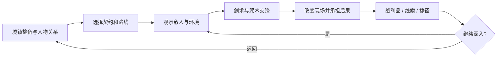

# 《余烬誓约》玩法设计草案

设计版本：0.2。工作名可调整；工程继续使用 AetherLab。本文描述待实现的游戏设计，不表示这些功能已进入当前实验场。

## 1. 玩家要扮演谁、做什么

你是一名受过剑术训练、能够在战斗中施展短咒的游誓者。你从边境城镇出发，接受委托、探索遗迹、结识不同信仰的人，在剑、咒术与环境之间寻找自己的作战方式，并决定谁有资格掌握正在复苏的古老力量。

游戏采用第三人称动作冒险 RPG。城镇是可返回的据点，野外与地城构成相互连通的区域；先做紧凑区域，再决定是否扩大为开放世界。冒险、人物与战斗构成主体，材料反应负责让这些经历有更多可能。

玩家应产生三种满足感：亲手格开一次重击；用聪明的方式改变一场不利战斗；在世界中留下能被人物认出的选择。

| 支柱 | 玩家行为 | 设计约束 |
|---|---|---|
| 剑术 | 观察招式、管理距离、格挡、拆招、反击 | 普通攻击和防守必须独立成立 |
| 咒术 | 决定改变哪个目标、哪片环境、何时释放 | 每种法术同时具备直接用途和环境用途 |
| 冒险 | 搜索路线、帮助或背弃他人、带回发现 | 战斗之外也能使用装备、法术与知识 |

## 2. 三种时间尺度的循环

**一场交锋，约 20–90 秒。** 识别威胁 → 用剑与移动争取空隙 → 施法或利用设施 → 近战收获优势 → 应对环境变化。这个时长是调试目标，精英和 Boss 另计。

**一次出行，约 15–35 分钟。** 在据点选择契约、携带装备 → 遇到战斗与岔路 → 消耗补给、发现捷径 → 决定继续深入还是返回 → 交付委托、修整装备和改变人物关系。

**一个区域篇章。** 解决当地可感知的问题 → 理解势力冲突 → 接近区域遗迹 → 作出具有代价的决定 → 新路线、服务或区域状态随之改变。

## 3. 剑术的完整作用

剑负责精确、持续和可靠的交互。它能打断施法者、攻击暴露部位、切断绳索、撬开已经松动的结构，在无法安全施法的近身距离保持主动。

### 基础动作

| 动作 | 战斗用途 | 环境用途 | 风险或代价 |
|---|---|---|---|
| 轻击连段 | 追击空隙、积累失衡、打断轻动作 | 切布、细绳和脆弱枝条 | 对完整板甲效果有限，乱挥会被反击 |
| 蓄力重击 | 增加结构冲量、压制架势 | 打碎冻脆件、击倒松动支撑 | 前摇明显，消耗较多体力 |
| 突刺 | 攻击盔甲缝隙、延长有效距离 | 精确触碰符印/狭窄机关 | 横向覆盖小，落空回收慢 |
| 格挡 | 吸收正面物理压力，维持位置 | 防碎片、遮护同伴 | 持续受击消耗体力，侧后方暴露 |
| 精准格挡 | 化解明确的近战招式，创造短反击窗口 | 无强制解谜依赖 | 时机失误退回普通格挡或受击 |
| 闪避/侧步 | 离开攻击线与危险地面 | 穿越短暂安全窗口 | 连续使用耗尽体力，不允许无脑无限滚动 |
| 踢击/盾击 | 打断、推开、破坏架势 | 推动松动物体 | 近距离，重甲敌人不容易被推走 |

不采用“所有非发光攻击都能完美弹反”的隐含规则。近战可格、可偏转和不可承受的攻击需要动作、音效及形状提示；大范围落石、地面雷电和持续火场主要靠离开危险区处理。

### 架势与受伤分开

生命代表受伤承受力；架势代表当前站稳与防守状态。干净的剑击、盾击和环境冲击能造成失衡。失衡后出现短暂的破绽，玩家可以选择近战重创、缴械或施放较慢的咒术。

轻型敌人可以被中断，重型敌人的强动作具有可读的抗打断阶段。重复施加同一类控制逐渐缩短其控制时间，防止把 Boss 永久锁在硬直中。抗打断/控制递减不会取消其真实燃烧、含水或结构损坏。

### 武器差异来自使用方式

| 武器 | 强项 | 局限 | 与魔法的配合 |
|---|---|---|---|
| 长剑 | 通用斩刺、反击稳定 | 对盾阵和厚甲需寻找空隙 | 可刻咒，适合短咒与近战交替 |
| 双手剑 | 横扫与架势压力 | 起手和回收较长 | 冻脆后重击、击倒燃烧支撑 |
| 战锤 | 钝击与结构冲量 | 距离短、落空代价高 | 破冰甲、敲断受损锁扣 |
| 长枪 | 控制距离、攻击狭口 | 狭窄室内转向不便 | 把敌人限制在风、霜和地形之间 |
| 单手剑与盾 | 稳定防御、护卫和逼近 | 施放持续咒术时不能同时保持完整举盾 | 先抵达安全施法位置，再改变环境 |

初版只制作单手剑和盾的完整动作，其他武器在基础交锋通过试玩后扩展。不给每种武器立即追加完整动作树。

## 4. 魔法的六艺

现代学派使用“焰、潮、霜、雷、风、岩”分类。这是人物理解世界的语言。开发层继续使用热量、物质、动量与场；玩家不必理解公式。

| 学艺 | 入门法术 | 熟练运用 | 自身代价与克制条件 |
|---|---|---|---|
| 焰 | 引焰：点燃小目标或加热接触面 | 火矢、灼刃、热障 | 潮湿环境耗能更高；会破坏想保留的物品 |
| 潮 | 引泉：引来携带或附近的水 | 水幕、短距离搬运水、净洗 | 水有来源与库存；大水量不能随手生成 |
| 霜 | 凝霜：持续抽走目标热量 | 霜路、冻结机关、脆化外壳 | 冻结厚实目标需要时间；干燥目标缺少可成冰的水 |
| 雷 | 鸣雷：对准目标释放短电脉冲 | 借导体绕行、激活古印、过载装置 | 必须判断接触路径，也可能波及施法者 |
| 风 | 推掌：短促推动 | 偏转轻投射物、搬运雾、减轻坠落 | 大质量目标难推动；可能助长火势 |
| 岩 | 筑垒：利用现有碎石形成遮挡 | 加固、破松土层、短暂锚定 | 需要材料；能改变的几何范围受明确限制 |

潮与霜有不同的战术位置：一个准备材料和接触条件，一个改变相态与通行性。岩系先使用可创作、可复原的局部节点，不承诺整座山随意变形。

祝祷、诅咒和召唤属于后续誓术内容。它们可以影响生命、感知和契约；其中产生的火、冰、实体或冲量仍进入世界反应。灵魂和誓言使用独立玩法规则，不能硬塞进温度数组。

### 三种释放形态

**短咒**可以在一次近战动作结束后快速使用，威力/范围较小。**蓄咒**需要站稳，有明确中断风险，适合剑术创造的机会。**刻咒**在休整时准备在武器或护符上，战斗中用一次明确动作激活。

装备四个快捷咒术，城镇和营火可重新编配。第一片区域采用引焰、引泉、凝霜、鸣雷；重击承担初期结构冲击作用。深层“对象 × 操作 × 形态”用于内容创作，玩家先获得有名称、演示和说明的完整法术。

### 刻咒的具体例子

灼刃使一次命中同时携带接触热量；霜印让盾击抽取少量热量；引雷钉把可消耗的金属钉固定在木构件上，建立清楚可见的导电端点。刻咒有适用对象、持续时间和有限储能，不能从一次充能无限复制到每次攻击。

剑仍需命中并处理防御，附魔随后进入材料响应；同一次命中不重复结算“技能伤害 + 元素伤害 + 世界事件伤害”三份来源不明的输出。

## 5. 资源：体力、法力与材料

玩家主要读取生命、体力、法力三种状态。共鸣负荷是局部风险提示，在连续强行施法时显现，不增加一条必须永久盯住的独立资源条。

- **体力**用于强攻击、防守、闪避和奔跑。离开连续动作后快速恢复，鼓励短促交锋。
- **法力**用于咒术。交锋中的恢复缓慢，脱离危险后恢复到稳定水平；补给可立即恢复一部分。普通近战始终可用。
- **材料**用于需要实体质量的法术。水囊提供可靠的小规模引泉，河流和雨水提供更大的外部来源；岩术需要可用岩土。
- **共鸣负荷**随短时间的大量输能升高，通过手部符纹、音色与轻微失衡提示。继续蓄咒会延长起手或降低控制精度，不触发不可预知的随机自爆。

环境便利度影响成本，但设置上限。雨天更容易引水，并不使水术、雷术成本降为零；连续施法也不会形成永久免费循环。需要移动水源时先检验数量和路径，再扣除对应库存。

### 仅用于首轮调试的数值起点

| 条目 | 起点 |
|---|---:|
| 体力/法力上限 | 100 / 100 |
| 轻击 / 重击 / 闪避体力 | 8 / 24 / 18 |
| 精准格挡窗口 | 约 0.16 秒，允许难度选项放宽 |
| 蓄咒时长 | 0.6–1.2 秒 |
| 入门法术法力 | 12–25 |
| 普通失衡收益窗口 | 1–2 秒 |
| 饮用恢复补给的暴露时间 | 约 1 秒 |

这些数字不来源于已完成的战斗实测，不是平衡结论。先记录命中率、受击原因、空法力时间和玩家实际动作分布，再调整。

## 6. 材质、护甲和生物

敌人的身份、行为与身体结构共同决定对策。材料不等于固定元素弱点表。

金属外甲导热、导电，但穿戴者是否受伤还取决于衬层、接触和持续时间。绝缘夹层可以降低电流进入身体的剂量；厚甲提供稳定的物理防护，也增加重量。木盾擅长防护轻击，受热、吸水后其可靠性变化。不能简单把所有骑士统一设成“雷伤乘二”。

角色使用分层代理：外部护甲/盾 → 传递到身体的物理或热电剂量 → 角色生命与状态。初版可用一层护甲加一个身体节点，不需要全身器官模拟。

**冻结角色**按身体受影响比例累积迟缓和关节束缚。表面一层水结冰不等于整个人立即成为可碎冰雕。普通人形可能被短暂限制，重型生物先损伤护甲/外壳或改变动作；致命粉碎只对达到明确破坏条件的部件或特定敌人发生。

### 首批敌人：每类迫使玩家学一种判断

| 敌人 | 行为特点 | 剑术机会 | 环境机会 | 防止单一最优解 |
|---|---|---|---|---|
| 边境劫掠者 | 结伴夹击，受伤后后退 | 格挡后反击、拆散阵形 | 打落灯火、切断吊物绳 | 会绕开明显火场 |
| 盾卫 | 正面推进，护卫后排 | 绕侧、盾击后暴露手臂 | 冻地使站位不稳，破坏木盾 | 有空间时会后撤，不站着无限挨烧 |
| 逐焰咒徒 | 远程引火，近身仓促施法 | 突进打断，利用柱子逼其移动 | 水幕和断视野，夺走油罐 | 主动改变施法位置 |
| 棘木守卫 | 慢重招，根系补充养分 | 攻击关节、斩断外露根系 | 燃烧干枝、冻脆吸水根部 | 外层灰烬保护内核，烧起来仍会反扑 |
| 誓缚骑士 | 防守严密，遵循古老巡守誓令 | 识别重击回收、拆扣甲片 | 引导其踏入导电地面、破坏誓印 | 绝缘衬层在完整时保护身体 |

第一版实际制作前三种中的两种，再加一个 Boss；其余是复用结构的后续内容。

## 7. 战斗可读性与风险

玩家能通过动作、声音、材质变化和环境线索判断主要结果。潮湿显示水迹，危险导体短暂出现电弧征兆，接近断裂的支撑先变形或发声，受热盔甲通过呼吸声与光泽变化提示。

可选“观物”能力在安全观察时突出材料大类和明显连接：易燃、导体、吸水、脆弱、密闭。它不给出精确焦耳和完整解题路径，也不让全部交互物体永久发光。

电、水、火对双方遵守一致空间规则。盟友受影响也应有清楚的预警与反应。难度辅助可以放宽预警、瞄准和闪避窗口；若改变自身环境伤害，需要作为明确选项说明，不能悄悄修改世界规则。

AI 只能依据感知到的危险更新行为：躲明显火焰、避开看到的带电区域、寻找干路。不会读取玩家尚未释放的法术输入，也不保证每次完美规避连锁反应。

## 8. 成长：技能、装备与知识都有效

能力来自三个可重新配置的修习方向，不要求玩家开局锁死职业。

| 修习方向 | 改变的行为 | 代价/取舍 |
|---|---|---|
| 剑卫 | 更可靠的格挡、盾步和近战反击 | 能同时维持的刻咒较少 |
| 游咒剑士 | 短咒接剑、接触刻咒和灵活移动 | 蓄咒上限与重甲负担受限制 |
| 塔院术士 | 持续咒术、多个场源、远距精细控制 | 施法窗口更长，更依赖掩护 |

升级提供有限基础属性提升，同时通过导师、契约和发现解锁动作/法术变体。属性成长保证冒险反馈，新的行为选择承担主要深度。拒绝用无限堆叠伤害词条替代战斗设计。

装备每件最多支持少量明确用途的改造：绝缘握柄、隔热衬层、可导流的刃槽、轻量盾骨。一个装备的好处应同时带来合理的重量、耐热性、储能或手感取舍。故事武器通过新剑技或专属刻咒产生价值。

“认识规律”不会直接在现实知识层面封锁玩家。角色解锁新的仪式/形态后才具备控制能力；聪明玩家可以提前运用已经拥有的能力，但不能仅凭知道化学名词解锁所有终局法术。

## 9. 探索、谜题与世界持续性

每个关键障碍至少允许一种不依赖消耗型法术资源的保底路线。额外路线奖励时间、补给、隐藏信息或更好的战斗位置，而不只是换一段相同动画。

| 障碍 | 剑与工具 | 咒术 | 探索/社交 |
|---|---|---|---|
| 桥面断裂 | 放下备用木梯或砍绳降栈板 | 冻结有水的浅沟形成临时通路 | 找维护小道、请渡夫帮忙 |
| 武装守门人 | 决斗、绕侧缴械 | 制造雾或导电牵制 | 出示通行誓印、找到其失踪同伴 |
| 老城闸门卡死 | 撬松连接件、破坏已损坏的门轴 | 冷却卡住的热件、推动闸轮 | 找到侧门钥匙或恢复水轮 |
| 圣所正在失火 | 开启泄水闸，救人搬物 | 引泉降温、切断热传播 | 组织居民分工疏散 |

持续性分三级：任务关键状态持久保存；普通场景交互在检查点/区域重置规则下恢复；碎屑、粒子、临时雾等只保存必要摘要。世界中的“可破坏”要由资产与关卡明确创作，不能让每块支撑石都默认摧毁整段主线。

关键道具不能因火焰粒子覆盖而消失：它可以在烧毁容器后落地、留下可拾取的残片或形成替代线索。重要 NPC 死亡必须有后续任务分支；无后续创作预算时，不把该任务配置成可由偶发环境伤害永久锁死。

死亡回到最近誓火检查点，不永久丢失已经获得的核心能力。当前遭遇的普通敌人与临时场景状态重置；已经确认的剧情抉择保留，任务进行中的失败按任务的显式回退点处理。剧情选择自动保存前，界面先显示其可感知后果。

## 10. 城镇与经济

据点提供铁匠、咒术导师、契约大厅、教会灯堂与市场。各功能由具体人物承担，他们会记住玩家的帮助、破坏和立场。先做一个有连续变化的灰渡镇，不一次创建十个空城。

货币用于服务、旅费和常见物资；稀有材料用于装备改造；势力信任用于特殊导师和进入许可。这三种获得方式不能全部收敛成重复刷怪。

世界有会引水的农人、维持炉温的工匠与点灯的修士，但大规模稳定施法需要学识、法力、材料、协调与维护。因此交通、粮食、矿石、铠甲和普通劳动仍然重要。水术不会凭空给全世界生产无限水，恢复术也不能补回失血、移除所有疾病或复活所有死者。

普通装备有可修复的战后磨损，战斗中不突然因隐藏耐久数值断掉主武器。材料变化造成的明显烧毁/脆断属于另一条规则，必须提前通过表现提示。

## 11. 任务与叙事在玩法里的位置

任务应先给人物目标，再让规则产生方案。例如磨坊主需要恢复运粮，而修士担心修复古钟会唤醒地下誓缚者；玩家面对的是两个可信的需求，不是一个写着“使用雷术”的按钮。

每个区域记录少量有表现预算的结果：谁获救、设施是否恢复、某势力是否接受玩家、哪条路线开放。对白、商店服务、巡逻和后续委托使用这些事实，避免只有一句结尾旁白。

重要人物会对玩家手段有自己的判断。救人时烧毁粮仓可以仍算救人成功，但要承担当地短期粮价与声望后果。不是所有难题都要有完全无损的最佳答案。

## 12. UE 5.8 中的玩法分工

以下是新增玩法的实施接口，不是当前已存在的类名保证。

| 拟建模块/系统 | 职责 | 与现有底层的关系 |
|---|---|---|
| AetherCombat | 武器接触、命中窗口、格挡、架势、护甲传递 | 接受动作定义，把有效机械作用交给世界和角色解析器 |
| AetherMagic | GAS 能力、法力、资源、刻咒、投射物 | 只在已验证的命中/持续场处提交 Stimulus |
| AetherCharacters | 生命、受伤、姿态、角色装备节点 | 接收反应剂量与结构事件，不重新求解世界温度 |
| AetherAI | 感知、站位、反应危险、战斗决策 | 读取局部危险摘要，不遍历全世界 |
| AetherAdventure | 契约、人物关系、关卡状态、检查点 | 记录显式任务事实与反应实体的持久状态 |
| AetherPresentation | 动作、音效、VFX、镜头和提示 | 读取状态；关掉特效不改变结果 |

剑的 Cutting/Piercing/Blunt 需要扩展为明确的机械载荷语义。当前只有冲量与完整度，不能把轻剑斩击直接当作小锤击后就宣称完成近战。角色 HP 与架势属于 GAS/战斗层；物质焓、水量与燃料仍属于 ReactiveWorld。

所有同一命中携带 `AttackId + SourceId + TargetId + ContactIndex`，避免武器扫掠多个帧或多个碰撞体重复扣除全额伤害。受击先确定防御与命中部位，再分配机械/热电剂量，最后提交生命和状态结果。输入、能量与伤害的归因链必须可以在调试日志里追踪。

## 13. 先验证什么

先做“断钟修道院”15 分钟切片：一把剑、一面盾、四个入门咒术、两类普通敌人和铸钟骑士。详细安排见同目录 `VerticalSlice.zh-CN.md`。

评估时观察：玩家是否愿意使用基础剑术；能否从表现预测危险；法术是否有超出直接伤害的用途；是否有人选择不同路线；出错后能否解释原因；没有法力是否仍有可执行的方案。

不要求每名玩家等比例使用剑与魔法。不设“平均施法次数达标”作为好玩的替代指标。若所有人只持续施放同一招，先检查敌人行为、资源、读图和收益结构，再调整数值。
