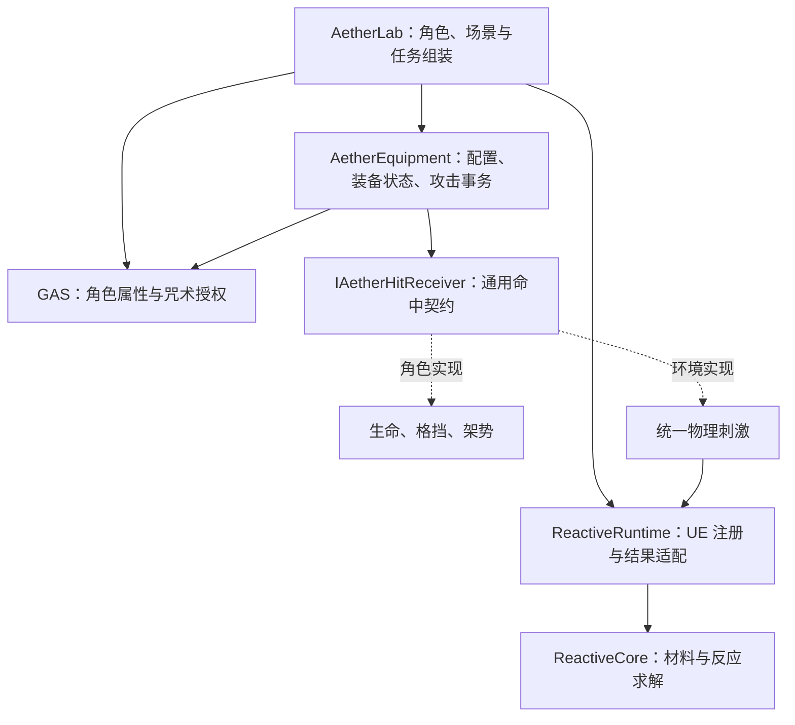

# 0.4：模块化角色、装备与 UE 玩法

本轮把 Blender 原型接入 UE 5.8，形成可换装的第三人称剑魔原型。扩展性通过独立模块、数据契约和回归检查维持；它不是对所有未来玩法或规模的无限承诺。

## 运行和资源

执行 `Scripts/PlayAdventure.ps1`，或打开 `/Game/SwordMagic/Maps/L_BrokenBell_Playable` 后 Play。地图使用 `AAetherModularAdventureMode`，运行时依据数据资产创建建筑、角色和 36 个玩法对象。编辑器静态地图为空是当前运行时布置方式的结果。

`-Graybox` 保留旧关卡。原实验场仍使用 `AReactiveLabGameMode`，不受新地图影响。

| 按键 | 行为 |
|---|---|
| R | 在当前角色配置的剑、训练锤之间切换 |
| T | 装备/卸下盾牌；双手锤与盾牌冲突时拒绝 |
| X | 卸下主手武器，角色身体保留 |
| 左键 / Shift | 当前武器轻击 / 重击 |
| 右键 / Space | 有盾时防御 / 闪避 |
| 1–4 / F | 选择热、水、霜、电咒术 / 施放；不依赖近战装备 |
| E / Q | 常规交互 / 古印的另一选择 |
| F5 / F9 | 单机检查点保存 / 读取 |

建模源文件为 `Art/SwordMagic/Modular/BrokenBellAbbey_Modular.blend`，通过 Blender MCP 制作。它保留原始展示场景，并新增 `SM_03_ModularCharacters`。原始合体模型文件未覆盖。

| 资源 | 三角面 | 用途 |
|---|---:|---|
| SK_Modular_Oathwanderer | 2,420 | 不含剑盾的游誓者，17 骨 |
| SK_Modular_BellKnight_Auren | 2,864 | 不含锤的铸钟骑士，17 骨 |
| SM_OathSword | 288 | 独立剑，右手关节局部坐标 |
| SM_OathShield | 344 | 独立盾，左手关节局部坐标 |
| SM_BellHammer | 744 | 独立锤，右手关节局部坐标 |

两个身体各有 Walk、Attack 原型动画。FBX 在 `Modular/FBX`，UE 资源在 `Content/SwordMagic`。骨架保存为单独的 USkeleton 包，先保存骨架再导入动画，避免跨进程丢失引用。

## 依赖方向和状态所有者

`AetherEquipment.Build.cs` 不依赖 AetherLab、ReactiveWorld、角色类、敌人枚举或任务。`ReactiveCore` 也不依赖装备。由 AetherLab 的适配代码连接二者，禁止以后把任务或具体武器判断加回求解器。

| 内容 | 唯一权威所有者 | 表现层 |
|---|---|---|
| 装备与攻击时间窗 | 服务器 EquipmentComponent | 独立 StaticMeshComponent、原型动画 |
| HP、Mana、Stamina、Posture | 服务器 GAS AttributeSet | HUD |
| 温度、含水量、冰比例、燃烧、完整度 | 服务器 ReactiveWorld | 材质、碰撞、破坏表现 |
| 任务、证词、Boss 结局、奖励 | 服务器 AdventureState | 提示与交互 |
| 身体和默认装备定义 | 只读 CharacterDefinition | SkeletalMesh + 骨骼附件 |

定义与实例分离：同一 `DA_OathSword` 可被多个角色引用；每个角色自己的 Slots、Attack、命中去重集合互不共享。不要在运行时修改定义资产实现升级或耐久。

## 装备契约

`UAetherEquipmentDefinition` 包含稳定 ItemId、Slot、Socket、Mesh、GripTransform、双手占用、格挡能力，以及攻击数组。每个攻击保存 Damage、PostureDamage、ImpulseNs、StaminaCost、ReachCm、RadiusCm 和前摇/有效期/后摇。

角色发起 `StartAttack(Light/Heavy)`。组件先校验权威、动作条件、装备、攻击参数及体力，接受后只扣费一次，进入带 Serial 的攻击事务；有效期内服务端执行形状查询和遮挡检查，每个目标最多命中一次。攻击期间禁止换装。招架、架势崩溃、触电眩晕、死亡和解除敌意可以取消攻击，命中回调中的取消也会停止后续派发。

目标实现 `IAetherHitReceiver`：

- 角色适配生命、格挡和架势规则。
- 世界物体将冲量及来源送入 ReactiveWorld，由材料决定是否破坏。

展示组件挂接手骨，继承手的位置与旋转。装备网格已经使用 UE 厘米单位，附件不继承 FBX 骨架的 100 倍单位缩放；`GripTransform.Scale` 是最终装备尺度。当前角色 Actor 按 1 倍缩放使用；新体型需配置合适握持变换与装备尺度。

当前 MainHand/OffHand 是原型槽位约定。攻击是角色朝向的球体扫掠，不是精确刀刃轨迹；动画用于表现，服务端时间窗决定命中。下一阶段可在装备层替换命中查询策略，不改变角色和材料的命中接口。

## 添加内容的方法

**添加一把近战武器**：复制 EquipmentDefinition 数据资产，填写新的 ItemId、网格、握持骨、伤害和攻击时间；加入 `DA_EquipmentCatalog`。若要由 R 切换，将 ID 加入 `DA_Character_Player.QuickEquipItems`。不新增角色子类，不添加 `if Sword/if Hammer` 分支。换装、复制和保存沿用现有组件。

**添加一个角色外观**：创建 CharacterDefinition，配置身体、骨架兼容的原型动画、胶囊和默认装备列表；将它绑定到 LevelDefinition 的敌人条目。骨架需要有效的附件骨/Socket。角色外观与行为类型分别配置。

**增加同类环境物件**：在 LevelDefinition.Objects 增加稳定 ID、变换、ArtMesh、对象类别和初始水量。需要新的材料响应时增加 ReactiveMaterialAsset；不要按木门、Boss 名称或法术名编写材料组合判断。

**扩展行为的边界**：弓箭、投掷、连击蒙太奇、召唤和装备授予技能需要增加行为策略或 Ability，不是仅改近战数值。现有四个法术仍有 AetherLab 中的原型分支；现有修道院任务也通过约定对象 ID 绑定。新法术体系应拆成独立 Ability/定义，新章节应增加任务定义或独立场景控制器，不继续扩张角色类和单个 GameMode。装备和反应核心无需随之重写。

## 网络与保存

客户端只请求稳定物品 ID；组件服务器校验可用目录、动作状态、槽位和双手冲突，再原子提交整个 Loadout。客户端的 `Equip()` 返回 false 表示提交了异步请求，不表示服务器已经拒绝；通过复制状态和 OnLoadoutChanged 得到最终结果。

复制 Slots、Revision 和当前攻击序号/时间，客户端重建本地附件。网格组件不作为装备权威，不能把客户端发来的网格路径、伤害或体力值当真。当前目录相当于原型可用装备清单，尚无背包物品实例、掉落归属、解锁或经济系统。

单机检查点升级到 Version 2，保存每个角色的 `{Slot, ItemId}`。恢复前检查所有角色装备和世界数据；未知 ID 或冲突组合整体拒绝，不把已验证的前半份存档先写入世界。布局 ID 不同也拒绝加载。旧 v1 存档保留但不迁移。新正式版本必须在增加耐久/词缀等实例数据时增加版本和迁移器，保持已发布 ItemId 稳定。

`DirectoriesToAlwaysCook=/Game/SwordMagic` 保证通过代码加载的资源纳入烘焙配置。当前以编辑器 Development 运行验证，未据此宣称 Shipping 打包通过。

## 验证入口和当前限制

- `Scripts/SmokeEquipment.ps1`：拆分附件、正确尺寸、两种武器参数、空手施法、盾牌冲突、命中去重、攻击取消、装备保存恢复。
- `Scripts/SmokeAdventure.ps1 -Art`：美术布局中的冻结碰撞、剑断绳、导电伤害、救人、见证与剑术结局、有限水源和存档。
- `Scripts/TestNetwork.ps1`：本机专用服务器与先后加入的客户端，校验装备 RPC、远端角色附件、世界基线、GAS 扣费和客户端修改拒绝。
- `Scripts/CaptureAdventure.ps1`：真实 UE 场景、剑盾、换锤和关卡总览截图。
- `Scripts/Verify.ps1`：已有反应系统及整套回归。

本轮独立运行已通过：34 项装备集成检查、26 项美术关卡检查、专用服务器与两个先后加入的客户端。最终整体结果见 `Docs/ModularVerification.json` 与 `Saved/Logs/EquipmentVerify.log`。

模型和动画属于可玩原型：无手指、面部、IK、最终布料和生产 AnimBP。双手锤当前只挂右手，左手 IK 待制作。建筑使用合并静态壳与单独交互件，尚未拆成 World Partition 模块库。任务、音效、正式 VFX、多人战斗延迟预算和长时间性能需继续制作与验收。
